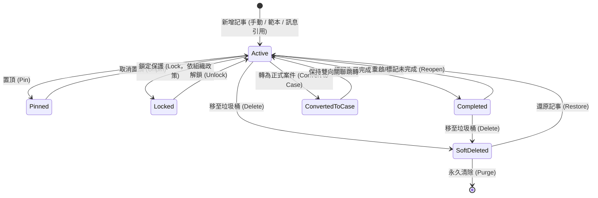

# 對話記事本管理規格（Chat Notes Management Specification）

## 1. 文件目的與設計原則（Purpose & Design Principles）

### 1.1 背景與問題意識
在 LINE 官方帳號（LINE OA）的日常營運中，每個聯絡人或群組聊天室皆可累積上百筆的對話記事（Chat Notes）。若僅將記事本視為「聊天側欄的小型便利貼」，當單一 OA 累積數千至數萬筆記事時，將面臨資訊碎片化、缺乏生命週期、無檢索治理機制等痛點。

同時，本系統作為**跨產業、跨場景的通用 SaaS 平台**，使用者涵蓋商業公司、工程單位、民意服務處、政府機關、學校教務、補習班、社團組織到個人工作室等。因此，對話記事本不可偏廢於單一特定業務，而必須具備**高度通用化（General-Purpose）**與**彈性治理機制（Flexible Governance）**。

### 1.2 核心原則（Core Principles）
1. **通用化與中性架構（Industry-Agnostic & General Purpose）**：
   - 核心欄位高度中性（標題、內文、分類、標籤、關聯成員、到期日、引用訊息），不綁死特定行業名詞。
   - 支援廣泛場景：商務商談、工程工務、政策民意、商務協商、學校教務、學生學習、售後客服、醫療照護、社團活動等。
2. **雙層管理架構（Two-Tier Architecture）**：
   - **聊天室側欄檢視（Room-Level View）**：專注於「當前對象的即時溝通、快速備忘、重點置頂與交接指引」。
   - **全域記事管理中心（Global Note Hub）**：提供「跨聊天室總覽、多維度篩選、批次處理、統計看板與全文檢索」。
3. **三位一體資訊邊界（Clear Information Boundaries）**：
   - **聯絡人備註（Contact Notes）**：記錄「這個對象是誰」（靜態人設、基本特徵）。
   - **對話記事本（Chat Notes）**：記錄「這段對話中發生的事與工作交接」（動態事件、對話上下文備忘）。
   - **案件（Cases）**：管理「需要跨部門、跨階段追蹤並有正式結案流程的工作事項」（工單任務）。
4. **靈活團隊治理（Flexible Governance for Small & Large Teams）**：
   - 考量多數後台僅 1~2 人身兼數職，繁瑣的權限限制會成為工作干擾；因此「鎖定保護」等控制功能由乙級組織管理員決定是否啟用。
5. **手動明確儲存防護（Explicit Manual Save & No Auto-Save）**：
   - 無論組織採取何種鎖定政策，所有新增、編輯修改**一律必須由使用者手動點擊「儲存」按鈕才寫入生效**。
   - **嚴禁即時自動儲存（No Auto-save）與輸入框失焦自動儲存**；編輯狀態隨時可點擊「取消」放棄修改，徹底杜絕瀏覽或點選時誤觸鍵盤導致內容被自動覆蓋。

---

## 2. 通用化應用場景矩陣（Cross-Industry Scenarios）

本系統的記事本架構可無縫套用於各類組織情境：

| 應用領域 | 場景說明 | 記事本範例與應用模式 | 常用標籤/分類範例 |
|---|---|---|---|
| **商務商談** (Business & Sales) | 客戶訪談、報價條件、採購偏好、付款共識 | 記錄客戶報價談判條件、交期承諾、採購窗口聯絡備忘 | `#報價議價`、`#交期確認`、`#重點大客戶` |
| **工程工務** (Engineering & Ops) | 現場勘查、施工規範、料件型號、修繕回報 | 施工前場勘細節、指定材料規格編號、現場出工注意事項 | `#工務派工`、`#材料型號`、`#安全須知` |
| **政策民意** (Policy & Public Affairs) | 選民陳情、陳情會勘、法案政策諮詢、跨局處追蹤 | 記錄陳情人陳情要點、會勘結論、公文辦理文號及承辦人 | `#會勘結論`、`#選民陳情`、`#跨局處協調` |
| **商務協商** (Negotiation & Deals) | 跨組織合作、分潤條款、合約協議、保密事項 | 記錄雙方會議協議原則、權利金比例、履約階段驗收標準 | `#合作備忘`、`#條款確認`、`#待簽約` |
| **學校教務** (Academic & Education) | 註冊選課、學籍異動、課程調度、校務行政通知 | 學生選課退選申請、補考安排、特殊輔導諮商交代事項 | `#註冊選課`、`#教務交接`、`#學籍管理` |
| **學生筆記** (Student & Tutoring) | 課堂重點、作業進度、學習歷程、家長聯絡 | 課堂問答摘要、一對一家教進度、弱點單元追蹤、家長交代 | `#作業提醒`、`#學習歷程`、`#家長聯絡` |
| **售後客服** (Customer Support) | 客訴處理、退換貨協議、特殊補償、技術排障 | 記錄使用者操作障礙步驟、退貨取件時間、補發折價券紀錄 | `#客訴追蹤`、`#退換貨`、`#VIP特例` |
| **醫療長照** (Healthcare & Care) | 照護指引、用藥叮嚀、家屬交代、特殊過敏史 | 記錄長者特殊飲食禁忌、復健時間表、就醫陪同回報 | `#用藥注意`、`#家屬交代`、`#照護指引` |
| **社團志工** (Community & NGO) | 活動籌備、物資清冊、志工排班、捐款核銷 | 志工活動現場分工、活動物資點收清單、報名特殊狀況 | `#活動籌備`、`#物資清冊`、`#志工排班` |

---

## 3. 名詞定義與資料模型（Terminology & Data Model）

| 中文名稱 | 英文術語 | 程式命名 / 資料庫欄位 | 定義與說明 |
|---|---|---|---|
| 對話記事 | Chat Note | `chat_note` / `chat_notes` | 附屬於特定聊天室（OA + Recipient）的單筆結構化記事 |
| 記事標題 | Note Title | `title` | 記事摘要標題（1~100 字元） |
| 記事內文 | Note Content | `content` | 記事詳細內容（支援純文字、條列、Markdown、引用訊息） |
| 記事分類/類型 | Note Category / Type | `category_id` / `category` | 組織自訂之記事業務類別（如：商務洽談、工務、教務、客服） |
| 記事標籤 | Note Tag | `note_tag` | 用於靈活標記記事屬性之標籤（與聯絡人標籤 `contact_tag` 獨立） |
| 置頂記事 | Pinned Note | `is_pinned` | 固定於聊天室頂部之關鍵記事（單一聊天室最多 5 筆） |
| 鎖定記事 | Locked Note | `is_locked` | 經鎖定之記事防止非授權人員誤改（鎖定政策依組織設定而定） |
| 完成狀態 | Completed / Active | `is_completed` | 標記此記事事項是否已處理完畢（已完成事項自動折疊或歸檔） |
| 到期日/預定日 | Due Date | `due_date` | 此事項之預計完成時間或執行日期（YYYY-MM-DD，選填） |
| 關聯成員 | Target Member | `target_user_id` | 群組聊天室中，指定此記事所屬或針對之群成員 LINE UID |
| 關聯案件 | Linked Case | `linked_case_id` | 此記事若已升級或關聯至案件，記錄對應之 `Case.id` |
| 引用訊息 | Source Message | `source_message_id` | 建立記事時所引用的原始 LINE 訊息 ID |

---

## 4. 記事生命週期與狀態流轉（Lifecycle & State Transitions）



### 4.1 狀態定義與操作規則
1. **進行中（Active）**：
   - 預設狀態。顯示於聊天室側欄與全域管理清單中。
2. **置頂（Pinned）**：
   - 每個聊天室最多允許 **5 筆**置頂。
   - 置頂記事在聊天室側欄頂部固定顯示，並帶有特殊圖示與醒目邊框，供交接人員第一時間掌握核心須知。
3. **完成與歸檔（Completed）**：
   - 事項處理完畢後（例如：已完成會勘、已確認報價），一鍵標記「已完成」。
   - 側欄預設折疊已完成項目，維持版面清爽，但仍可展開查閱；全域中心可依狀態篩選。
4. **轉為案件（Convert to Case）**：
   - 當記事內容升級為重大事件、跨部門專案、複雜客訴時，可一鍵轉為正式案件。
   - 系統自動帶入標題、內文、關聯對象與引文，建立成功後維持雙向連結（`linked_case_id`）。
5. **垃圾桶與軟刪除（Soft Delete & Retention）**：
   - 刪除記事採軟刪除（`deleted_at IS NOT NULL`），移入垃圾桶保存 30 天。
   - 垃圾桶內記事可一鍵還原；30 天後系統自動清理，或由管理員手動永久刪除。

---

## 5. 鎖定防篡改機制與組織彈性開關（Lock Policy & Governance）

### 5.1 痛點分析與設計考量
- **大型團隊 / 嚴格合規組織**：需要防止一般人員誤刪、篡改重大協議或歷史交接紀錄，需要強制的管理員鎖定機制。
- **小型團隊 / 身兼數職微型組織（1~2人）**：過於嚴格的權限鎖定會造成操作繁瑣、阻礙流暢編輯。

### 5.2 組織鎖定政策開關（Organization Lock Policy Setting）
組織管理員（`org_admin`）可在「組織設定 ➔ 記事與案件偏好」中自訂鎖定模式：

| 鎖定模式 (Lock Policy) | 適用場景 | 功能行為與權限表現 |
|---|---|---|
| **模式 A：自由編輯模式（預設）**<br>`policy = "disabled"` | 1~2 人小型團隊、扁平組織、身兼數職 | **介面隱藏鎖定按鈕**。所有具後台權限人員皆可自由新增、編輯、刪除記事，無任何多餘權限卡點，最為輕快流暢。<br><br>【防誤改防線】：所有新增與修改**必須手動點擊「儲存」按鈕才會寫入生效**；**嚴禁即時自動儲存（No Auto-save）與失焦自動儲存**。若內容有修改但在未儲存前嘗試關閉或切換，系統會跳出防呆警告通知。 |
| **模式 B：團隊協作鎖定模式**<br>`policy = "collaborative"` | 中型協作團隊、需防止手殘誤改 | **所有人皆可鎖定與解鎖**。<br>1. **鎖定即唯讀**：鎖定狀態下**卡片全面轉為唯讀展示，無法直接編輯或誤改**。<br>2. **支援自由複製**：未解鎖狀態下**可自由框選文字或點擊「複製內容」按鈕（SVG 圖示）**，方便快速將交接資訊貼至對話框，但「就是不能直接編輯」。<br>3. **解鎖流程**：需要修改時，任何成員皆可點擊「解鎖」進入編輯表單，修改後仍須手動按「儲存」。 |
| **模式 C：管理員嚴格合規模式**<br>`policy = "strict_admin"` | 大型組織、正式合約備忘、嚴格稽核 | **僅乙級（組織管理員）可鎖定與解鎖**。鎖定後卡片呈唯讀狀態，一般操作員與協作員可複製內容但無法解鎖或編輯，確保法律與稽核證據力。 |

### 5.3 編輯防呆與未儲存警告機制（Unsaved Changes Guard）
為徹底杜絕「誤改自動儲存」或「打到一半誤關遺失」，前端表單導入表單變更防呆（Dirty State Guard）：
1. **未儲存離開警告（Unsaved Changes Warning）**：
   - 當使用者在編輯或新增記事過程中已有修改輸入，若嘗試點擊「取消」、按右上角「關閉」、切換至其他聊天室、重新整理或離開頁面時：
   - 系統**強制跳出確認通知視窗**（搭配 warning 三角向量圖示）：
     > 「**您有尚未儲存的修改內容**：離開將會遺失剛才的編輯內容，確定要放棄變更嗎？」
     > 按鈕選項：`[繼續編輯]`（停留在表單） / `[放棄變更]`（確認捨棄並關閉）。
2. **明確儲存防線**：
   - 只有在使用者明確按下「儲存」按鈕且後端回傳 HTTP 200 後，變更才會持久化寫入資料庫。

---

## 6. Apple iOS / macOS 視覺風格與雙層管理介面（Apple HIG UI Architecture）

### 6.1 Apple HIG 設計美學原則（Apple Human Interface Guidelines）
記事本與管理中心全面導入 **Apple iOS / macOS 現代原生美學（Apple Notes & Reminders Design System）**：
1. **材質與毛玻璃質感（Materials & Frosted Glass Vibrancy）**：
   - 頂欄與側欄面板採用 Apple 經典霧面毛玻璃效果（`backdrop-filter: blur(20px); -webkit-backdrop-filter: blur(20px); background: rgba(255, 255, 255, 0.85);`）。
   - 搭配超細髮絲邊框（Subtle Hairline Border：`1px solid rgba(0, 0, 0, 0.08)`）與多層柔和微陰影，捨棄厚重黑邊。
2. **連續平滑圓角（Smooth Squircle Radii）**：
   - 外層面板與大卡片：`rounded-2xl`（16px ~ 20px）。
   - 記事卡片：`rounded-xl`（12px ~ 14px）。
   - 標籤與狀態徽章：`rounded-full`（膠囊形狀 Pill Badge）。
   - 操作按鈕與輸入框：`rounded-xl`（10px）。
3. **字體與排版層次（Apple Typography System）**：
   - 字體優先採用 `-apple-system, BlinkMacSystemFont, "SF Pro Text", "SF Pro Display", "PingFang TC", sans-serif`。
   - 標題與內文層次分明：卡片標題（15px Semi-bold）、內文（13.5px Regular，行高 1.55）、時間與標籤（12px Medium）、輔助資訊（11px Regular 次級灰）。
4. **Apple 經典膠囊徽章（Capsule Pill Badges）**：
   - 採用 Apple Notes/Reminders 風格：10%~15% 低飽和淺底色搭配 100% 飽和文字與 20% 細邊框（例如：`background: rgba(0, 122, 255, 0.12); color: #007AFF; border: 1px solid rgba(0, 122, 255, 0.2);`）。
5. **嚴格禁止原生 Emoji 圖示（Strictly No Native Emojis）**：
   - 全面採用純向量 SVG 與 CSS 圖示（Apple SF Symbols 風格），嚴禁使用作業系統預設 Emoji，確保跨瀏覽器與跨裝置視覺渲染一致。

---

### 6.2 聊天室側欄記事本面板（Room-Level View，參考 iOS Notes 側欄）
- **入口**：位於「聊天」畫面右側資訊面板第 2 區塊（標籤下方、案件上方）。
- **標題欄（Apple ToolBar Style）**：
  - 顯示「記事本 `已用/上限`」（例如：`23/100`）。
  - 右側提供 Apple 圓角風格「`＋ 新增`」按鈕及「`管理檢視`」快速跳轉按鈕（內嵌向量搜尋放大鏡 SVG）。
  - 提示文字：「僅後台成員可瀏覽與編輯，LINE 對方看不到」。
- **清單結構**：
  - **置頂區（Pinned Section）**：以 Apple 經典黃色/琥珀色大頭針向量圖示（SVG `pin.fill`）標註，置於頂端。
  - **一般進行中區（Active Section）**：以 iOS Inset Grouped List 卡片樣式排列。
  - **已完成折疊區（Completed Section）**：預設收合，顯示「已完成事項 (N)」（內嵌向量向下箭頭 SVG）。
- **單筆卡片操作選單（Actions，一律採用純向量 SVG 圖示）**：
  - `[置頂 / 取消置頂]` (SVG: `pin` / `pin.slash`)
  - `[鎖定 / 解鎖]` (SVG: `lock` / `lock.open`，鎖定狀態呈唯讀，可複製不可編輯；依組織鎖定政策顯示)
  - `[複製記事內容]` (SVG: `doc.on.doc`，未解鎖狀態下可一鍵複製文字)
  - `[轉為案件]` (SVG: `briefcase`)
  - `[編輯]` (SVG: `square.and.pencil`，點擊開啟編輯表單，修改後手動按儲存)
  - `[標記完成 / 重啟]` (SVG: `checkmark.circle` / `arrow.counterclockwise`)
  - `[刪除]` (SVG: `trash`)

---

### 6.3 全域對話記事本管理中心（Global Note Hub，參考 macOS Notes & Reminders）
- **入口**：後台主導覽列「記事本管理」或於聊天室側欄點擊「管理檢視」。
- **檢視模式**：
  - **卡片檢視（Grid View）**：macOS Notes 磁貼卡片佈局，直觀瀏覽記事顏色條與標籤膠囊。
  - **表格檢視（Table View）**：macOS Finder / TableView 精緻排版，適合大量數據檢視、排序、批次勾選。
- **多維度篩選工具列（Filter Toolbar）**：
  1. **關鍵字搜尋**：搜尋標題、內文、建立者、對象名稱（內嵌 SVG `magnifyingglass`）。
  2. **LINE OA 篩選**：多 OA 組織可切換或選擇全部 OA。
  3. **聊天對象篩選**：可指定特定個人或群組。
  4. **記事分類/類型**：下拉篩選（商務、工務、教務、客服等）。
  5. **記事標籤**：多選膠囊標籤篩選（內嵌 SVG `tag`）。
  6. **狀態篩選**：全部 / 置頂 / 進行中 / 已完成 / 鎖定 / 已轉案件 / 垃圾桶。
  7. **日期範圍**：建立時間、最後修改時間、到期日範圍（內嵌 SVG `calendar`）。
  8. **建立人員/負責人員**：篩選特定後台同仁所建立之記事。
- **批次操作（Batch Operations）**：
  - 批次變更分類 / 批次新增標籤。
  - 批次標記完成 / 批次取消完成。
  - 批次移至垃圾桶 / 批次還原。
  - 批次匯出（CSV / Excel / Markdown）。

---

### 6.4 向量圖示庫對照規範（Apple SF Symbols Inspired Vector SVGs）
系統介面一律使用純向量 SVG（16×16 或 20×20 px，線寬 1.5px / 2px，`stroke-linecap="round" stroke-linejoin="round"`）：

| 功能語意 | Apple SF Symbol 參照 | SVG 圖示用途說明 |
|---|---|---|
| **置頂記事** | `pin.fill` | 顯示於置頂記事卡片頂部，黃色/琥珀色高亮 |
| **鎖定防護** | `lock.fill` / `lock.open` | 鎖定唯讀狀態切換與指示 |
| **複製文字** | `doc.on.doc` | 唯讀狀態下一鍵複製內文至剪貼簿 |
| **轉為案件** | `briefcase` | 記事升級轉為案件工單按鈕 |
| **編輯記事** | `square.and.pencil` | 開啟編輯表單按鈕 |
| **完成標記** | `checkmark.circle.fill` | 綠色勾選標記已處理完畢 |
| **垃圾桶刪除** | `trash` | 軟刪除記事按鈕 |
| **還原記事** | `arrow.uturn.backward` | 從垃圾桶還原記事按鈕 |
| **放大鏡搜尋** | `magnifyingglass` | 全域與聊天室側欄搜尋輸入框圖示 |
| **標籤圖示** | `tag.fill` | 標籤膠囊左側向量圖示 |
| **分類資料夾** | `folder.fill` | 業務分類左側向量圖示 |
| **未儲存警告** | `exclamationmark.triangle.fill` | 未儲存離開防呆通知對話框標題圖示 |

---

## 7. 分類、標籤與範本體系（Taxonomy & Templates）

### 7.1 記事分類管理與治理機制（Note Category Governance）

#### 7.1.1 權限制度與分工（比照標籤制度）
- **乙級（組織管理員）與 丙級（操作人員）**：擁有完整「記事分類管理」權限，可新增分類、修改名稱、調整代表色票、設定排序權重、執行分類合併與刪除。
- **丁級（協作人員）**：**僅能於撰寫/編輯記事時「下拉選取分類」**，無分類管理權限，不可新增或修改分類庫。
- **甲級（平台管理員）**：根本用不到（不參與客戶營運資料與分類設定）。

#### 7.1.2 系統預設 8 大通用分類範例（採用 Apple 官方系統色彩 System Colors）
系統初始預建 8 種跨行業、跨場景通用分類，**乙級與丙級可根據自身組織性質自由保留、修改名稱顏色或一鍵刪除**：

| 預設分類名稱 | Apple 官方系統色 (Hex) | 適用場景與說明 |
|---|:---:|---|
| **商務商談** | **Apple System Blue** (`#007AFF`) | 客戶訪談、採購意向、報價談判、商業合作 |
| **工程工務** | **Apple System Orange** (`#FF9500`) | 現場勘查、施工進度、材料料件、設備修繕 |
| **政策民意** | **Apple System Purple** (`#AF52DE`) | 選民陳情、會勘結論、政策諮詢、跨局處協調 |
| **商務協商** | **Apple System Teal** (`#30B0C7`) | 會議協議、分潤條款、授權合約、簽約備忘 |
| **學校教務** | **Apple System Green** (`#34C759`) | 註冊選課、學籍異動、補考排程、校務行政 |
| **售後客服** | **Apple System Red** (`#FF3B30`) | 客訴通報、退換貨協議、特殊補償、技術排障 |
| **學生筆記** | **Apple System Yellow** (`#FFCC00`) | 課堂問答重點、家教進度、作業提醒、家長聯絡 |
| **一般備忘** | **Apple System Gray** (`#8E8E93`) | 日常工作交接、主管交代、內部行政備忘 |

#### 7.1.3 分類維護與治理工具（Category Maintenance & Merge）
1. **分類合併（Category Merge）**：
   - 當組織發現分類重疊（如自訂的「客戶洽談」與「商務商談」），管理員可一鍵將多個分類合併為單一標準分類，系統自動批次更新所有歷史關聯記事。
2. **刪除防呆與自動轉移**：
   - 欲刪除之分類若仍有現存記事，系統強制提示：「此分類尚有 N 篇記事，請選擇轉移至目標分類或設為未分類」，避免記事失去歸屬。

---

### 7.2 記事標籤治理與防氾濫管理機制（Note Tag Governance & Anti-Sprawl）

#### 7.2.1 標籤氾濫痛點（Problem Statement）
若允許每位同仁在撰寫筆記時隨意輸入自創標籤，短期內將迅速產生大量同義、錯字或重複標籤（例如：`#報價`、`#報價單`、`#客戶報價`、`#已報價`、`#quotation`），導致檢索失效與統計混亂。

#### 7.2.2 系統預設 8 大通用標籤範例（採用 Apple System Color Palette）
系統初始預建 8 種跨場景通用標籤範例，**乙級與丙級可依實際營運狀況自由調整、重新命名或刪除**：

| 預設標籤名稱 | Apple 系統色票 (Hex) | 標籤所屬分組維度 | 範例用途 |
|---|:---:|---|---|
| `#急件優先` | **Apple System Red** (`#FF3B30`) | 優先等級 | 需當日或即時緊急處理之記事 |
| `#待主管確認` | **Apple System Yellow** (`#FFCC00`) | 審核流程 | 需主管批示或決策後方可執行之事項 |
| `#已報價` | **Apple System Blue** (`#007AFF`) | 商務進度 | 已向對方提供正式報價單或報價條件 |
| `#重要協議` | **Apple System Indigo** (`#5856D6`) | 法律合約 | 涉及條款承諾、口頭約定或履約共識 |
| `#需二次回訪` | **Apple System Teal** (`#30B0C7`) | 追蹤進度 | 需安排電話或實地回訪之對象 |
| `#現場勘查` | **Apple System Orange** (`#FF9500`) | 工務執行 | 需出工至現場實勘、測量之紀錄 |
| `#交接待辦` | **Apple System Green** (`#34C759`) | 內部協作 | 同仁輪班或休假交接代辦事項 |
| `#處理中` | **Apple System Gray** (`#8E8E93`) | 任務狀態 | 正在進行溝通排障或採購流程中 |

#### 7.2.3 標籤權限分工與建立政策（Tag Permission Matrix & Creation Policy）
為確保標籤庫乾淨且符合營運分工，標籤權限嚴格劃分如下：
- **乙級（組織管理員）與 丙級（操作人員）**：擁有完整「記事標籤管理」權限，可新增標準標籤、自訂顏色分組、執行標籤合併（Tag Merge）及清理廢棄標籤。
- **丁級（協作人員）**：**僅能「選擇是否使用」既有標籤**，無標籤管理介面權限，無法自創新標籤或修改標籤庫。
- **甲級（平台管理員）**：根本用不到（不參與客戶營運內容與標籤維護）。

組織管理員可在後台設定標籤建立政策：

| 標籤政策 (Tag Creation Policy) | 適用場景 | 操作表現與防氾濫機制 |
|---|---|---|
| **受控選取模式（預設推薦）**<br>`tag_policy = "controlled"` | 追求規範、多人協作團隊 | **僅能從既有標準標籤庫中搜尋與挑選**。<br>丁級僅能挑選；乙級與丙級可在標籤管理介面中維護標準標籤，從源頭根治標籤氾濫。 |
| **自由建立模式**<br>`tag_policy = "open"` | 1~2 人彈性團隊、探索初期 | **乙、丙級可直接在記事輸入時自創標籤**。<br>丁級仍只能挑選既有標籤；乙、丙級建立之新標籤自動納入標籤庫。 |

#### 7.2.4 標籤維護與治理工具（Tag Maintenance & Merging Tools）
後台「記事標籤管理」介面（僅開放給乙級與丙級人員）提供以下治理功能：
1. **標籤合併（Tag Merge）**：
   - 勾選多個同義標籤（例如：勾選 `#報價單`、`#已報價`、`#客戶報價`），點擊「合併至...」並指定目標標籤（例如 `#報價確認`）。
   - 系統自動批次將所有歷史關聯記事轉換為目標標籤，並安全刪除被合併的舊標籤。
2. **標籤即時更名與調色（Tag Rename & Recolor）**：
   - 修改標籤名稱或顏色，所有關聯之歷史記事無縫即時更新。
3. **引用計數與一鍵清理（Usage Count & Orphan Cleanup）**：
   - 標籤清單清晰標示使用量（如：`#急件 (128篇)`、`#待簽約 (14篇)`、`#舊版測試 (0篇)`）。
   - 提供「一鍵清除無任何記事引用之孤立標籤」功能，常保標籤庫簡潔乾淨。

### 7.3 跨場景範本包（Template Packs）
- 支援與「案件管理」共用範本架構（見[案件管理流程規格](案件管理流程規格.md)「17. 記事與案件共用規則」）。
- 範本範例：
  - **商務洽談範本**：洽談日期、客戶預算、需求項目、付款期程、下次追蹤日。
  - **工務場勘範本**：場勘地址、施工項目、材料型號、安全危害提示、預計工期。
  - **政策陳情範本**：陳情人訴求、陳情案由、涉及法規/權責單位、會勘時間、辦理期限。
  - **教務/諮商範本**：學生姓名、申請/諮商事由、輔導重點、後續追蹤事項。
  - **客訴通報範本**：問題發生時間、客訴主旨、嚴重程度、初步回應、待辦事項。

---

## 8. 權限與角色矩陣（Permissions Matrix）

| 權限級別 | 角色名稱 | 檢視記事 | 新增/編輯記事 | 選擇/使用分類與標籤 | 管理分類與標籤庫 (新增/改名/合併/清理) | 標記完成/置頂 | 鎖定/解鎖 | 刪除記事 | 轉為案件 | 批次操作/匯出 |
|:---:|---|:---:|:---:|:---:|:---:|:---:|:---:|:---:|:---:|:---:|
| **甲級** | 平台管理員 (`platform_admin`) | 👁 (唯讀) | ✗ | ✗ | ✗ (根本用不到) | ✗ | ✗ | ✗ | ✗ | ✗ |
| **乙級** | 組織管理員 (`org_admin`) | ✓ | ✓ | ✓ | ✓ | ✓ | ✓ | ✓ | ✓ | ✓ |
| **丙級** | 操作人員 (`operator`) | ✓ | ✓ | ✓ | ✓ | ✓ | 依政策 | ✓ (受政策限制) | ✓ | ✓ (受限) |
| **丁級** | 協作人員 (`collaborator`) | ✓ | ✓ | ✓ (僅能選擇) | ✗ (無管理權限) | ✓ | 依政策 | ✓ (受政策限制) | ✓ | ✗ |

---

## 9. 容量配額與本機效能治理（Capacity Quotas & Performance）

| 項目 | 上限值 | 說明與預警機制 |
|---|---|---|
| **單一聊天室記事上限** | **100 筆** | 達到 80 筆時顯示橘色預警；達到 100 筆時禁止新增，提示「請先歸檔或刪除舊記事」。 |
| **單一聊天室置頂上限** | **5 筆** | 超過 5 筆時提示需先取消現有置頂。 |
| **單一 OA 總記事上限** | **10,000 筆** | 達到 8,000 筆時於管理後台發出維護通知，建議執行舊記事封存。 |
| **單筆記事字數上限** | **2,000 字** | 標題上限 100 字，內文上限 2,000 字。 |
| **單筆記事標籤上限** | **10 個** | 避免過度標記影響檢索效能。 |
| **垃圾桶保留天數** | **30 天** | 超過 30 天由背景排程自動永久抹除。 |

---

## 10. 資料庫綱要與 API 端點設計（Database & API Spec）

### 10.1 資料庫資料表綱要（Database Schema）

```sql
CREATE TABLE IF NOT EXISTS chat_notes (
    note_id TEXT PRIMARY KEY,                       -- UUIDv4 (32 hex)
    channel_id TEXT NOT NULL,                       -- 所屬 LINE OA Channel ID
    recipient_id TEXT NOT NULL,                     -- 所屬聯絡對象 (User UID 或 Group ID)
    target_user_id TEXT DEFAULT '',                 -- 群組時關聯之成員 UID (選填)
    title TEXT NOT NULL,                            -- 記事標題 (1~100 字)
    content TEXT NOT NULL,                          -- 記事內文 (純文字/Markdown)
    category_id TEXT DEFAULT '',                    -- 分類 ID (關聯 note_categories)
    is_pinned INTEGER NOT NULL DEFAULT 0,           -- 是否置頂 (0: 否, 1: 是)
    is_locked INTEGER NOT NULL DEFAULT 0,           -- 是否鎖定 (0: 否, 1: 是)
    is_completed INTEGER NOT NULL DEFAULT 0,        -- 是否已完成 (0: 進行中, 1: 已完成)
    due_date TEXT DEFAULT '',                       -- 預計完成/執行日期 (YYYY-MM-DD, 選填)
    source_message_id TEXT DEFAULT '',              -- 引用之 LINE Message ID
    linked_case_id TEXT DEFAULT '',                 -- 關聯之 Case ID
    created_by TEXT NOT NULL,                       -- 建立人員帳號 Email
    created_at TEXT NOT NULL,                       -- 建立時間 (ISO8601 UTC)
    updated_by TEXT NOT NULL,                       -- 最後修改人員帳號 Email
    updated_at TEXT NOT NULL,                       -- 最後修改時間 (ISO8601 UTC)
    deleted_at TEXT DEFAULT NULL,                   -- 軟刪除時間 (NULL 表示正常)
    FOREIGN KEY (channel_id) REFERENCES line_channels(channel_id) ON DELETE CASCADE
);

-- 索引優化
CREATE INDEX IF NOT EXISTS idx_chat_notes_lookup 
ON chat_notes (channel_id, recipient_id, deleted_at, is_pinned DESC, updated_at DESC);

CREATE INDEX IF NOT EXISTS idx_chat_notes_global
ON chat_notes (channel_id, deleted_at, is_completed, updated_at DESC);

CREATE INDEX IF NOT EXISTS idx_chat_notes_case
ON chat_notes (channel_id, linked_case_id) WHERE linked_case_id != '';
```

### 10.2 記事分類主表綱要（Note Categories Schema）

```sql
-- 記事分類主表 (預設 8 大通用分類，乙丙級可自訂增刪改)
CREATE TABLE IF NOT EXISTS chat_note_categories (
    category_id TEXT PRIMARY KEY,                  -- UUIDv4 (32 hex)
    channel_id TEXT NOT NULL,                      -- 所屬 LINE OA Channel ID
    name TEXT NOT NULL,                            -- 分類名稱 (1~30 字)
    color TEXT DEFAULT '#3b82f6',                  -- 分類代表色票 Hex Code
    sort_order INTEGER NOT NULL DEFAULT 0,         -- 排序權重 (越小越前)
    created_at TEXT NOT NULL,
    FOREIGN KEY (channel_id) REFERENCES line_channels(channel_id) ON DELETE CASCADE,
    UNIQUE(channel_id, name)
);
```

### 10.3 記事專屬標籤主表與關聯表（Note Tags Schema）

```sql
-- 記事標準標籤主表 (預設 8 大通用標籤，乙丙級可自訂增刪改)
CREATE TABLE IF NOT EXISTS chat_note_tags (
    tag_id TEXT PRIMARY KEY,                       -- UUIDv4 (32 hex)
    channel_id TEXT NOT NULL,                      -- 所屬 LINE OA Channel ID
    name TEXT NOT NULL,                            -- 標籤名稱 (1~20 字)
    color TEXT DEFAULT '#3b82f6',                  -- 標籤顏色色票 Hex Code
    category TEXT DEFAULT 'general',               -- 標籤維度/分組 (如: 優先級、進度、業務)
    created_at TEXT NOT NULL,
    FOREIGN KEY (channel_id) REFERENCES line_channels(channel_id) ON DELETE CASCADE,
    UNIQUE(channel_id, name)
);

-- 記事與標籤多對多關聯表
CREATE TABLE IF NOT EXISTS chat_note_tag_assignments (
    channel_id TEXT NOT NULL,
    note_id TEXT NOT NULL,
    tag_id TEXT NOT NULL,
    created_at TEXT NOT NULL,
    PRIMARY KEY (channel_id, note_id, tag_id),
    FOREIGN KEY (note_id) REFERENCES chat_notes(note_id) ON DELETE CASCADE,
    FOREIGN KEY (tag_id) REFERENCES chat_note_tags(tag_id) ON DELETE CASCADE
);
```

### 10.4 組織偏好與治理設定（Organization Note Settings）
在 `organizations` 表或 `channel_settings` 中新增：
```sql
-- 記事鎖定政策：'disabled' (自由無鎖定), 'collaborative' (全員自由鎖定), 'strict_admin' (僅管理員鎖定)
ALTER TABLE organizations ADD COLUMN note_lock_policy TEXT DEFAULT 'disabled';

-- 標籤建立政策：'controlled' (受控選取模式，防氾濫), 'open' (自由建立模式)
ALTER TABLE organizations ADD COLUMN note_tag_policy TEXT DEFAULT 'controlled';
```

### 10.5 後端 RESTful API 端點

| HTTP Method | API 路由路徑 | 說明 | 存取角色權限 |
|---|---|---|---|
| `GET` | `/api/chat-notes?recipient_id={id}` | 取得指定聊天室的記事列表（含置頂、進行中、已完成統計） | 乙、丙、丁（甲唯讀） |
| `GET` | `/api/chat-notes/global` | 全域記事查詢（支援跨聊天室多條件過濾、分頁與排序） | 乙、丙、丁（甲唯讀） |
| `POST` | `/api/chat-notes/save` | 新增或編輯記事（手動儲存、自動驗證鎖定與上限） | 乙、丙、丁 |
| `POST` | `/api/chat-notes/pin` | 切換記事置頂狀態（驗證單室 5 筆上限） | 乙、丙、丁 |
| `POST` | `/api/chat-notes/lock` | 鎖定或解鎖記事（依組織 `note_lock_policy` 判定） | 依組織政策 |
| `POST` | `/api/chat-notes/complete` | 標記記事已完成或重啟 | 乙、丙、丁 |
| `POST` | `/api/chat-notes/convert-to-case` | 將記事轉換並建立關聯案件 | 乙、丙、丁 |
| `POST` | `/api/chat-notes/delete` | 軟刪除記事（移入垃圾桶） | 乙、丙、丁 (受政策限制) |
| `POST` | `/api/chat-notes/restore` | 從垃圾桶還原記事 | 乙、丙、丁 |
| `POST` | `/api/chat-notes/purge` | 永久刪除垃圾桶中指定記事 | 乙級（組織管理員）專用 |
| `GET` | `/api/chat-notes/categories` | 取得組織分類清單（含各分類引用篇數與色票） | 乙、丙、丁 |
| `POST` | `/api/chat-notes/categories/save` | 新增、修改分類名稱、色票或排序 | 乙、丙（組織管理員、操作員） |
| `POST` | `/api/chat-notes/categories/merge` | 合併多個同義分類至指定目標分類，自動移轉關聯 | 乙、丙（組織管理員、操作員） |
| `POST` | `/api/chat-notes/categories/delete` | 刪除分類（支援關聯記事自動轉移目標分類） | 乙、丙（組織管理員、操作員） |
| `GET` | `/api/chat-notes/tags` | 取得組織標準標籤庫清單（含各標籤引用篇數） | 乙、丙、丁 |
| `POST` | `/api/chat-notes/tags/save` | 新增、修改標籤名稱或顏色（同步更新歷史記事） | 乙、丙（組織管理員、操作員） |
| `POST` | `/api/chat-notes/tags/merge` | 合併多個同義標籤至指定目標標籤，自動移轉關聯 | 乙、丙（組織管理員、操作員） |
| `POST` | `/api/chat-notes/tags/cleanup` | 一鍵清理 0 篇引用之孤立廢棄標籤 | 乙、丙（組織管理員、操作員） |
| `GET` | `/api/chat-notes/export` | 匯出符合條件之記事（CSV / JSON / Markdown） | 乙、丙 |
