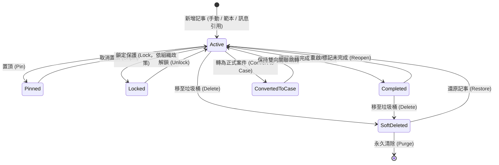

# 對話記事本管理規格（Chat Notes Management Specification）

> 最後對齊實作：2026-10-05。本文件描述目前程式行為；尚未實作的規劃項目以「（規劃中）」標示。

## 1. 文件目的與設計原則（Purpose & Design Principles）

### 1.1 背景與問題意識
在 LINE 官方帳號（LINE OA）的日常營運中，每個聯絡人或群組聊天室皆可累積上百筆的對話記事（Chat Notes）。若僅將記事本視為「聊天側欄的小型便利貼」，當單一 OA 累積數千至數萬筆記事時，將面臨資訊碎片化、缺乏生命週期、無檢索治理機制等痛點。

同時，本系統作為**跨產業、跨場景的通用 SaaS 平台**，使用者涵蓋商業公司、工程單位、民意服務處、政府機關、學校教務、補習班、社團組織到個人工作室等。因此，對話記事本不可偏廢於單一特定業務，而必須具備**高度通用化（General-Purpose）**與**彈性治理機制（Flexible Governance）**。

### 1.2 核心原則（Core Principles）
1. **通用化與中性架構（Industry-Agnostic & General Purpose）**：
   - 核心欄位高度中性（標題、內文、分類、標籤、關聯成員、到期日、引用訊息），不綁死特定行業名詞。
   - 支援廣泛場景：商務、工程、民意服務、教育、售後客服、醫療照護、社團活動等；預設分類維持精簡，行業專屬分類由組織自行新增。
2. **雙層管理架構（Two-Tier Architecture）**：
   - **聊天室側欄檢視（Room-Level View）**：專注於「當前對象的即時溝通、快速備忘、重點置頂與交接指引」。
   - **全域記事管理中心（Global Note Hub）**：提供「跨聊天室總覽、多維度篩選、批次處理、統計看板與全文檢索」。
3. **三位一體資訊邊界（Clear Information Boundaries）**：
   - **聯絡人備註（Contact Notes）**：記錄「這個對象是誰」（靜態人設、基本特徵）。
   - **對話記事本（Chat Notes）**：記錄「這段對話中發生的事與工作交接」（動態事件、對話上下文備忘）。
   - **案件（Cases）**：管理「需要跨部門、跨階段追蹤並有正式結案流程的工作事項」（工單任務）。
4. **靈活團隊治理（Flexible Governance for Small & Large Teams）**：
   - 考量多數後台僅 1~2 人身兼數職，繁瑣的權限限制會成為工作干擾；因此「鎖定保護」等控制功能由乙級組織管理員決定是否啟用。
5. **手動明確儲存防護（Explicit Manual Save & No Auto-Save）**：
   - 無論組織採取何種鎖定政策，所有新增、編輯修改**一律必須由使用者手動點擊「儲存」按鈕才寫入生效**。
   - **嚴禁即時自動儲存（No Auto-save）與輸入框失焦自動儲存**；編輯狀態隨時可點擊「取消」放棄修改，徹底杜絕瀏覽或點選時誤觸鍵盤導致內容被自動覆蓋。
   - **唯一例外：Markdown 待辦勾選**。卡片或預覽中的 `- [ ]`／`- [x]` 方框可直接勾選並立即儲存（見 7.3），只切換該方框，不改動其他文字。

---

## 2. 通用化應用場景矩陣（Cross-Industry Scenarios）

本系統的記事本架構可套用於各類組織情境。下表為應用範例；實際預設分類只有 4 個通用項目（見 7.1.2），各行業可自行新增分類與標籤：

| 應用領域 | 場景說明 | 記事本範例與應用模式 | 常用標籤/分類範例 |
|---|---|---|---|
| **商務商談** (Business & Sales) | 客戶訪談、報價條件、採購偏好、付款共識 | 記錄客戶報價談判條件、交期承諾、採購窗口聯絡備忘 | `#報價議價`、`#交期確認`、`#重點大客戶` |
| **工程工務** (Engineering & Ops) | 現場勘查、施工規範、料件型號、修繕回報 | 施工前場勘細節、指定材料規格編號、現場出工注意事項 | `#工務派工`、`#材料型號`、`#安全須知` |
| **政策民意** (Policy & Public Affairs) | 選民陳情、陳情會勘、法案政策諮詢、跨局處追蹤 | 記錄陳情人陳情要點、會勘結論、公文辦理文號及承辦人 | `#會勘結論`、`#選民陳情`、`#跨局處協調` |
| **商務協商** (Negotiation & Deals) | 跨組織合作、分潤條款、合約協議、保密事項 | 記錄雙方會議協議原則、權利金比例、履約階段驗收標準 | `#合作備忘`、`#條款確認`、`#待簽約` |
| **學校教務** (Academic & Education) | 註冊選課、學籍異動、課程調度、校務行政通知 | 學生選課退選申請、補考安排、特殊輔導諮商交代事項 | `#註冊選課`、`#教務交接`、`#學籍管理` |
| **學生筆記** (Student & Tutoring) | 課堂重點、作業進度、學習歷程、家長聯絡 | 課堂問答摘要、一對一家教進度、弱點單元追蹤、家長交代 | `#作業提醒`、`#學習歷程`、`#家長聯絡` |
| **售後客服** (Customer Support) | 客訴處理、退換貨協議、特殊補償、技術排障 | 記錄使用者操作障礙步驟、退貨取件時間、補發折價券紀錄 | `#客訴追蹤`、`#退換貨`、`#VIP特例` |
| **醫療長照** (Healthcare & Care) | 照護指引、用藥叮嚀、家屬交代、特殊過敏史 | 記錄長者特殊飲食禁忌、復健時間表、就醫陪同回報 | `#用藥注意`、`#家屬交代`、`#照護指引` |
| **社團志工** (Community & NGO) | 活動籌備、物資清冊、志工排班、捐款核銷 | 志工活動現場分工、活動物資點收清單、報名特殊狀況 | `#活動籌備`、`#物資清冊`、`#志工排班` |

---

## 3. 名詞定義與資料模型（Terminology & Data Model）

| 中文名稱 | 英文術語 | 程式命名 / 資料庫欄位 | 定義與說明 |
|---|---|---|---|
| 對話記事 | Chat Note | `chat_note` / `chat_notes` | 附屬於特定聊天室（OA + Recipient）的單筆結構化記事 |
| 記事標題 | Note Title | `title` | 記事摘要標題（1~100 字元） |
| 記事內文 | Note Content | `content` | 記事詳細內容（支援純文字、條列、Markdown、引用訊息） |
| 記事分類/類型 | Note Category / Type | `category_id` / `note_type` | 組織自訂之記事業務類別（預設：一般備忘、商務往來、問題處理、待辦交接）；`note_type` 存分類名稱，`category_id` 指向 `chat_note_categories` |
| 記事標籤 | Note Tag | `tags_json` / `chat_note_tag_assignments` | 標記記事屬性之標籤（與聯絡人標籤 `contact_tag` 獨立），只能從治理清單選取 |
| 置頂記事 | Pinned Note | `is_pinned` | 固定於聊天室頂部之關鍵記事（單一聊天室最多 5 筆） |
| 鎖定記事 | Locked Note | `is_locked` | 經鎖定之記事防止非授權人員誤改（鎖定政策依組織設定而定） |
| 完成狀態 | Completed / Active | `is_completed` | 標記此記事事項是否已處理完畢（已完成事項自動折疊或歸檔） |
| 到期日/預定日 | Due Date | `due_date` | 此事項之預計完成時間或執行日期（YYYY-MM-DD，選填） |
| 關聯成員 | Target Member | `target_user_id` / `about_member_id` | 群組聊天室中，指定此記事所屬或針對之群成員 LINE UID |
| 建立人員 | Author | `author` | 建立記事的後台身分；全員協作防護模式下用來判斷操作人員能否解鎖 |
| 關聯案件 | Linked Case | `linked_case_id` | 此記事若已升級或關聯至案件，記錄對應之 `Case.id` |
| 引用訊息 | Source Message | `source_message_id` | 建立記事時所引用的原始 LINE 訊息 ID |

---

## 4. 記事生命週期與狀態流轉（Lifecycle & State Transitions）



### 4.1 狀態定義與操作規則
1. **進行中（Active）**：
   - 預設狀態。顯示於聊天室側欄與全域管理清單中。
2. **置頂（Pinned）**：
   - 每個聊天室最多允許 **5 筆**置頂。
   - 置頂記事在聊天室側欄頂部固定顯示，並帶有特殊圖示與醒目邊框，供交接人員第一時間掌握核心須知。
3. **完成與歸檔（Completed）**：
   - 事項處理完畢後（例如：已完成會勘、已確認報價），一鍵標記「已完成」。
   - 側欄預設折疊已完成項目，維持版面清爽，但仍可展開查閱；全域中心可依狀態篩選。
4. **轉為案件（Convert to Case）**：
   - 當記事內容升級為重大事件、跨部門專案、複雜客訴時，可一鍵轉為正式案件。
   - 系統自動帶入標題、內文、關聯對象與引文，建立成功後維持雙向連結（`linked_case_id`）。
5. **回收筒與軟刪除（Soft Delete & Retention）**：
   - 刪除記事採軟刪除（`deleted_at` 寫入時間，空字串表示正常），同時取消置頂，移入回收筒保存 30 天。
   - 聊天側欄列表底部的回收筒按鈕可查看並還原；超過 30 天的記事在下次載入該聊天室記事時自動清除，組織管理員也可手動永久刪除。
   - 已鎖定的記事不能刪除，也不能切換完成狀態。

---

## 5. 鎖定防篡改機制與組織彈性開關（Lock Policy & Governance）

### 5.1 痛點分析與設計考量
- **大型團隊 / 嚴格合規組織**：需要防止一般人員誤刪、篡改重大協議或歷史交接紀錄，需要強制的管理員鎖定機制。
- **小型團隊 / 身兼數職微型組織（1~2人）**：過於嚴格的權限鎖定會造成操作繁瑣、阻礙流暢編輯。

### 5.2 組織防護政策（Organization Lock Policy Setting）
組織管理員（`org_admin`）可在「組織設定 ➔ 記事本治理」中選擇防護模式。**同一個政策同時套用記事與案件的上鎖／解鎖**。任何模式下，上鎖後內容皆為唯讀（可閱覽、可複製，不可編輯、刪除、勾選待辦或切換完成）。

| 防護模式 (Lock Policy) | 適用場景 | 誰可以上鎖 | 誰可以解鎖 |
|---|---|---|---|
| **自由編輯模式（預設）**<br>`policy = "disabled"` | 1~3 人小型團隊、身兼數職 | 組織管理員、操作人員、協作人員 | 同左（任何授權角色皆可解鎖任何紀錄） |
| **全員協作防護**<br>`policy = "collaborative"` | 多人共編、需防止誤改 | 組織管理員、操作人員（協作人員不可操作鎖頭） | 組織管理員可解鎖全部；操作人員**只能解鎖自己建立的紀錄**（記事比對 `author`，案件比對建立案件的活動紀錄） |
| **管理員嚴格管控**<br>`policy = "strict_admin"` | 分工嚴謹、具審查制度 | 僅組織管理員 | 僅組織管理員 |

補充規則：
1. 平台管理員與「視角預覽」狀態一律不可上鎖或解鎖。
2. 無權操作鎖頭時，介面只顯示唯讀鎖頭圖示，滑鼠提示說明原因（已上鎖、已結案或目前視角僅可閱覽）。
3. 不論模式為何，新增與編輯都必須手動按「儲存」才寫入；未儲存就關閉會跳出防呆警告（見 5.3）。
4. 已結案的案件在介面上同樣視為唯讀，但結案狀態不受防護政策控制。

### 5.3 編輯防呆與未儲存警告機制（Unsaved Changes Guard）
為徹底杜絕「誤改自動儲存」或「打到一半誤關遺失」，前端表單導入表單變更防呆（Dirty State Guard）：
1. **未儲存離開警告（Unsaved Changes Warning）**：
   - 當使用者在編輯或新增記事過程中已有修改輸入，若嘗試點擊「取消」、按右上角「關閉」、切換至其他聊天室、重新整理或離開頁面時：
   - 系統**強制跳出確認通知視窗**（搭配 warning 三角向量圖示）：
     > 「**您有尚未儲存的修改內容**：離開將會遺失剛才的編輯內容，確定要放棄變更嗎？」
     > 按鈕選項：`[繼續編輯]`（停留在表單） / `[放棄變更]`（確認捨棄並關閉）。
2. **明確儲存防線**：
   - 只有在使用者明確按下「儲存」按鈕且後端回傳 HTTP 200 後，變更才會持久化寫入資料庫。

---

## 6. Apple iOS / macOS 視覺風格與雙層管理介面（Apple HIG UI Architecture）

### 6.1 Apple HIG 設計美學原則（Apple Human Interface Guidelines）
記事本與管理中心全面導入 **Apple iOS / macOS 現代原生美學（Apple Notes & Reminders Design System）**：
1. **材質與毛玻璃質感（Materials & Frosted Glass Vibrancy）**：
   - 頂欄與側欄面板採用 Apple 經典霧面毛玻璃效果（`backdrop-filter: blur(20px); -webkit-backdrop-filter: blur(20px); background: rgba(255, 255, 255, 0.85);`）。
   - 搭配超細髮絲邊框（Subtle Hairline Border：`1px solid rgba(0, 0, 0, 0.08)`）與多層柔和微陰影，捨棄厚重黑邊。
2. **連續平滑圓角（Smooth Squircle Radii）**：
   - 外層面板與大卡片：`rounded-2xl`（16px ~ 20px）。
   - 記事卡片：`rounded-xl`（12px ~ 14px）。
   - 標籤與狀態徽章：`rounded-full`（膠囊形狀 Pill Badge）。
   - 操作按鈕與輸入框：`rounded-xl`（10px）。
3. **字體與排版層次（Apple Typography System）**：
   - 字體優先採用 `-apple-system, BlinkMacSystemFont, "SF Pro Text", "SF Pro Display", "PingFang TC", sans-serif`。
   - 標題與內文層次分明：卡片標題（15px Semi-bold）、內文（13.5px Regular，行高 1.55）、時間與標籤（12px Medium）、輔助資訊（11px Regular 次級灰）。
4. **Apple 經典膠囊徽章（Capsule Pill Badges）**：
   - 採用 Apple Notes/Reminders 風格：10%~15% 低飽和淺底色搭配 100% 飽和文字與 20% 細邊框（例如：`background: rgba(0, 122, 255, 0.12); color: #007AFF; border: 1px solid rgba(0, 122, 255, 0.2);`）。
5. **嚴格禁止原生 Emoji 圖示（Strictly No Native Emojis）**：
   - 全面採用純向量 SVG 與 CSS 圖示（Apple SF Symbols 風格），嚴禁使用作業系統預設 Emoji，確保跨瀏覽器與跨裝置視覺渲染一致。

---

### 6.2 聊天室側欄工作面板（Room-Level View）
- **位置**：「聊天」畫面右側資訊欄，聯絡資料卡下方。記事與案件共用同一個工作面板，以分頁切換。
- **統計卡**：頂部三張卡片：對話記事（總數與待處理數）、關聯案件（總數與進行中數）、逾期案件（有逾期時以警示色呈現）。
- **分頁**：「對話記事 (N)」／「關聯案件 (N)」。
- **控制列（固定於列表上方）**：
  - 搜尋框（搜尋標題、內容、分類與標籤）＋「新增」按鈕。
  - 狀態篩選並附數量：全部／待處理／已完成（案件為「已結案」）／已置頂（僅記事）。
  - 排序：建立時間新→舊或舊→新；置頂紀錄永遠排在最前。
  - 每個聊天室各自保留分頁、搜尋、篩選與排序狀態，切換聊天室後返回時不會重置。
- **列表**：獨立捲動，每頁 12 筆，底部顯示「起–迄 / 總數 筆」與上一頁／下一頁；記事分頁另有回收筒按鈕。紀錄依「置頂」與建立月份分組。
- **記事卡片**：顯示標題、建立時間、內容摘要、狀態、分類與標籤；**不顯示任何識別碼**。待辦方框可直接勾選（自動儲存）。
  - 雙擊卡片、按 Enter 或點預覽按鈕開啟預覽視窗；預覽內可編輯或刪除（移至回收筒）。
  - 操作列置於卡片底部並可換行：釘選、鎖頭（依 5.2 規則顯示）、預覽；複製內容、轉為案件、標記完成、編輯、刪除等次要操作收進「更多操作」選單。
- **編輯表單**：內容區至少 280px 高並可手動拉高；標籤只能勾選既有治理清單，每則最多 5 個，儲存記事不會自動新增標籤。
- 圖示一律使用向量 SVG（見 6.4）。

---

### 6.3 全域對話記事本管理中心（Global Note Hub，參考 macOS Notes & Reminders）
- **入口**：後台主導覽列「記事本管理」或於聊天室側欄點擊「管理檢視」。
- **檢視模式**：
  - **卡片檢視（Grid View）**：macOS Notes 磁貼卡片佈局，直觀瀏覽記事顏色條與標籤膠囊。
  - **表格檢視（Table View）**：macOS Finder / TableView 精緻排版，適合大量數據檢視、排序、批次勾選。
- **篩選工具列（目前實作）**：
  1. **關鍵字搜尋**：搜尋記事標題、內容或對話對象。
  2. **LINE OA 篩選**：全部 LINE OA 或指定 OA。
  3. **記事分類**：下拉選單，附各分類篇數。
  4. **記事標籤**：下拉選單，附各標籤篇數。
  5. **狀態**：全部／進行中／已完成／已置頂／已鎖定；上方另有狀態分頁「全部、待追蹤、已完成、已釘選」並附數量。
  6. **排序**：建立時間新→舊或舊→新。
- **單筆操作**：查看詳情、編輯、置頂、鎖定、標記完成、複製內容、轉為案件、刪除、開啟聊天室。
- **匯出**：CSV（含 BOM，Excel 可直接開啟）、Markdown、JSON；限組織管理員、操作人員（平台管理員可唯讀匯出）。
- **分類與標籤管理**：工具列提供「分類與標籤管理」入口（見 7.1、7.2）。
- **規劃中**：日期範圍與建立人員篩選、批次變更分類／標籤、批次完成、批次刪除與還原。

---

### 6.4 向量圖示庫對照規範（Apple SF Symbols Inspired Vector SVGs）
系統介面一律使用純向量 SVG（16×16 或 20×20 px，線寬 1.5px / 2px，`stroke-linecap="round" stroke-linejoin="round"`）：

| 功能語意 | Apple SF Symbol 參照 | SVG 圖示用途說明 |
|---|---|---|
| **置頂記事** | `pin.fill` | 顯示於置頂記事卡片頂部，黃色/琥珀色高亮 |
| **鎖定防護** | `lock.fill` / `lock.open` | 鎖定唯讀狀態切換與指示 |
| **複製文字** | `doc.on.doc` | 唯讀狀態下一鍵複製內文至剪貼簿 |
| **轉為案件** | `briefcase` | 記事升級轉為案件工單按鈕 |
| **編輯記事** | `square.and.pencil` | 開啟編輯表單按鈕 |
| **完成標記** | `checkmark.circle.fill` | 綠色勾選標記已處理完畢 |
| **垃圾桶刪除** | `trash` | 軟刪除記事按鈕 |
| **還原記事** | `arrow.uturn.backward` | 從垃圾桶還原記事按鈕 |
| **放大鏡搜尋** | `magnifyingglass` | 全域與聊天室側欄搜尋輸入框圖示 |
| **標籤圖示** | `tag.fill` | 標籤膠囊左側向量圖示 |
| **分類資料夾** | `folder.fill` | 業務分類左側向量圖示 |
| **未儲存警告** | `exclamationmark.triangle.fill` | 未儲存離開防呆通知對話框標題圖示 |

---

## 7. 分類、標籤與範本體系（Taxonomy & Templates）

### 7.1 記事分類管理與治理機制（Note Category Governance）

#### 7.1.1 權限制度與分工（比照標籤制度）
- **乙級（組織管理員）與 丙級（操作人員）**：擁有完整「記事分類管理」權限，可新增分類、修改名稱、調整代表色票、設定排序權重、執行分類合併與刪除。
- **丁級（協作人員）**：**僅能於撰寫/編輯記事時「下拉選取分類」**，無分類管理權限，不可新增或修改分類庫。
- **甲級（平台管理員）**：根本用不到（不參與客戶營運資料與分類設定）。

#### 7.1.2 系統預設 4 個通用分類（Apple 系統色）
新 OA 預建 4 個跨行業通用分類，**乙級與丙級可自由改名、調色或新增**。記事分類、範本分類與案件類別共用這 4 個名稱：

| 預設分類名稱 | Apple 系統色 (Hex) | 適用場景 |
|---|:---:|---|
| **一般備忘** | System Gray (`#8E8E93`) | 日常聯絡、主管交代、內部行政備忘；系統保留項目，不可改名或刪除 |
| **商務往來** | System Blue (`#007AFF`) | 詢價、報價、合作與諮詢 |
| **問題處理** | System Orange (`#FF9500`) | 報修、客訴、售後與反映 |
| **待辦交接** | System Green (`#34C759`) | 待辦事項、輪班交接、約定事項 |

**舊預設項目合併（一次性）**：系統啟動時執行一次 `compact-defaults-20261005` 合併（`line-oa-archive/compact_defaults.py`），將舊版內建分類（商務商談、工程工務、政策民意、學校教務、售後客服、學生筆記、一般、諮詢、報修、待辦、交接事項等）對應到上述 4 類，歷史記事與案件一併移轉；**使用者自訂的分類不受影響**。執行紀錄寫入 `defaults_migrations`，不會重複執行。

#### 7.1.3 分類維護與治理工具（Category Maintenance & Merge）
1. **分類合併（Category Merge）**：
   - 當組織發現分類重疊（如自訂的「客戶洽談」與「商務商談」），管理員可一鍵將多個分類合併為單一標準分類，系統自動批次更新所有歷史關聯記事。
2. **刪除防呆與自動轉移**：
   - 欲刪除之分類若仍有現存記事，系統強制提示：「此分類尚有 N 篇記事，請選擇轉移至目標分類或設為未分類」，避免記事失去歸屬。

---

### 7.2 記事標籤治理與防氾濫管理機制（Note Tag Governance & Anti-Sprawl）

#### 7.2.1 標籤氾濫痛點（Problem Statement）
若允許每位同仁在撰寫筆記時隨意輸入自創標籤，短期內將迅速產生大量同義、錯字或重複標籤（例如：`#報價`、`#報價單`、`#客戶報價`、`#已報價`、`#quotation`），導致檢索失效與統計混亂。

#### 7.2.2 系統預設 8 個通用標籤（Apple 系統色）
**乙級與丙級可依實際營運狀況調整、改名或刪除**：

| 預設標籤名稱 | Apple 系統色 (Hex) | 分組 | 範例用途 |
|---|:---:|---|---|
| `急件優先` | System Red (`#FF3B30`) | 優先等級 | 需當日或即時處理 |
| `待確認` | System Yellow (`#FFCC00`) | 追蹤 | 需主管或對方確認後才能執行 |
| `待追蹤` | System Teal (`#30B0C7`) | 追蹤 | 需回訪、後續跟進 |
| `需回覆` | System Purple (`#AF52DE`) | 追蹤 | 尚待回覆對方 |
| `已報價` | System Blue (`#007AFF`) | 商務 | 已提供報價單或報價條件 |
| `合約文件` | System Indigo (`#5856D6`) | 文件 | 涉及合約、條款或正式文件 |
| `技術支援` | System Orange (`#FF9500`) | 服務 | 技術排障、維修支援 |
| `交接事項` | System Green (`#34C759`) | 協作 | 同仁輪班或休假交接 |

一次性合併同時處理舊標籤：「待主管確認、重要協議」併入 `待確認`；「需二次回訪、現場勘查、交接待辦、處理中」併入 `待追蹤`；與分類重複的舊範本標籤「聯絡紀錄、待辦、交接」自記事移除並刪除。

#### 7.2.3 標籤權限分工與建立政策（Tag Permission Matrix & Creation Policy）
為確保標籤庫乾淨且符合營運分工，標籤權限嚴格劃分如下：
- **乙級（組織管理員）與 丙級（操作人員）**：擁有完整「記事標籤管理」權限，可新增標準標籤、自訂顏色分組、執行標籤合併（Tag Merge）及清理廢棄標籤。
- **丁級（協作人員）**：**僅能「選擇是否使用」既有標籤**，無標籤管理介面權限，無法自創新標籤或修改標籤庫。
- **甲級（平台管理員）**：根本用不到（不參與客戶營運內容與標籤維護）。

**目前實作：記事只能選用治理清單中的既有標籤**。儲存記事時若帶入清單外的標籤，後端拒絕並提示「請選用清單中的既有標籤；新增標籤請至分類與標籤管理」。新增標籤一律透過「分類與標籤管理」介面（乙、丙級）。

組織設定中仍保留標籤政策選項（`note_tag_policy`：`controlled` 集中規範管理／`open` 全員自由自訂），設定會被儲存並記錄稽核，**但目前不影響實際行為**；介面上兩個選項的說明（「僅組織管理員可管理」、「全員可自創標籤」）與現行行為不符，待後續決定移除或重新實作。

#### 7.2.4 標籤維護與治理工具（Tag Maintenance & Merging Tools）
後台「記事標籤管理」介面（僅開放給乙級與丙級人員）提供以下治理功能：
1. **標籤合併（Tag Merge）**：
   - 勾選多個同義標籤（例如：勾選 `#報價單`、`#已報價`、`#客戶報價`），點擊「合併至...」並指定目標標籤（例如 `#報價確認`）。
   - 系統自動批次將所有歷史關聯記事轉換為目標標籤，並安全刪除被合併的舊標籤。
2. **標籤即時更名與調色（Tag Rename & Recolor）**：
   - 修改標籤名稱或顏色，所有關聯之歷史記事無縫即時更新。
3. **引用計數與一鍵清理（Usage Count & Orphan Cleanup）**：
   - 標籤清單清晰標示使用量（如：`#急件 (128篇)`、`#待簽約 (14篇)`、`#舊版測試 (0篇)`）。
   - 提供「一鍵清除無任何記事引用之孤立標籤」功能，常保標籤庫簡潔乾淨。
4. **單一標籤刪除**：刪除標籤時同步移除所有記事上的該標籤。

### 7.3 跨場景範本與 Markdown 骨架（Universal Templates & Markdown）
- 支援與「案件管理」共用範本架構（見[案件管理流程規格](案件管理流程規格.md)「17. 記事與案件共用規則」與[範本與分類管理](範本與分類管理.md)）。
- **通用預設範本**：內建 3 個記事範本：聯絡紀錄（一般備忘，預設標籤 `待追蹤`）、待辦事項（待辦交接，預設標籤 `待確認`）、交接備忘（待辦交接）。管理者可修改或停用內建範本。
- **Markdown 格式與 SOP 檢查清單**：
  - 記事內文與範本骨架全面支援純文字與 Markdown 雙模式。
  - 支援 Markdown 標題、條列清單、粗體、行內程式碼以及 SOP 檢查清單（`- [ ]` 待辦、`- [x]` 已完成）。
  - 編輯時提供「編輯／預覽」切換（向量圖示，不使用 Emoji）。
- **待辦勾選（自動儲存）**：
  - `- [ ]`、`- [x]`、`* [ ]`、`* [x]`（可縮排）皆視為待辦；程式碼區塊（```）內的方框不轉成待辦。
  - 在側欄卡片、預覽視窗或全域管理中心勾選時，前端呼叫 `POST /api/chat-notes/task`，帶 `note_id`、待辦序號 `task_index`（從 0 起算）、`checked` 與目前內容 `expected_content`；後端只改該方框的 `x`／空白，其他內容不變。
  - 若內容已被他人修改（`expected_content` 不符）會拒絕並提示重新開啟預覽；鎖定記事、已刪除記事與唯讀視角不可勾選。
  - 每次勾選寫入稽核紀錄（`chat_note.task`）。
- **快速帶入膠囊**：
  - 撰寫記事時，表單頂部提供常用範本膠囊按鈕，點擊一鍵直接帶入標題、分類、標籤與 Markdown 內容骨架，無需多層彈窗。
- **範本輕量管理與批次維護**：
  - 範本清單支援低調圖標化刪除（Icon-only）與多筆勾選批次刪除（Batch Delete）。

---

## 8. 權限與角色矩陣（Permissions Matrix）

| 權限級別 | 角色名稱 | 檢視記事 | 新增/編輯/勾選待辦 | 選用分類與標籤 | 管理分類與標籤庫 | 完成/置頂 | 鎖定/解鎖 | 刪除與還原 | 永久刪除 | 轉為案件 | 匯出 |
|:---:|---|:---:|:---:|:---:|:---:|:---:|:---:|:---:|:---:|:---:|:---:|
| **甲級** | 平台管理員 (`platform_admin`) | 唯讀 | ✗ | ✗ | ✗ | ✗ | ✗ | ✗ | ✗ | ✗ | ✓（唯讀匯出） |
| **乙級** | 組織管理員 (`org_admin`) | ✓ | ✓ | ✓ | ✓ | ✓ | ✓（所有模式） | ✓ | ✓ | ✓ | ✓ |
| **丙級** | 操作人員 (`operator`) | ✓ | ✓ | ✓ | ✓ | ✓ | 依 5.2 | ✓ | ✗ | ✓ | ✓ |
| **丁級** | 協作人員 (`collaborator`) | ✓ | ✓ | ✓（僅選用） | ✗ | ✓ | 僅自由編輯模式 | ✓ | ✗ | ✓ | ✗ |

已鎖定的記事對所有角色都是唯讀；視角預覽狀態不可寫入。

---

## 9. 容量配額與本機效能治理（Capacity Quotas & Performance）

所有數值定義於 `line-oa-archive/limits.py`。

| 項目 | 上限值 | 說明 |
|---|---|---|
| **單一聊天室記事上限** | **100 筆**（`NOTES_PER_ROOM`） | 達上限時禁止新增，提示「請先歸檔或刪除舊記事」。 |
| **單一聊天室置頂上限** | **5 筆**（`PINNED_NOTES_PER_ROOM`） | 超過時提示需先取消現有置頂。 |
| **單筆記事內文上限** | **2,000 字**（`NOTE_CONTENT_MAX`） | 標題上限 100 字。 |
| **單筆記事標籤上限** | **5 個**（`TAGS_PER_NOTE`） | 超過的部分不會儲存。 |
| **單一 OA 記事標籤上限** | **30 個**（`NOTE_TAGS_PER_OA`） | 標籤名稱 1~30 字。 |
| **單一 OA 記事分類上限** | **50 個**（`NOTE_CATEGORIES_PER_OA`） | |
| **自訂篩選條件** | **10 組**（`SAVED_FILTERS_PER_OA`） | |
| **回收筒保留天數** | **30 天**（`NOTE_TRASH_DAYS`） | 超過後於載入聊天室記事時自動永久刪除。 |

---

## 10. 資料庫綱要與 API 端點設計（Database & API Spec）

### 10.1 資料庫資料表綱要（Database Schema）
以 `line-oa-archive/schema.sql` 為準，以下為摘要：

```sql
CREATE TABLE IF NOT EXISTS chat_notes (
    note_id TEXT PRIMARY KEY,
    channel_id TEXT NOT NULL,                      -- 所屬 LINE OA
    recipient_id TEXT NOT NULL,                    -- 所屬聊天室（個人、群組或多人聊天室）
    target_user_id TEXT NOT NULL DEFAULT '',       -- 群組時關聯之成員 UID
    title TEXT NOT NULL DEFAULT '',
    note_type TEXT NOT NULL DEFAULT '一般',         -- 分類名稱（新資料由程式寫入「一般備忘」）
    category_id TEXT NOT NULL DEFAULT '',          -- 對應 chat_note_categories
    tags_json TEXT NOT NULL DEFAULT '[]',          -- 標籤名稱陣列，與 chat_note_tag_assignments 同步
    content TEXT NOT NULL,                         -- 純文字 / Markdown
    is_pinned INTEGER NOT NULL DEFAULT 0,
    is_locked INTEGER NOT NULL DEFAULT 0,
    about_member_id TEXT NOT NULL DEFAULT '',
    due_date TEXT NOT NULL DEFAULT '',
    is_completed INTEGER NOT NULL DEFAULT 0,
    source_message_id TEXT NOT NULL DEFAULT '',
    linked_case_id TEXT NOT NULL DEFAULT '',
    deleted_at TEXT NOT NULL DEFAULT '',           -- 空字串表示正常；有值表示在回收筒
    author TEXT NOT NULL,                          -- 建立人員
    created_at TEXT NOT NULL,
    updated_at TEXT NOT NULL
);
CREATE INDEX IF NOT EXISTS idx_chat_notes_lookup ON chat_notes(channel_id, recipient_id, deleted_at, is_pinned DESC, updated_at DESC);
CREATE INDEX IF NOT EXISTS idx_chat_notes_global ON chat_notes(channel_id, deleted_at, is_completed, updated_at DESC);
CREATE INDEX IF NOT EXISTS idx_chat_notes_case ON chat_notes(channel_id, linked_case_id) WHERE linked_case_id != '';
```

### 10.2 記事分類、標籤與關聯表

```sql
CREATE TABLE IF NOT EXISTS chat_note_categories (
    category_id TEXT PRIMARY KEY, channel_id TEXT NOT NULL, name TEXT NOT NULL,
    color TEXT NOT NULL DEFAULT '#007AFF', sort_order INTEGER NOT NULL DEFAULT 0,
    created_at TEXT NOT NULL, UNIQUE(channel_id, name)
);
CREATE TABLE IF NOT EXISTS chat_note_tags (
    tag_id TEXT PRIMARY KEY, channel_id TEXT NOT NULL, name TEXT NOT NULL,
    color TEXT NOT NULL DEFAULT '#007AFF', category TEXT NOT NULL DEFAULT 'general',
    created_at TEXT NOT NULL, UNIQUE(channel_id, name)
);
CREATE TABLE IF NOT EXISTS chat_note_tag_assignments (
    channel_id TEXT NOT NULL, note_id TEXT NOT NULL, tag_id TEXT NOT NULL,
    created_at TEXT NOT NULL, PRIMARY KEY (channel_id, note_id, tag_id)
);
-- 一次性預設項目合併的執行紀錄
CREATE TABLE IF NOT EXISTS defaults_migrations (
    migration_key TEXT PRIMARY KEY, applied_at TEXT NOT NULL
);
```

### 10.3 組織治理設定（Organization Note Settings）
位於 `organizations` 表：
```sql
note_lock_policy TEXT NOT NULL DEFAULT 'disabled'
    CHECK (note_lock_policy IN ('disabled', 'collaborative', 'strict_admin')),  -- 同時套用記事與案件
note_tag_policy TEXT NOT NULL DEFAULT 'controlled'
    CHECK (note_tag_policy IN ('controlled', 'open'))                           -- 目前僅儲存，不影響行為
```
透過 `POST /api/org-settings/notes-policy` 更新（組織管理員；平台管理員需指定 `org_id`），並寫入稽核紀錄。

### 10.4 後端 RESTful API 端點

| HTTP Method | API 路由路徑 | 說明 | 存取角色權限 |
|---|---|---|---|
| `GET` | `/api/chat-notes?recipient_id={id}` | 指定聊天室的記事列表（含置頂、進行中、已完成統計與上限） | 乙、丙、丁（甲唯讀） |
| `GET` | `/api/chat-notes/global` | 全域記事查詢（跨聊天室篩選、排序） | 乙、丙、丁（甲唯讀） |
| `GET` | `/api/chat-notes/trash?recipient_id={id}` | 回收筒列表 | 乙、丙、丁（甲唯讀） |
| `POST` | `/api/chat-notes/save` | 新增或編輯記事（手動儲存；驗證鎖定、上限、併發修改與標籤清單） | 乙、丙、丁 |
| `POST` | `/api/chat-notes/task` | 勾選或取消單一 Markdown 待辦（自動儲存） | 乙、丙、丁 |
| `POST` | `/api/chat-notes/pin` | 切換置頂（驗證單室 5 筆上限） | 乙、丙、丁 |
| `POST` | `/api/chat-notes/lock` | 上鎖或解鎖（依 `note_lock_policy`，見 5.2） | 依組織政策 |
| `POST` | `/api/chat-notes/complete` | 標記完成或重啟（鎖定時不可） | 乙、丙、丁 |
| `POST` | `/api/chat-notes/convert-to-case` | 將記事轉為案件並建立雙向關聯 | 乙、丙、丁 |
| `POST` | `/api/chat-notes/delete` | 軟刪除（移入回收筒；鎖定時不可） | 乙、丙、丁 |
| `POST` | `/api/chat-notes/restore` | 從回收筒還原 | 乙、丙、丁 |
| `POST` | `/api/chat-notes/purge` | 永久刪除回收筒中的記事 | 乙級（組織管理員） |
| `GET` | `/api/chat-notes/categories` | 分類清單（含篇數與色票） | 乙、丙、丁 |
| `POST` | `/api/chat-notes/categories/save` | 新增或修改分類名稱、色票、排序 | 乙、丙 |
| `POST` | `/api/chat-notes/categories/merge` | 合併分類並移轉關聯記事 | 乙、丙 |
| `POST` | `/api/chat-notes/categories/delete` | 刪除分類（可指定轉移目標） | 乙、丙 |
| `GET` | `/api/chat-notes/tags` | 標籤清單（含篇數） | 乙、丙、丁 |
| `POST` | `/api/chat-notes/tags/save` | 新增或修改標籤名稱、顏色（同步更新歷史記事） | 乙、丙 |
| `POST` | `/api/chat-notes/tags/merge` | 合併同義標籤 | 乙、丙 |
| `POST` | `/api/chat-notes/tags/cleanup` | 清除 0 篇引用的孤立標籤 | 乙、丙 |
| `POST` | `/api/chat-notes/tags/delete` | 刪除單一標籤並從記事移除 | 乙、丙 |
| `GET` | `/api/chat-notes/export?format=csv\|markdown\|json` | 匯出符合條件的記事 | 乙、丙（甲唯讀） |
| `POST` | `/api/org-settings/notes-policy` | 更新防護政策與標籤政策 | 乙級（甲需指定組織） |
