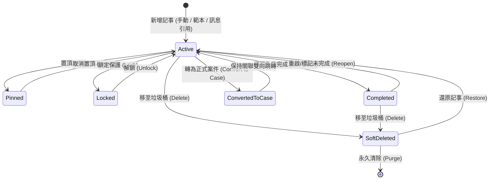

# 對話記事本管理規格（Chat Notes Management Specification）

## 1. 文件目的與設計原則（Purpose & Design Principles）

### 1.1 背景與問題意識
在 LINE 官方帳號（LINE OA）的日常客服與營運中，每個聯絡人或群組的聊天室皆可建立高達上百筆的對話記事（Chat Notes）。若僅將記事本視為「聊天側欄的小型便利貼」，當單一 OA 累積數千至數萬筆記事時，將面臨以下營運痛點：
1. **資訊碎片化**：關鍵交代事項散落於各個聊天室，管理人員無法跨聊天室掌握進行中事項。
2. **缺乏生命週期**：重要備忘、待辦事項、已解決事項混雜，無有效歸檔或結案機制。
3. **無權限與防篡改制度**：重要溝通證據或關鍵交接資訊可能被誤改或誤刪。
4. **與案件管理脫節**：重大客訴或需跨部門追蹤的事項無法無縫升級為正式案件（Case）。

### 1.2 核心原則（Core Principles）
1. **雙層管理架構（Two-Tier Architecture）**：
   - **聊天室側欄檢視（Room-Level View）**：專注於「當前對象的即時溝通、快速備忘與置頂指引」。
   - **全域記事管理中心（Global Note Hub）**：提供「跨聊天室總覽、多維度篩選、批次處理、統計與稽核治理」。
2. **三位一體資訊邊界（Clear Information Boundaries）**：
   - **聯絡人備註（Contact Notes）**：記錄「這個對象是誰」（靜態人設、基本特徵）。
   - **對話記事本（Chat Notes）**：記錄「這段對話中發生的事與工作交接」（動態事件、對話上下文備忘）。
   - **案件（Cases）**：管理「需要跨部門、跨階段追蹤並有正式結案流程的工作事項」（任務生命週期）。
3. **無縫升級機制（Progressive Escalation）**：
   - 對話訊息 ➔ 一鍵轉為記事本（Chat Note）。
   - 記事本事項 ➔ 一鍵升級為正式案件（Case），並保留完整原始引文與建立歷程。

---

## 2. 名詞定義與資料模型（Terminology & Data Model）

| 中文名稱 | 英文術語 | 程式命名 / 資料庫欄位 | 定義與說明 |
|---|---|---|---|
| 對話記事 | Chat Note | `chat_note` / `chat_notes` | 附屬於特定聊天室（OA + Recipient）的單筆結構化記事 |
| 記事標題 | Note Title | `title` | 記事摘要標題（1~100 字元） |
| 記事內文 | Note Content | `content` | 記事詳細內容（支援純文字、條列、引用訊息） |
| 記事分類/類型 | Note Category / Type | `category_id` / `category` | 組織自訂之記事業務類別（如：客戶需求、交接備忘、帳務問題） |
| 記事標籤 | Note Tag | `note_tag` | 用於靈活標記記事屬性之標籤（與聯絡人標籤 `contact_tag` 獨立） |
| 置頂記事 | Pinned Note | `is_pinned` | 固定於聊天室頂部之關鍵記事（單一聊天室最多 5 筆） |
| 鎖定記事 | Locked Note | `is_locked` | 經鎖定之記事禁止非管理員編輯或刪除，確保證據力 |
| 完成狀態 | Completed / Active | `is_completed` | 標記此記事事項是否已處理完畢（已完成事項自動折疊或歸檔） |
| 關聯成員 | Target Member | `target_user_id` | 群組聊天室中，指定此記事所屬或針對之群成員 LINE UID |
| 關聯案件 | Linked Case | `linked_case_id` | 此記事若已升級或關聯至案件，記錄對應之 `Case.id` |
| 引用訊息 | Source Message | `source_message_id` | 建立記事時所引用的原始 LINE 訊息 ID |

---

## 3. 記事生命週期與狀態流轉（Lifecycle & State Transitions）



### 3.1 狀態定義與操作規則
1. **進行中（Active）**：
   - 預設狀態。顯示於聊天室側欄與全域管理清單中。
2. **置頂（Pinned）**：
   - 每個聊天室最多允許 **5 筆**置頂。
   - 置頂記事在聊天室側欄頂部固定顯示，並帶有特殊圖示與醒目邊框，供交接人員第一時間掌握重要禁忌或核心須知。
3. **鎖定（Locked）**：
   - 由組織管理員（`org_admin`）或具授權人員鎖定。
   - 鎖定後內容唯讀，防止操作員（`operator`）或協作人員（`collaborator`）誤改。如需修改必須先由管理員解鎖。
4. **已完成（Completed）**：
   - 記事事項若已處理完畢（例如：已補寄發票、已電話聯繫確認），可一鍵標記「已完成」。
   - 側欄預設折疊已完成項目，維持版面清爽，但仍可展開查閱；全域中心可依狀態篩選。
5. **轉為案件（Convert to Case）**：
   - 當記事內容升級為重大事件、客訴、報修或需跨部門跑流程時，可點擊「轉為案件」。
   - 系統自動將記事標題、內容、關聯對象、引用訊息複製至案件建立表單，建立成功後自動建立雙向連結（`linked_case_id`），記事本保留為歷史依據。
6. **垃圾桶與軟刪除（Soft Delete & Retention）**：
   - 刪除記事採軟刪除（`deleted_at IS NOT NULL`），移入垃圾桶保存 30 天。
   - 垃圾桶內記事可一鍵還原；30 天後系統自動清理，或由管理員手動永久刪除。

---

## 4. 雙層管理介面架構（UI Architecture）

### 4.1 聊天室側欄記事本面板（Room-Level View）
- **入口**：位於「聊天」畫面右側資訊面板第 2 區塊（標籤下方、案件上方）。
- **標題欄**：
  - 顯示「記事本 `已用/上限`」（例如：`23/100`）。
  - 右側提供「`＋ 新增`」按鈕及「`🔎 管理檢視`」快速跳轉按鈕。
  - 提示文字：「僅後台成員可瀏覽與編輯，LINE 對方看不到」。
- **清單結構**：
  - **置頂區（Pinned Section）**：以徽章標註，優先排在最上方。
  - **一般進行中區（Active Section）**：依最後更新時間排序。
  - **已完成折疊區（Completed Section）**：預設收合，顯示「已完成事項 (N) ▼」。
- **單筆卡片操作選單（Actions）**：
  - `📌 置頂 / 取消置頂`
  - `🔒 鎖定 / 解鎖`
  - `💼 轉為案件`
  - `✏️ 編輯`
  - `✓ 標記完成 / 重啟`
  - `🗑️ 刪除`

### 4.2 全域對話記事本管理中心（Global Note Hub）
- **入口**：後台導覽列「記事本管理」或於聊天室側欄點擊「管理檢視」。
- **檢視模式**：
  - **卡片檢視（Grid View）**：適合快速瀏覽記事摘要與標籤。
  - **表格檢視（Table View）**：適合大量數據檢視、排序、批次勾選操作。
- **多維度篩選工具列（Filter Toolbar）**：
  1. **關鍵字搜尋**：搜尋標題、內文、建立者、對象名稱。
  2. **LINE OA 篩選**：多 OA 組織可切換或選擇全部 OA。
  3. **聊天對象篩選**：可指定特定個人或群組。
  4. **記事分類/類型**：下拉篩選（如：待辦、客訴、交接、合約）。
  5. **記事標籤**：多選標籤篩選。
  6. **狀態篩選**：全部 / 置頂 / 進行中 / 已完成 / 鎖定 / 已轉案件 / 垃圾桶。
  7. **日期範圍**：建立時間、最後修改時間、到期日範圍。
  8. **建立人員/負責人員**：篩選特定後台同仁所建立之記事。
- **批次操作（Batch Operations）**：
  - 批次變更分類 / 批次新增標籤。
  - 批次標記完成 / 批次取消完成。
  - 批次移至垃圾桶 / 批次還原。
  - 批次匯出（CSV / Excel / Markdown）。

---

## 5. 分類、標籤與範本體系（Taxonomy & Templates）

### 5.1 記事分類（Categories / Types）
組織管理員可在「記事與案件設定」中維護統一的業務類別：
- 預設分類：`一般備忘`、`客戶需求`、`問題追蹤`、`交接事項`、`重要協議`、`內部審核`。
- 每個分類可指定代表顏色與排序權重。

### 5.2 記事專屬標籤（Note Tags）
- 與聯絡人標籤（`Contact Tags`）完全解耦，專注於事件性質（如：`#急件`、`#待確認金額`、`#主管指示`、`#需二次回訪`）。
- 支援標籤自動補全（Auto-complete）與顏色自訂。

### 5.3 範本包與結構化輸入（Template Packs）
- 支援與「案件管理」共用範本機制（見[案件管理流程規格](案件管理流程規格.md)「17. 記事與案件共用規則」）。
- 範本範例：
  - **電話預約交接範本**：預約日期時間、服務項目、特殊要求、聯絡電話。
  - **客訴通報範本**：問題發生時間、客訴主旨、嚴重程度、初步回應、待辦事項。
- 從對話訊息「加入記事本」時，可套用範本並自動將引用訊息置於範本骨架後方。

---

## 6. 權限與多角色管理制度（Permissions & Access Control）

本系統遵循四級權限矩陣（詳見[權限與角色規格](權限與角色規格.md)）：

| 權限級別 | 角色名稱 | 檢視記事 | 新增/編輯記事 | 標記完成/置頂 | 鎖定/解鎖 | 刪除記事 | 轉為案件 | 批次操作/匯出 | 管理分類與範本 |
|:---:|---|:---:|:---:|:---:|:---:|:---:|:---:|:---:|:---:|
| **甲級** | 平台管理員 (`platform_admin`) | 👁 (唯讀) | ✗ | ✗ | ✗ | ✗ | ✗ | ✗ | ✗ (保護客戶隱私) |
| **乙級** | 組織管理員 (`org_admin`) | ✓ | ✓ | ✓ | ✓ | ✓ | ✓ | ✓ | ✓ |
| **丙級** | 操作人員 (`operator`) | ✓ | ✓ | ✓ | ✗ (僅能檢視鎖定) | ✓ (僅未鎖定) | ✓ | ✓ (受限) | ✗ |
| **丁級** | 協作人員 (`collaborator`) | ✓ | ✓ | ✓ | ✗ | ✓ (僅自己建立) | ✓ | ✗ | ✗ |

### 6.1 安全防護與鎖定規則
1. **鎖定保護**：已被鎖定（`is_locked = 1`）的記事，丙級與丁級人員點擊編輯時顯示「此記事已由管理員鎖定，如需修改請洽管理員」。
2. **操作紀錄稽核（Audit Trail）**：
   - 每筆記事皆記錄 `created_by`（建立者 Email）、`created_at`、`updated_by`（最後修改者）、`updated_at`。
   - 鎖定、解鎖、轉案件、刪除等重大動作皆寫入組織操作紀錄（Activity Log）。

---

## 7. 容量配額與本機效能治理（Capacity Quotas & Performance）

為確保本機單機部署環境（SQLite）運作流暢，訂定以下數量與儲存上限：

| 項目 | 上限值 | 說明與預警機制 |
|---|---|---|
| **單一聊天室記事上限** | **100 筆** | 達到 80 筆時顯示橘色預警；達到 100 筆時禁止新增，提示「請先歸檔或刪除舊記事」。 |
| **單一聊天室置頂上限** | **5 筆** | 超過 5 筆時提示需先取消現有置頂。 |
| **單一 OA 總記事上限** | **10,000 筆** | 達到 8,000 筆時於管理後台發出維護通知，建議執行舊記事封存。 |
| **單筆記事字數上限** | **2,000 字** | 標題上限 100 字，內文上限 2,000 字。 |
| **單筆記事標籤上限** | **10 個** | 避免過度標記影響檢索效能。 |
| **垃圾桶保留天數** | **30 天** | 超過 30 天由背景排程自動永久抹除。 |

---

## 8. 資料庫綱要與 API 端點設計（Database & API Spec）

### 8.1 資料庫資料表綱要（Database Schema）

```sql
CREATE TABLE IF NOT EXISTS chat_notes (
    note_id TEXT PRIMARY KEY,                       -- UUIDv4 (32 hex)
    channel_id TEXT NOT NULL,                       -- 所屬 LINE OA Channel ID
    recipient_id TEXT NOT NULL,                     -- 所屬聯絡對象 (User UID 或 Group ID)
    target_user_id TEXT DEFAULT '',                 -- 群組時關聯之成員 UID (選填)
    title TEXT NOT NULL,                            -- 記事標題 (1~100 字)
    content TEXT NOT NULL,                          -- 記事內文 (純文字/Markdown)
    category_id TEXT DEFAULT '',                    -- 分類 ID (關聯 note_categories)
    is_pinned INTEGER NOT NULL DEFAULT 0,           -- 是否置頂 (0: 否, 1: 是)
    is_locked INTEGER NOT NULL DEFAULT 0,           -- 是否鎖定 (0: 否, 1: 是)
    is_completed INTEGER NOT NULL DEFAULT 0,        -- 是否已完成 (0: 進行中, 1: 已完成)
    due_date TEXT DEFAULT '',                       -- 預計完成日期 (YYYY-MM-DD, 選填)
    source_message_id TEXT DEFAULT '',              -- 引用之 LINE Message ID
    linked_case_id TEXT DEFAULT '',                 -- 關聯之 Case ID
    created_by TEXT NOT NULL,                       -- 建立人員帳號 Email
    created_at TEXT NOT NULL,                       -- 建立時間 (ISO8601 UTC)
    updated_by TEXT NOT NULL,                       -- 最後修改人員帳號 Email
    updated_at TEXT NOT NULL,                       -- 最後修改時間 (ISO8601 UTC)
    deleted_at TEXT DEFAULT NULL,                   -- 軟刪除時間 (NULL 表示正常)
    FOREIGN KEY (channel_id) REFERENCES line_channels(channel_id) ON DELETE CASCADE
);

-- 索引優化
CREATE INDEX IF NOT EXISTS idx_chat_notes_lookup 
ON chat_notes (channel_id, recipient_id, deleted_at, is_pinned DESC, updated_at DESC);

CREATE INDEX IF NOT EXISTS idx_chat_notes_global
ON chat_notes (channel_id, deleted_at, is_completed, updated_at DESC);

CREATE INDEX IF NOT EXISTS idx_chat_notes_case
ON chat_notes (channel_id, linked_case_id) WHERE linked_case_id != '';
```

### 8.2 記事標籤關聯表（Note Tag Assignments）

```sql
CREATE TABLE IF NOT EXISTS chat_note_tag_assignments (
    channel_id TEXT NOT NULL,
    note_id TEXT NOT NULL,
    tag_id TEXT NOT NULL,
    created_at TEXT NOT NULL,
    PRIMARY KEY (channel_id, note_id, tag_id),
    FOREIGN KEY (note_id) REFERENCES chat_notes(note_id) ON DELETE CASCADE
);
```

### 8.3 後端 RESTful API 端點

| HTTP Method | API 路由路徑 | 說明 | 存取角色權限 |
|---|---|---|---|
| `GET` | `/api/chat-notes?recipient_id={id}` | 取得指定聊天室的記事列表（含置頂、進行中、已完成統計） | 乙、丙、丁（甲唯讀） |
| `GET` | `/api/chat-notes/global` | 全域記事查詢（支援多條件過濾、分頁與排序） | 乙、丙、丁（甲唯讀） |
| `POST` | `/api/chat-notes/save` | 新增或編輯記事（自動防範鎖定狀態與字數上限） | 乙、丙、丁 |
| `POST` | `/api/chat-notes/pin` | 切換記事置頂狀態（驗證單室 5 筆上限） | 乙、丙、丁 |
| `POST` | `/api/chat-notes/lock` | 鎖定或解鎖記事 | 乙級（組織管理員）專用 |
| `POST` | `/api/chat-notes/complete` | 標記記事已完成或重啟 | 乙、丙、丁 |
| `POST` | `/api/chat-notes/convert-to-case` | 將記事轉換並建立關聯案件 | 乙、丙、丁 |
| `POST` | `/api/chat-notes/delete` | 軟刪除記事（移入垃圾桶） | 乙、丙、丁 (受鎖定限制) |
| `POST` | `/api/chat-notes/restore` | 從垃圾桶還原記事 | 乙、丙、丁 |
| `POST` | `/api/chat-notes/purge` | 永久刪除垃圾桶中指定記事 | 乙級（組織管理員）專用 |
| `GET` | `/api/chat-notes/export` | 匯出符合條件之記事（CSV / JSON / Markdown） | 乙、丙 |

---

## 9. 驗收標準與測試案例（Acceptance Criteria & Test Cases）

### 9.1 功能驗收標準（Acceptance Criteria）
1. **建立與編輯**：
   - 能夠在聊天側欄直接新增記事，必填欄位為標題與內文。
   - 在對話訊息選單點擊「加入記事本」，能正確帶入訊息內容與時間。
2. **置頂機制**：
   - 置頂記事永遠排序在該聊天室的最頂端，並標示置頂圖示。
   - 當置頂數量達 5 筆時，嘗試置頂第 6 筆應跳出上限提示並阻止操作。
3. **完成與歸檔**：
   - 標記完成後，卡片自動收入「已完成」折疊區，不佔據進行中工作視野。
4. **鎖定保護**：
   - 經管理員鎖定的記事，一般操作員點擊編輯或刪除時，系統嚴格阻擋並提示鎖定原因。
5. **轉為案件**：
   - 轉為案件後，記事本卡片應顯示關聯案件標籤，點擊可直接開啟該案件詳細對話框；案件歷程中亦註記「源自對話記事本」。
6. **數量配額管控**：
   - 單一聊天室達 100 筆時，系統禁止新增並提醒歸檔；刪除移至垃圾桶後立即釋心配額。
7. **全域檢索與管理**：
   - 全域管理中心可在 1 秒內搜尋 10,000 筆記事，正確篩選出符合關鍵字、標籤與對象之項目。
