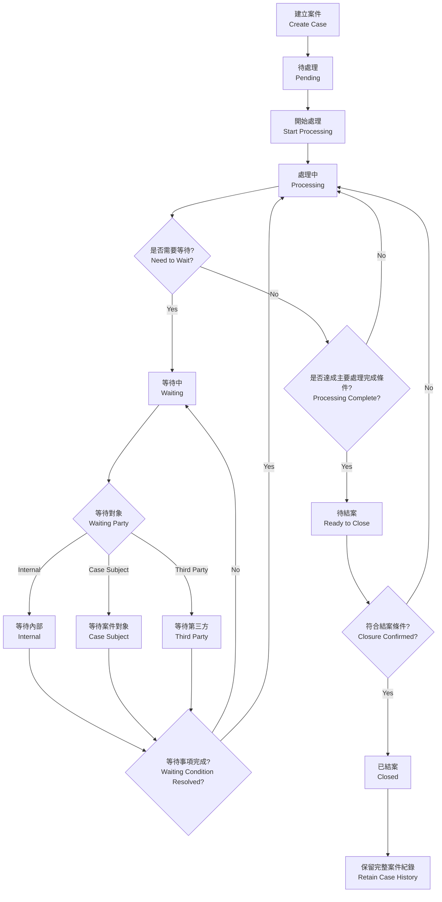
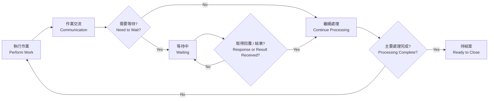
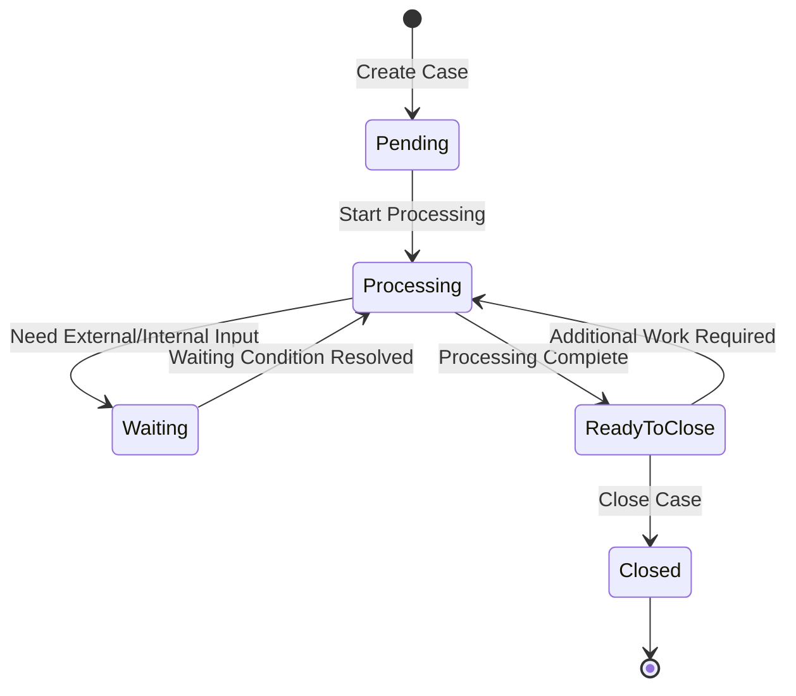

# 案件管理流程規格（Case Management Workflow Specification）

## 1. 文件目的（Purpose）

本文件定義 SaaS 平台的通用案件管理（Case Management）流程與技術用語，供 AI Agent、Frontend、Backend、Database Schema 與 Test Case 共用。

設計原則是：系統只管理案件生命週期（Case Lifecycle）、等待狀態（Waiting State）與處理紀錄（Case Activity / Activity Log），不將特定公司的標準作業程序（Standard Operating Procedure, SOP）、部門分工或產業流程寫死在系統中。

因此，不同行業可共用同一套 Case Management 核心，例如 Customer Service、Maintenance、Logistics、Consulting、Education、Healthcare Administration、E-commerce、B2B Service 等；實際作業方式由各企業依 Internal SOP 自行規範。

> **核心原則（Core Principle）**：系統管理案件狀態（Case Status）與處理歷程（Case History）；實際作業方式由企業內部 SOP 決定。

---

## 2. 名詞定義（Terminology）

為避免 AI Agent、Developer 或不同模組對相同概念產生不同解讀，以下術語應固定使用。

| 中文名稱 | 英文術語 | 建議程式名稱 | 定義 |
|---|---|---|---|
| 案件 | Case | `case` | 一個需要持續追蹤、處理並最終結案的工作事項 |
| 案件狀態 | Case Status | `status` | 案件目前所處的生命週期階段 |
| 案件對象 | Case Subject | `case_subject_id` | 此案件主要服務、聯繫、申請或處理的對象 |
| 等待對象 | Waiting Party | `waiting_party` | 案件目前正在等待哪一方完成事項或回覆 |
| 等待原因 | Waiting Reason | `waiting_reason` | 案件進入 Waiting 狀態的具體原因 |
| 處理紀錄 | Case Activity | `case_activity` | 案件處理過程中的單筆操作、說明、溝通或事件紀錄 |
| 處理歷程 | Activity Log / Case History | `activity_log` | 由多筆 Case Activity 組成的案件時間軸 |
| 結案摘要 | Resolution | `resolution` | 案件最終處理結果與結案說明 |
| 結案 | Close Case | `close_case` | 將案件狀態正式變更為 Closed |
| 待結案 | Ready to Close | `ready_to_close` | 主體處理已完成，但仍需最終確認或完成結案程序 |

### 2.1 案件對象（Case Subject）

`Case Subject` 是跨產業的中性術語，不限定為「客戶（Customer）」。

依產業可能代表：

- 客戶（Customer）
- 會員（Member）
- 患者（Patient）
- 學員（Student / Trainee）
- 住戶（Resident）
- 申請人（Applicant）
- 合作窗口（Business Contact）
- LINE User

系統層統一使用 Case Subject 概念，不依產業改變欄位名稱。資料庫與 API 欄位固定為 `case_subject_id`，引用 `Contact.id`（見 `聯絡人管理規格.md`「20. Contact 與 Case Management」章節），不存物件或 LINE User ID。`waiting_party` 的 enum 值 `case_subject` 不受影響。

---

## 3. 核心案件狀態（Case Status）

系統只保留少量且通用的主狀態（Primary Status）。

| 中文狀態 | 英文狀態 | Enum 建議值 | 定義 |
|---|---|---|---|
| 待處理 | Pending | `pending` | Case 已建立，但尚未正式開始處理 |
| 處理中 | Processing | `processing` | Case 正在進行作業、確認、溝通或問題排除 |
| 等待中 | Waiting | `waiting` | 暫停主動處理，等待某一方提供回覆、資料、結果或完成事項 |
| 待結案 | Ready to Close | `ready_to_close` | 主要處理已完成，等待最終確認或結案程序 |
| 已結案 | Closed | `closed` | Case 已正式完成並封存供後續查閱 |

### 3.1 狀態設計原則（Status Design Rules）

以下內容**不可新增為獨立 Case Status**：

- 內部確認（Internal Confirmation）
- 跨部門協調（Cross-department Coordination）
- 問題排除（Troubleshooting）
- 對外詢問（External Inquiry）
- 回報進度（Progress Update）
- 等待客戶照片
- 等待財務確認
- 等待物流回覆
- 等待商品寄回

以上應記錄為 `Case Activity`、`Waiting Party` 或 `Waiting Reason`，而不是新增主狀態。

---

## 4. 等待狀態（Waiting State）

`Waiting` 是一個主狀態，但必須搭配 `Waiting Party`，以明確識別案件目前卡在哪一方。

### 4.1 等待對象（Waiting Party）

固定使用三種類型：

| 中文名稱 | 英文名稱 | Enum 建議值 | 定義 |
|---|---|---|---|
| 內部 | Internal | `internal` | 等待公司內部人員、部門、主管或內部流程 |
| 案件對象 | Case Subject | `case_subject` | 等待此 Case 的主要服務、聯繫或處理對象 |
| 第三方 | Third Party | `third_party` | 等待供應商、物流商、合作廠商、外部機構等其他外部單位 |

### 4.2 Waiting 必要欄位

當 `status = waiting` 時，建議至少記錄：

```text
status          = waiting
waiting_party   = internal | case_subject | third_party
waiting_reason  = free text
waiting_since   = datetime
```

其中：

- `waiting_party`：Required
- `waiting_reason`：Required
- `waiting_since`：由系統自動寫入（System Generated Timestamp）

### 4.3 範例（Examples）

```text
Status: Waiting
Waiting Party: Internal
Waiting Reason: 等待財務確認退款金額
```

```text
Status: Waiting
Waiting Party: Case Subject
Waiting Reason: 等待案件對象補提供照片
```

```text
Status: Waiting
Waiting Party: Third Party
Waiting Reason: 等待物流商確認貨件狀態
```

---

## 5. 案件處理概念（Processing Model）

案件處理（Case Processing）不是單向工作流，而是一個可能重複多次的循環（Processing Loop）：

```text
作業（Work）
→ 交流（Communication）
→ 等待（Waiting）
→ 取得回覆或結果（Response / Result Received）
→ 繼續處理（Resume Processing）
```

`Processing` 階段內可以發生任何符合企業 Internal SOP 的作業，例如：

- 內部確認（Internal Confirmation）
- 跨部門協調（Cross-department Coordination）
- 資料查核（Data Verification）
- 問題排除（Troubleshooting）
- 與 Case Subject 溝通（Case Subject Communication）
- 向 Case Subject 詢問資料（Information Request）
- 處理進度通知（Progress Update）
- 與 Third Party 聯繫（Third-party Communication）
- 實體物品寄送或返還（Physical Item Delivery / Return）

上述都是 `Processing` 階段中的 **Activity**，不是新的 Case Status。

---

## 6. 主流程（Main Case Workflow）



---

## 7. 處理循環（Processing Loop）

實際案件可以在 `Processing` 與 `Waiting` 之間反覆切換多次。



此循環不限制次數。

例如：

```text
Processing
→ Waiting / Internal
→ Processing
→ Waiting / Case Subject
→ Processing
→ Waiting / Third Party
→ Processing
→ Ready to Close
→ Closed
```

---

## 8. 狀態轉換（State Transition）



### 8.1 允許的狀態轉換（Allowed Transitions）

```text
pending        -> processing
processing     -> waiting
waiting        -> processing
processing     -> ready_to_close
ready_to_close -> processing
ready_to_close -> closed
```

Phase 1 不需要：

```text
closed -> processing
```

亦即 Phase 1 不實作 Reopen Case。

---

## 9. 待結案（Ready to Close）

`Ready to Close` 表示 Case 的主要處理工作已完成，但尚未正式執行 `Close Case`。

適用情境例如：

- 已通知 Case Subject 處理完成，等待對方確認。
- Case Subject 表示仍有問題，Case 回到 `Processing`。
- Case Subject 確認問題已解決，可執行 `Close Case`。
- 有實體物品寄送、返還或到貨，需要確認最後流程完成。
- Internal SOP 規定需填寫結案摘要（Resolution）或結案報告（Closure Report）。

系統不強制所有產業採用同一種 Closure Rule，只提供通用的 `Ready to Close` 狀態。

---

## 10. 處理紀錄（Case Activity）與狀態（Case Status）必須分離

`Case Status` 只表示案件目前的生命週期階段。

實際作業、溝通、確認、問題與結果應寫入 `Case Activity`，形成 `Activity Log / Timeline`。

### 10.1 Timeline 範例

```text
10/01 09:30  [Create Case] 建立案件
10/01 09:35  [Status Change] Pending -> Processing
10/01 10:20  [Internal Note] 發現案件資料有誤
10/01 10:25  [Communication] 已通知 Case Subject 確認資料
10/01 10:25  [Status Change] Processing -> Waiting
               Waiting Party: Case Subject
               Waiting Reason: 等待補提供正確資料

10/01 14:10  [Response Received] 收到 Case Subject 回覆
10/01 14:15  [Status Change] Waiting -> Processing
10/01 15:20  [Internal Confirmation] 已向財務確認退款方式
10/01 15:20  [Status Change] Processing -> Waiting
               Waiting Party: Internal
               Waiting Reason: 等待財務確認

10/02 09:10  [Result Received] 財務確認完成
10/02 09:15  [Status Change] Waiting -> Processing
10/02 11:00  [Processing Complete] 主要處理完成
10/02 11:05  [Communication] 通知 Case Subject 處理完成
10/02 11:05  [Status Change] Processing -> Ready to Close
10/02 14:30  [Closure Confirmation] Case Subject 確認無問題
10/02 14:31  [Close Case] Ready to Close -> Closed
```

---

## 11. 建議資料模型（Recommended Data Model）

### 11.1 Case

```text
Case
- id
- case_no
- title
- category
- status
- priority
- case_subject_id
- description
- resolution
- waiting_party
- waiting_reason
- waiting_since
- created_at
- updated_at
- closed_at
```

### 11.2 Case Status Enum

```text
pending
processing
waiting
ready_to_close
closed
```

### 11.3 Waiting Party Enum

```text
internal
case_subject
third_party
```

顯示文字（Display Label）：

```text
internal     -> 內部
case_subject -> 案件對象
third_party  -> 第三方
```

### 11.4 Case Activity

```text
CaseActivity
- id
- case_id
- activity_type
- content
- created_at
```

`activity_type` 可作為 Activity 分類，但不應影響 Case Status State Machine。

可使用的通用 Activity Type 例如：

```text
note
communication
internal_action
status_change
response_received
progress_update
processing_complete
closure_confirmation
close_case
```

這些 Activity Type 可依未來需求擴充，不需要改變主案件流程。

---

## 12. AI Agent Implementation Rules

AI Agent 在實作 Case Management 時必須遵守以下規則：

1. **不得自行新增 Case Status。**
   - 只能使用：`pending`, `processing`, `waiting`, `ready_to_close`, `closed`。

2. **Waiting 必須使用 Waiting Party 分類。**
   - 只能使用：`internal`, `case_subject`, `third_party`。

3. **不得把企業 SOP 轉成系統 State。**
   - 例如「等待財務」、「等待物流」、「等待照片」只能放入 `waiting_reason` 或 `CaseActivity`。

4. **Processing 是通用工作狀態。**
   - Internal Work、Communication、Troubleshooting、Coordination 都屬於 Processing Activity。

5. **Case Status 與 Case Activity 必須分離。**
   - Status 是當前狀態。
   - Activity 是歷史事件與操作紀錄。

6. **Closed Case 必須保留歷史紀錄。**
   - 不刪除 Timeline / Activity Log。

7. **Phase 1 不實作 Assignee / Handler。**
   - 不需要案件指派負責人或承辦人流程。

8. **Phase 1 不實作 Reopen。**
   - Closed 視為終態（Terminal State）。

9. **Closure Rule 不應寫死。**
   - 是否需要 Case Subject 確認、實體寄送完成、Closure Report 等，由企業 Internal SOP 決定。

10. **UI 顯示名稱與 Backend Enum 分離。**
    - Backend 使用固定英文 Enum。
    - UI 可顯示中文 Label。

---

## 13. 最終設計摘要（Final Design Summary）

Case Management 核心只負責以下三件事：

```text
1. Case Lifecycle
   Pending -> Processing -> Waiting / Ready to Close -> Closed

2. Waiting Classification
   Internal / Case Subject / Third Party

3. Case History
   Case Activity / Activity Log / Timeline
```

不同產業的實際工作方法、部門分工、確認程序與 SOP 不應寫死在 Case State Machine 中。

如此可在保持系統簡潔的同時，讓同一套 Case Management 模組適用於多種產業與企業流程。
