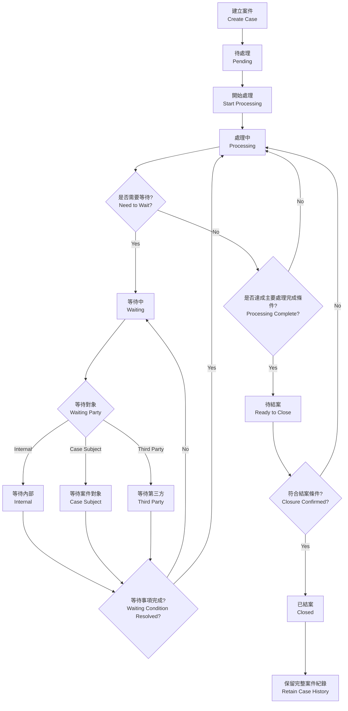
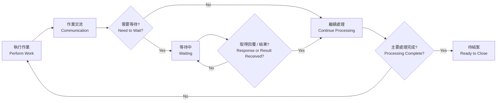
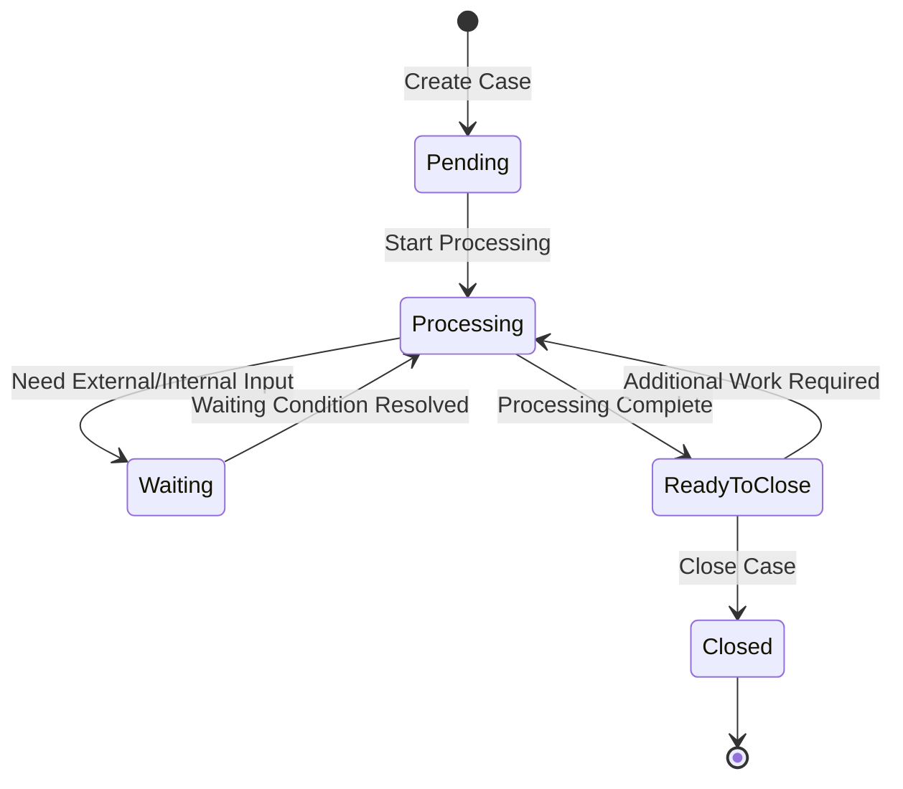

# 案件管理流程規格（Case Management Workflow Specification）

> 最後對齊實作：2026-10-05。

## 1. 文件目的（Purpose）

本文件定義 SaaS 平台的通用案件管理（Case Management）流程與技術用語，供 AI Agent、Frontend、Backend、Database Schema 與 Test Case 共用。

設計原則是：系統只管理案件生命週期（Case Lifecycle）、等待狀態（Waiting State）與處理紀錄（Case Activity / Activity Log），不將特定公司的標準作業程序（Standard Operating Procedure, SOP）、部門分工或產業流程寫死在系統中。

因此，不同行業可共用同一套 Case Management 核心，例如 Customer Service、Maintenance、Logistics、Consulting、Education、Healthcare Administration、E-commerce、B2B Service 等；實際作業方式由各企業依 Internal SOP 自行規範。

> **核心原則（Core Principle）**：系統管理案件狀態（Case Status）與處理歷程（Case History）；實際作業方式由企業內部 SOP 決定。

---

## 2. 名詞定義（Terminology）

為避免 AI Agent、Developer 或不同模組對相同概念產生不同解讀，以下術語應固定使用。

| 中文名稱 | 英文術語 | 建議程式名稱 | 定義 |
|---|---|---|---|
| 案件 | Case | `case` | 一個需要持續追蹤、處理並最終結案的工作事項 |
| 案件狀態 | Case Status | `status` | 案件目前所處的生命週期階段 |
| 案件對象 | Case Subject | `case_subject_id` | 此案件主要服務、聯繫、申請或處理的對象 |
| 等待對象 | Waiting Party | `waiting_party` | 案件目前正在等待哪一方完成事項或回覆 |
| 等待原因 | Waiting Reason | `waiting_reason` | 案件進入 Waiting 狀態的具體原因 |
| 處理紀錄 | Case Activity | `case_activity` | 案件處理過程中的單筆操作、說明、溝通或事件紀錄 |
| 處理歷程 | Activity Log / Case History | `activity_log` | 由多筆 Case Activity 組成的案件時間軸 |
| 結案摘要 | Resolution | `resolution` | 案件最終處理結果與結案說明 |
| 結案 | Close Case | `close_case` | 將案件狀態正式變更為 Closed |
| 待結案 | Ready to Close | `ready_to_close` | 主體處理已完成，但仍需最終確認或完成結案程序 |

### 2.1 案件對象（Case Subject）

`Case Subject` 是跨產業的中性術語，不限定為「客戶（Customer）」。

依產業可能代表：

- 客戶（Customer）
- 會員（Member）
- 患者（Patient）
- 學員（Student / Trainee）
- 住戶（Resident）
- 申請人（Applicant）
- 合作窗口（Business Contact）
- LINE User

系統層統一使用 Case Subject 概念，不依產業改變欄位名稱。資料庫與 API 欄位固定為 `case_subject_id`，引用 `Contact.id`（見 `聯絡人管理規格.md`「20. Contact 與 Case Management」章節），不存物件或 LINE User ID。`waiting_party` 的 enum 值 `case_subject` 不受影響。

---

## 3. 核心案件狀態（Case Status）

系統只保留少量且通用的主狀態（Primary Status）。

| 中文狀態 | 英文狀態 | Enum 建議值 | 定義 |
|---|---|---|---|
| 待處理 | Pending | `pending` | Case 已建立，但尚未正式開始處理 |
| 處理中 | Processing | `processing` | Case 正在進行作業、確認、溝通或問題排除 |
| 等待中 | Waiting | `waiting` | 暫停主動處理，等待某一方提供回覆、資料、結果或完成事項 |
| 待結案 | Ready to Close | `ready_to_close` | 主要處理已完成，等待最終確認或結案程序 |
| 已結案 | Closed | `closed` | Case 已正式完成並封存供後續查閱 |

### 3.1 狀態設計原則（Status Design Rules）

以下內容**不可新增為獨立 Case Status**：

- 內部確認（Internal Confirmation）
- 跨部門協調（Cross-department Coordination）
- 問題排除（Troubleshooting）
- 對外詢問（External Inquiry）
- 回報進度（Progress Update）
- 等待客戶照片
- 等待財務確認
- 等待物流回覆
- 等待商品寄回

以上應記錄為 `Case Activity`、`Waiting Party` 或 `Waiting Reason`，而不是新增主狀態。

---

## 4. 等待狀態（Waiting State）

`Waiting` 是一個主狀態，但必須搭配 `Waiting Party`，以明確識別案件目前卡在哪一方。

### 4.1 等待對象（Waiting Party）

固定使用三種類型：

| 中文名稱 | 英文名稱 | Enum 建議值 | 定義 |
|---|---|---|---|
| 內部 | Internal | `internal` | 等待公司內部人員、部門、主管或內部流程 |
| 案件對象 | Case Subject | `case_subject` | 等待此 Case 的主要服務、聯繫或處理對象 |
| 第三方 | Third Party | `third_party` | 等待供應商、物流商、合作廠商、外部機構等其他外部單位 |

### 4.2 Waiting 必要欄位

當 `status = waiting` 時，建議至少記錄：

```text
status          = waiting
waiting_party   = internal | case_subject | third_party
waiting_reason  = free text
waiting_since   = datetime
```

其中：

- `waiting_party`：Required
- `waiting_reason`：Required
- `waiting_since`：由系統自動寫入（System Generated Timestamp）

### 4.3 範例（Examples）

```text
Status: Waiting
Waiting Party: Internal
Waiting Reason: 等待財務確認退款金額
```

```text
Status: Waiting
Waiting Party: Case Subject
Waiting Reason: 等待案件對象補提供照片
```

```text
Status: Waiting
Waiting Party: Third Party
Waiting Reason: 等待物流商確認貨件狀態
```

---

## 5. 案件處理概念（Processing Model）

案件處理（Case Processing）不是單向工作流，而是一個可能重複多次的循環（Processing Loop）：

```text
作業（Work）
→ 交流（Communication）
→ 等待（Waiting）
→ 取得回覆或結果（Response / Result Received）
→ 繼續處理（Resume Processing）
```

`Processing` 階段內可以發生任何符合企業 Internal SOP 的作業，例如：

- 內部確認（Internal Confirmation）
- 跨部門協調（Cross-department Coordination）
- 資料查核（Data Verification）
- 問題排除（Troubleshooting）
- 與 Case Subject 溝通（Case Subject Communication）
- 向 Case Subject 詢問資料（Information Request）
- 處理進度通知（Progress Update）
- 與 Third Party 聯繫（Third-party Communication）
- 實體物品寄送或返還（Physical Item Delivery / Return）

上述都是 `Processing` 階段中的 **Activity**，不是新的 Case Status。

---

## 6. 主流程（Main Case Workflow）



---

## 7. 處理循環（Processing Loop）

實際案件可以在 `Processing` 與 `Waiting` 之間反覆切換多次。



此循環不限制次數。

例如：

```text
Processing
→ Waiting / Internal
→ Processing
→ Waiting / Case Subject
→ Processing
→ Waiting / Third Party
→ Processing
→ Ready to Close
→ Closed
```

---

## 8. 狀態轉換（State Transition）



### 8.1 允許的狀態轉換（Allowed Transitions）

```text
pending        -> processing
processing     -> waiting
waiting        -> processing
processing     -> ready_to_close
ready_to_close -> processing
ready_to_close -> closed
```

Phase 1 不需要：

```text
closed -> processing
```

亦即 Phase 1 不實作 Reopen Case。

---

## 9. 待結案（Ready to Close）

`Ready to Close` 表示 Case 的主要處理工作已完成，但尚未正式執行 `Close Case`。

適用情境例如：

- 已通知 Case Subject 處理完成，等待對方確認。
- Case Subject 表示仍有問題，Case 回到 `Processing`。
- Case Subject 確認問題已解決，可執行 `Close Case`。
- 有實體物品寄送、返還或到貨，需要確認最後流程完成。
- Internal SOP 規定需填寫結案摘要（Resolution）或結案報告（Closure Report）。

系統不強制所有產業採用同一種 Closure Rule，只提供通用的 `Ready to Close` 狀態。

---

## 10. 處理紀錄（Case Activity）與狀態（Case Status）必須分離

`Case Status` 只表示案件目前的生命週期階段。

實際作業、溝通、確認、問題與結果應寫入 `Case Activity`，形成 `Activity Log / Timeline`。

### 10.1 Timeline 範例

```text
10/01 09:30  [Create Case] 建立案件
10/01 09:35  [Status Change] Pending -> Processing
10/01 10:20  [Internal Note] 發現案件資料有誤
10/01 10:25  [Communication] 已通知 Case Subject 確認資料
10/01 10:25  [Status Change] Processing -> Waiting
               Waiting Party: Case Subject
               Waiting Reason: 等待補提供正確資料

10/01 14:10  [Response Received] 收到 Case Subject 回覆
10/01 14:15  [Status Change] Waiting -> Processing
10/01 15:20  [Internal Confirmation] 已向財務確認退款方式
10/01 15:20  [Status Change] Processing -> Waiting
               Waiting Party: Internal
               Waiting Reason: 等待財務確認

10/02 09:10  [Result Received] 財務確認完成
10/02 09:15  [Status Change] Waiting -> Processing
10/02 11:00  [Processing Complete] 主要處理完成
10/02 11:05  [Communication] 通知 Case Subject 處理完成
10/02 11:05  [Status Change] Processing -> Ready to Close
10/02 14:30  [Closure Confirmation] Case Subject 確認無問題
10/02 14:31  [Close Case] Ready to Close -> Closed
```

---

## 11. 建議資料模型（Recommended Data Model）

### 11.1 Case

```text
Case
- id
- case_no              -- 唯一，格式見「14. 案件編號」；只能透過前綴覆蓋整批變更
- title
- category_id          -- 案件類別，各 OA 自訂，見 17
- status
- priority
- case_subject_id      -- 可為群組中的個別成員，見 17
- locked               -- 防誤觸鎖定，見 17
- due_date             -- 選填期限，見 17
- source_note_id       -- 由記事轉成時的來源記事
- reference_no         -- 選填參考編號（訂單號、產品序號、地址等），見 15.4
- continued_from_id    -- 選填，延續的前案 id，見 15.3
- description
- resolution
- waiting_party
- waiting_reason
- waiting_since
- created_at
- updated_at
- closed_at
```

### 11.2 Case Status Enum

```text
pending
processing
waiting
ready_to_close
closed
```

### 11.3 Waiting Party Enum

```text
internal
case_subject
third_party
```

顯示文字（Display Label）：

```text
internal     -> 內部
case_subject -> 案件對象
third_party  -> 第三方
```

### 11.4 Case Activity

```text
CaseActivity
- id
- case_id
- activity_type
- content
- source_message_id    -- 選填，來自對話的 LINE 訊息 id
- source_snapshot      -- 選填，建立當下複製的訊息文字、發話者與時間，見 15.2
- created_by
- created_at
```

```text
CaseNumberSequence     -- 案件編號流水號
- prefix
- period               -- YYYYMM
- last_number
```

```text
CaseCategory           -- 每個 OA 最多 20 項；「一般備忘」保留
- id
- oa_id
- name
- sort_order
```

```text
TemplatePack           -- 自訂範本包；預設範本包內建於程式，不存資料庫
- id
- workspace_id
- name                 -- 同工作區唯一
- description
- note_types           -- JSON 字串陣列，含「一般備忘」
- case_categories      -- JSON 字串陣列，含「一般備忘」
- locked
- created_by / updated_by / updated_at
```

```text
CaseTemplate / NoteTemplate   -- 自訂範本，屬於一個自訂範本包；每包各最多 20 個
- id
- pack_id
- name
- category_name        -- 預設案件類別或記事類型（以名稱對應）
- title
- body                 -- 內容骨架，可含 {聯絡對象}、{今天}、{OA}
- defaults             -- JSON：案件為優先級、期限天數、參考編號提示；記事為記事標籤
- sort_order
- locked
- created_by / updated_by / updated_at
```

```text
OaTemplatePack         -- 每個 OA 啟用的範本包
- oa_id
- pack_key             -- 預設範本包代碼或自訂範本包 id
```

```text
CaseNumberPrefix       -- 每個 OA 一筆；prefix 全平台唯一
- oa_id
- prefix
- updated_by
- updated_at
```

```text
CaseNumberAlias        -- 前綴覆蓋後保留的舊編號
- case_id
- old_case_no          -- 唯一
- replaced_at
```

**實作欄位對照**（`line-oa-archive/schema.sql`）：`category_id` 實作為 `category`（直接存類別名稱）、`locked` 為 `is_locked`、`reference_no` 為 `ref_no`、`CaseActivity.created_by` 為 `actor`。案件建立人員不另存欄位，由該案件第一筆 `create_case` 處理紀錄的 `actor` 推導（API 回傳 `created_by`），供全員協作防護模式判斷操作人員能否解鎖。

`activity_type` 可作為 Activity 分類，但不應影響 Case Status State Machine。

可使用的通用 Activity Type 例如：

```text
note
communication
internal_action
status_change
response_received
progress_update
processing_complete
closure_confirmation
close_case
```

這些 Activity Type 可依未來需求擴充，不需要改變主案件流程。

---

## 12. AI Agent Implementation Rules

AI Agent 在實作 Case Management 時必須遵守以下規則：

1. **不得自行新增 Case Status。**
   - 只能使用：`pending`, `processing`, `waiting`, `ready_to_close`, `closed`。

2. **Waiting 必須使用 Waiting Party 分類。**
   - 只能使用：`internal`, `case_subject`, `third_party`。

3. **不得把企業 SOP 轉成系統 State。**
   - 例如「等待財務」、「等待物流」、「等待照片」只能放入 `waiting_reason` 或 `CaseActivity`。

4. **Processing 是通用工作狀態。**
   - Internal Work、Communication、Troubleshooting、Coordination 都屬於 Processing Activity。

5. **Case Status 與 Case Activity 必須分離。**
   - Status 是當前狀態。
   - Activity 是歷史事件與操作紀錄。

6. **Closed Case 必須保留歷史紀錄。**
   - 不刪除 Timeline / Activity Log。

7. **Phase 1 不實作 Assignee / Handler。**
   - 不需要案件指派負責人或承辦人流程。

8. **Phase 1 不實作 Reopen。**
   - Closed 視為終態（Terminal State）。

9. **Closure Rule 不應寫死。**
   - 是否需要 Case Subject 確認、實體寄送完成、Closure Report 等，由企業 Internal SOP 決定。

10. **UI 顯示名稱與 Backend Enum 分離。**
    - Backend 使用固定英文 Enum。
    - UI 可顯示中文 Label。

11. **案件編號由系統產生，不可單筆修改。**
    - 依「14. 案件編號」規則在建立交易內取號，不得重複、不得回收、不得讓使用者手動輸入；只能透過修改前綴並選擇覆蓋來整批變更，舊編號保留為別名。

12. **案件與處理紀錄不自動刪除。**
    - 不隨聊天紀錄或媒體的保存期限清除；從對話建立的紀錄須保存當下的訊息快照。

13. **同一問題再次發生時建立新案件並標註延續，不重新開啟已結案案件。**

---

## 13. 最終設計摘要（Final Design Summary）

Case Management 核心只負責以下三件事：

```text
1. Case Lifecycle
   Pending -> Processing -> Waiting / Ready to Close -> Closed

2. Waiting Classification
   Internal / Case Subject / Third Party

3. Case History
   Case Activity / Activity Log / Timeline
```

不同產業的實際工作方法、部門分工、確認程序與 SOP 不應寫死在 Case State Machine 中。

如此可在保持系統簡潔的同時，讓同一套 Case Management 模組適用於多種產業與企業流程。

---

## 14. 案件編號（Case Number）

> 2026-10-01 使用者新增需求：案件編號須唯一且具規律，方便對內溝通、對外告知與跨年度查詢。

### 14.1 格式

```text
{前綴}-{年月}-{流水號}

例：216RUX-202610-0042
```

| 部分 | 規則 |
|---|---|
| 前綴 | 每個 LINE OA 一個，2–6 個大寫英文字母或數字；全平台不可重複；預設與修改規則見 14.2 |
| 年月 | 案件建立日期的西元年與月份 `YYYYMM`，依 Asia/Taipei 時區 |
| 流水號 | 4 位數、左側補 0，每個前綴每月從 `0001` 重新開始；超過 `9999` 時自動增加位數，不循環 |
| 分隔 | 一律使用 `-` |

### 14.2 前綴

- **預設值**：取該 OA 的 LINE 識別碼（LINE ID，Bot info 的 `basicId`，現有欄位 `line_channels.basic_id`）去掉開頭 `@` 後的前 6 碼，轉為大寫。例如 `@216ruxyz` → `216RUX`；LINE ID 不足 6 碼時取全部（至少 2 碼）。
- **自動設定時機**：OA 建立第一個案件前自動帶入預設值；若無法取得 LINE ID（例如舊版單一 OA 模式未記錄 `basicId`），請管理員先手動設定，未設定前不可建立案件。
- **不可重複**：設定或修改前綴時，若與其他 OA 的前綴相同（不分大小寫），顯示警告「此前綴已由「某 OA」使用，請改用其他前綴」並拒絕儲存；預設值剛好重複時同樣要求管理員改用其他前綴。前綴唯一由資料庫限制保證，不只靠畫面檢查。
- **開放編輯**：管理員可在 OA 的案件設定修改前綴，儲存前顯示新舊編號範例。

### 14.3 修改前綴時的既有案件

修改前綴並按「儲存」時，必須選擇其中一種：

| 選項 | 結果 |
|---|---|
| 只套用到新案件（預設） | 既有案件編號不變；之後的新案件使用新前綴 |
| 覆蓋既有案件編號 | 該 OA 所有既有案件的前綴改為新前綴，年月與流水號不變，例如 `216RUX-202610-0042` → `SVC-202610-0042` |

- 選擇覆蓋時，再次確認並提示「已告知對方的舊編號仍可搜尋，但對方看到的編號會與系統顯示不同」。
- 覆蓋在單一資料庫交易內完成，失敗則全部不變更。
- 每個案件的舊編號保留為別名（`CaseNumberAlias`），輸入舊編號仍可找到案件，詳情顯示「原編號」；匯出時另列「原編號」欄。
- 新舊前綴的流水號互不影響：覆蓋後，新前綴在各年月沿用既有最大流水號繼續編號，不會產生重複。
- 修改前綴與是否覆蓋都寫入操作紀錄（修改者、時間、新舊前綴、影響筆數）。

### 14.4 其他規則

- **系統產生**：建立案件時在同一個資料庫交易內取號（`CaseNumberSequence` 加 1），確保同時建立也不重複；資料庫對 `case_no` 設唯一限制。
- **不可手動修改**：單一案件的編號不可手動修改；只能透過 14.3 的前綴覆蓋整批變更。案件不刪除，編號不回收。
- **顯示**：案件清單、詳情、聊天面板與匯出一律顯示完整編號；可一鍵複製，方便告知對方「您的案件編號是 216RUX-202610-0042」。
- **搜尋**：輸入完整編號、舊編號或流水號片段皆可找到案件。

## 15. 案件歷程與跨年度查詢（Case History Lookup）

同一個對象可能一年內多次建立案件，維修等情境也需要調閱前一年、前兩年的紀錄。

### 15.1 聯絡對象的案件歷程

- 聯絡對象詳情與聊天右側面板提供「案件歷程」，列出該對象歷年所有案件：案件編號、標題、類別、狀態、建立日期、結案日期。
- 依建立日期新到舊排序；可依年度、狀態、類別篩選。
- 點選進入案件詳情，可看完整處理紀錄。

### 15.2 保存期限與訊息快照

- 案件與 Case Activity **永久保存**，不隨聊天紀錄（文字 5 年）或媒體檔（1 年）的保存期限清除（見[聊天功能規格](聊天功能規格.md)「14. 保存、匯出與容量」）。
- 從對話建立案件或把訊息加入處理紀錄時，將訊息文字、發話者與時間複製到 `source_snapshot`；原始訊息日後被清除時，案件仍能看到當時內容。
- 被案件引用的圖片與位置一併保存，不受聊天媒體保存期限清除（見「17. 記事與案件共用規則」第 5 條）。

### 15.3 延續前案

- 已結案案件不重新開啟（見「12. AI Agent Implementation Rules」第 8 條）。
- 同一問題再次發生時，從舊案件按「建立延續案件」，新案件記錄 `continued_from_id`，並自動帶入對象、類別與參考編號。
- 新舊案件詳情互相顯示連結（「延續自 SVC-2025-00118」／「後續案件 SVC-2026-00042」），各自保留完整歷程。

### 15.4 參考編號與搜尋

- 每個案件可填一個選填的參考編號（1–60 字），例如訂單號、產品序號、設備編號、地址。
- 案件管理頁可依下列條件搜尋全部案件（不限年度）：案件編號、標題、參考編號、聯絡對象名稱、處理紀錄內文、類別、狀態、建立或結案日期區間。
- 依參考編號搜尋可找出同一產品或設備歷年的所有案件，即使由不同聯絡對象回報。

## 16. 匯出（CSV／XLSX）

### 16.1 範圍與格式

- 案件管理頁可將**目前篩選結果**匯出為 CSV 或 XLSX。
- 單次最多 5,000 件案件；超過時提示縮小日期區間或條件後再匯出（單台 PC，避免長時間佔用資源）。
- 檔名：`cases_{前綴}_{匯出日期}.csv`／`.xlsx`，例如 `cases_SVC_20261001.xlsx`。

| 格式 | 內容 |
|---|---|
| CSV | 「案件清單」一個檔案；勾選「含處理紀錄」時另外產生「處理紀錄」CSV，兩檔以案件編號對應，打包為 ZIP 下載 |
| XLSX | 一個檔案兩個工作表：「案件清單」與「處理紀錄」（未勾選時只有案件清單） |

### 16.2 欄位

案件清單：

| 欄位 | 說明 |
|---|---|
| 案件編號 | `case_no` |
| 原編號 | 前綴覆蓋前的舊編號（若有） |
| 標題、類別、優先級 | |
| 狀態 | 中文顯示名稱（待處理、處理中、等待中、待結案、已結案） |
| 等待對象、等待原因、等待開始時間 | 狀態為等待中時才有值 |
| 案件對象 | 主要顯示名稱（依聯絡人規格「9. 顯示名稱規則」） |
| 聯絡對象類型、對方組織 | 依聯絡人規格 6.1、6.3 |
| 參考編號、延續自 | 延續自顯示前案編號 |
| 建立時間、最後更新時間、結案時間 | Asia/Taipei，`YYYY-MM-DD HH:mm` |
| 結案摘要 | `resolution` |
| 處理紀錄筆數、最後處理時間 | |

處理紀錄：案件編號、時間、類型、內容、建立者、訊息快照（若有）。

### 16.3 檔案規則

- CSV 使用 UTF-8 含 BOM，讓 Excel 直接開啟不亂碼；欄位內換行與逗號依 CSV 標準加引號。
- 為避免試算表公式注入，儲存格內容以 `=`、`+`、`-`、`@` 開頭時，前面加上單引號 `'`。
- XLSX 以 Python 標準函式庫產生（不新增套件）；若日後需要格式化功能而要新增套件，須先取得使用者同意。
- 預設不匯出電話、Email、地址等聯絡資訊；勾選「含聯絡資訊」才加入，並提示內容含個人資料。

### 16.4 權限與紀錄

- 只有乙級（管理員）可以匯出，範圍限目前工作區與 OA；甲級不能匯出客戶資料。
- 每次匯出寫入操作紀錄：匯出者、時間、格式、筆數、是否含處理紀錄與聯絡資訊。

## 17. 記事與案件共用規則

> 2026-10-01 依多種組織情境（學校、服務處、企業內部、政府窗口、公益團體、社團、商店）檢視後訂定，2026-10-05 依實作更新。對話記事本（[對話記事本管理規格](對話記事本管理規格.md)）與案件共用以下規則，兩者的介面與資料欄位一致，不各做一套。

| # | 規則 | 記事 | 案件 |
|---|---|---|---|
| 1 | **對象可指定到個人**：在群組或多人聊天室，可指定「關於」哪一位成員；該成員尚不是聯絡對象時自動建立 | 選填「關於成員」 | 案件對象可選群組中的發話者 |
| 2 | **分類由各 OA 自訂**：每個 OA 各自維護清單，最多 20 項；預設 4 項「一般備忘、商務往來、問題處理、待辦交接」，記事與案件共用同一組名稱；「一般備忘」為保留項目不可改名或刪除，刪除其他項目時改為「一般備忘」 | 記事類型 | 案件類別 |
| 3 | **鎖定**：每筆可切換鎖頭，鎖定後內容唯讀（編輯、刪除、勾選待辦停用）。誰可以上鎖或解鎖由組織的防護政策決定（自由編輯／全員協作防護／管理員嚴格管控，見[對話記事本管理規格](對話記事本管理規格.md)「5.2」），記事與案件套用同一政策 | ✓ | ✓（鎖定時不可修改案件欄位、勾選待辦或結案；狀態推進與處理紀錄仍可進行） |
| 4 | **期限**：選填期限日；過期且未完成時標示「逾期」，可篩選；只做標示，不自動推播提醒 | 另有「已完成」勾選 | 以結案判斷是否完成 |
| 5 | **證據永久保存**：被記事或案件引用的訊息（含圖片、位置）複製保存，不受聊天保存期限清除；媒體計入總容量上限 | ✓ | ✓ |
| 6 | **串連**：記事可「轉為案件」並互相連結；聯絡對象詳情的「紀錄」區彙整該對象在同一 OA 的記事與案件；案件可「通知對象」進度（以範本產生訊息，送出前依聊天規格 7.1 提示是否耗用額度，送出後寫入處理紀錄） | 轉為案件 | 通知對象 |
| 7 | **Markdown 待辦可直接勾選**：內容中的 `- [ ]`、`- [x]`、`* [ ]` 方框在卡片與預覽中可直接勾選並自動儲存，只改該方框；程式碼區塊內不算待辦；以 `expected_content` 防止覆蓋他人修改 | `POST /api/chat-notes/task` | `POST /api/cases/task`（已結案或鎖定時不可；寫入處理紀錄與稽核） |

### 17.0 聊天側欄的案件卡片

- 案件在聊天右側工作面板的「關聯案件」分頁顯示（與記事共用面板，見[對話記事本管理規格](對話記事本管理規格.md)「6.2」），篩選為全部／待處理／已結案，每頁 12 筆。
- 卡片採筆記卡片樣式，呈現標題、狀態與描述摘要；雙擊卡片、按 Enter 或點預覽按鈕開啟預覽。
- 預覽內可編輯案件基本資料與 Markdown 描述，儲存後同步更新卡片；描述中的待辦方框可在卡片或預覽中勾選，兩處同步。
- 鎖定、已結案及唯讀視角的案件不可編輯或勾選。

### 17.1 範本的階層

範本分兩層，避免各種範本混在同一份清單：

```text
範本群組（例：通用標準流程）
├─ 分類組合：記事類型＋案件類別
├─ 案件範本：一般諮詢、問題與報修、退換補寄與售後
└─ 記事範本：聯絡紀錄、待辦事項、交接備忘
```

| 層級 | 規則 |
|---|---|
| 範本群組 (Pack) | 依用途分組；系統內建通用預設群組，另可建立自訂範本群組。只有一層，群組內不再分資料夾 |
| 範本 (Template) | 每個範本只屬於一個群組；每個群組最多 20 個案件範本、20 個記事範本 |
| 啟用 | 每個 OA 自行勾選要啟用的範本群組（預設啟用「通用」）；新增案件或記事時，只列出已啟用群組的範本 |

### 17.2 預設範本庫（Universal Preset Pack）

系統內建一個跨產業中性的「通用」範本包（新 OA 預設啟用），共 6 個範本、4 個分類：

| 範本包 | 記事類型 ＝ 案件類別 | 案件範本 | 記事範本 |
|---|---|---|---|
| 通用（新 OA 預設） | 一般備忘、商務往來、問題處理、待辦交接 | 一般諮詢、問題與報修、退換補寄與售後 | 聯絡紀錄、待辦事項、交接備忘 |

預設案件範本（內容支援 Markdown 與 SOP 檢查清單）：

| 案件範本 | 預設類別 | 預設優先級／期限 | 參考編號提示 | 骨架重點 |
|---|---|---|---|---|
| 一般諮詢 | 商務往來 | 中／2 天 | — | 諮詢確認（需求、回覆方式）、處置措施 |
| 問題與報修 | 問題處理 | 高／3 天 | 設備或產品編號 | 狀況描述（品項、現象、時間）、處置進度（存證、聯絡、結案確認） |
| 退換補寄與售後 | 問題處理 | 高／3 天 | 訂單編號 | 售後類別（缺貨換款、漏發補寄、瑕疵換貨、保固送修、鑑賞期退貨）、佐證照片、6 步 SOP 檢核 |

預設記事範本：

| 記事範本 | 預設類型 | 預設標籤 |
|---|---|---|
| 聯絡紀錄 | 一般備忘 | 待追蹤 |
| 待辦事項 | 待辦交接 | 待確認 |
| 交接備忘 | 待辦交接 | — |

內建範本保留固定 ID（`preset_u_case_1`、`preset_u_case_3`、`preset_u_case_5`、`preset_u_note_1~3`），已儲存的選取與修改覆蓋仍可對應。

### 17.3 案件範本與記事範本規格

| 欄位 | 案件範本 | 記事範本 |
|---|---|---|
| 名稱 | 1–30 字，同群組內不重複 | 同左 |
| 分類 | 預設案件類別 | 預設記事類型 |
| 標題 | 預設標題，可含代入欄位 | 同左 |
| 內容骨架 | 說明欄的預設文字（1,000 字內，支援純文字 / Markdown 雙格式） | 記事內容的預設文字（1,000 字內，支援純文字 / Markdown 雙格式） |
| 編輯模式 | 支援「純文字 / Markdown」切換與「編輯 / 預覽」子分頁；預設純文字，記住使用者上次選擇 | 同左 |
| 其他預設 | 優先級、期限（建立後 N 天）、參考編號欄位提示文字 | 記事標籤 |

- 代入欄位只提供三個：`{聯絡對象}`（主要顯示名稱）、`{今天}`（YYYY-MM-DD）、`{OA}`（OA 名稱）。
- 使用方式：新增案件或記事時點「從範本建立」或頂部膠囊按鈕；範本內容帶入表單後仍可修改，**按「儲存」才建立**。
- 從對話「建立案件」或「加入記事本」時也可選範本；被引用的訊息附加在骨架之後。
- 範本帶入的類別或類型若目前 OA 沒有，表單改用「一般備忘」並提示，不自動新增分類。
- 範本的預設標籤只會帶入治理清單中已存在的標籤，範本不會自動產生同名標籤。

### 17.4 自訂範本群組、刪除與直接管理

| 項目 | 規則 |
|---|---|
| 範圍 | 屬於工作區（個人或組織），同一工作區的所有 OA 都可啟用；不同工作區互不可見 |
| 數量 | 每個工作區最多 20 個自訂範本群組；每個群組最多 20 個案件範本、20 個記事範本 |
| 預設範本管理 | **支援刪除**（寫入隔離表，從此不干擾）與**直接修改**（自動轉化為自訂範本覆蓋） |
| 刪除操作 | 卡片採用低調圖示按鈕（`.tmpl-icon-btn.danger`）；支援多筆勾選**批次刪除**（`POST /api/templates/batch-delete`）與「復原」提示 |

- **建立範本群組**：新增空白、複製預設或自訂範本群組、由目前 OA 的分類建立。
- **建立範本**：在自訂群組內新增空白範本、複製任一範本，或由現有案件／記事「存成範本」（只帶入標題、分類與內容，不帶入對象、日期與處理紀錄）。
- **搬移**：自訂範本可在自訂範本群組之間搬移。
- **編輯**：修改後按「儲存」才生效，未儲存離開時提醒；項目可拖曳排序；範本群組與範本皆可上鎖防止誤改或誤刪。
- **刪除**：已用範本建立的案件與記事不受刪除影響。

### 17.5 套用分類組合

在 OA 的「範本與分類」選擇某個範本包的分類組合後，先顯示預覽，再按「套用」：

| 方式 | 結果 |
|---|---|
| 取代（預設） | 範本包中的項目加入；目前清單中未被任何記事或案件使用的項目移除；已被使用的項目保留 |
| 合併 | 只加入範本包中目前沒有的項目，不移除任何既有項目 |

- 預覽以「新增／保留／移除」標示每一項，並顯示套用後的總數。
- 套用後若超過 20 項上限，超出的項目不加入，預覽中標示「超過上限，未加入」。
- 名稱相同的項目視為同一項（不分全形半形空白），不重複建立。
- 套用分類組合不會自動啟用該範本包；啟用範本包也不會自動改動分類。
- 套用寫入操作紀錄：套用者、時間、範本包名稱、方式、新增與移除的項目。

### 17.6 範本與分類設定頁

範本與分類集中在同一個「範本與分類」頁，依 OA 設定：

| 頁籤 | 內容 |
|---|---|
| 記事類型 | 目前 OA 的記事類型清單與使用筆數 |
| 案件類別 | 目前 OA 的案件類別清單與使用筆數 |
| 範本包 | 左側為範本包清單（預設與自訂分組顯示，可勾選此 OA 啟用哪些）；右側為所選範本包的分類組合、案件範本、記事範本，可預覽、套用分類、複製、建立、編輯、刪除 |

入口：對話記事本「管理檢視」、案件管理頁的「範本與分類」，兩者開啟同一頁。介面與互動細節見[範本與分類管理](範本與分類管理.md)。

### 17.7 不做的事

- 不指派負責人或派工（維持「12. AI Agent Implementation Rules」第 7 條）；需要區分處理單位時，以類別或等待對象（內部／第三方）表示。
- 不做細分的權限模組：權限依[權限與角色規格](權限與角色規格.md)的甲、乙、丙、丁四級；記事與案件的操作開放給乙、丙、丁級，甲級（系統供應商）只能閱讀。
- 視角預覽依權限規格「5. 視角預覽」：甲級只能檢視；乙級點 🔒 切換為編輯後依被預覽者等級操作，丁級不能「通知對象」。
- 不自動推播期限提醒、不做 SLA 或自動升級。
- 不讓對方透過 LINE 按鈕核准或確認；之後若需要，另行評估。
