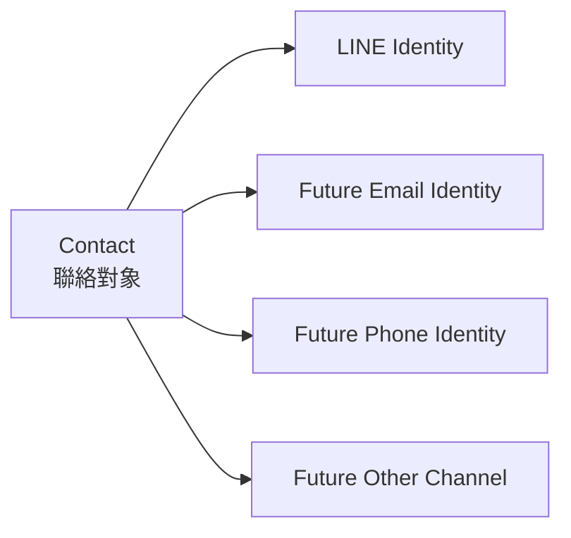
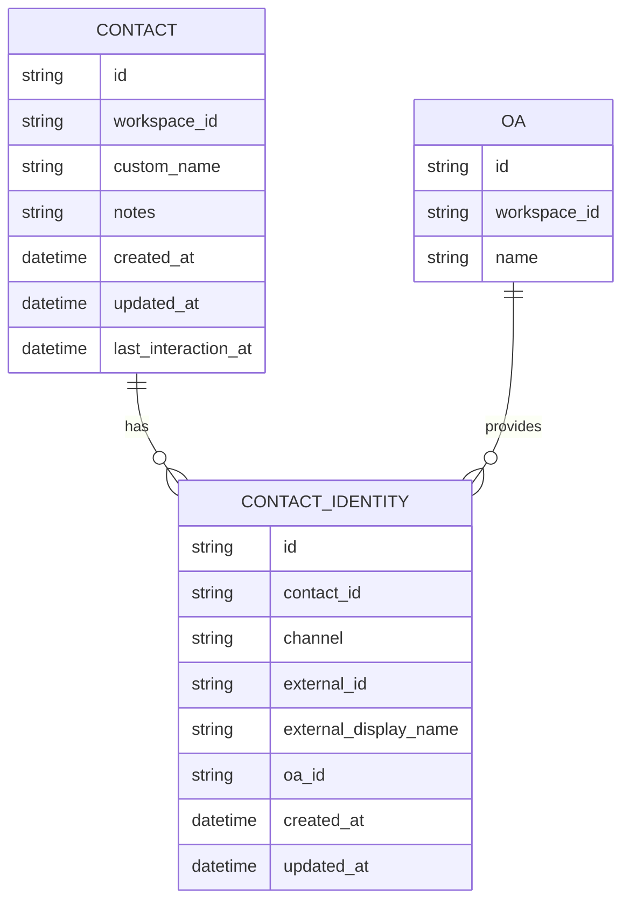
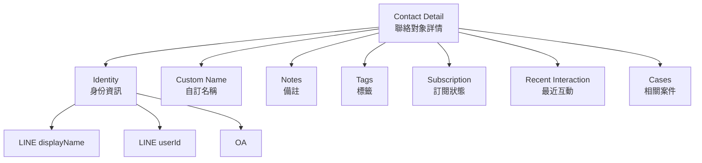
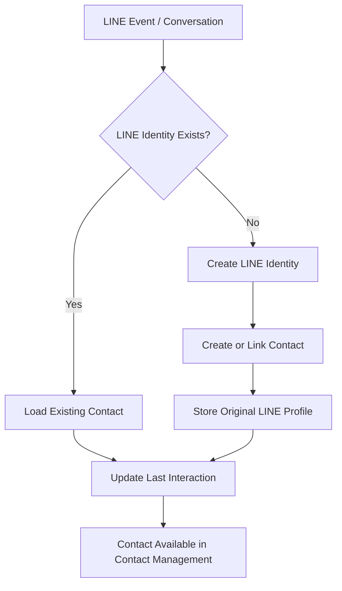
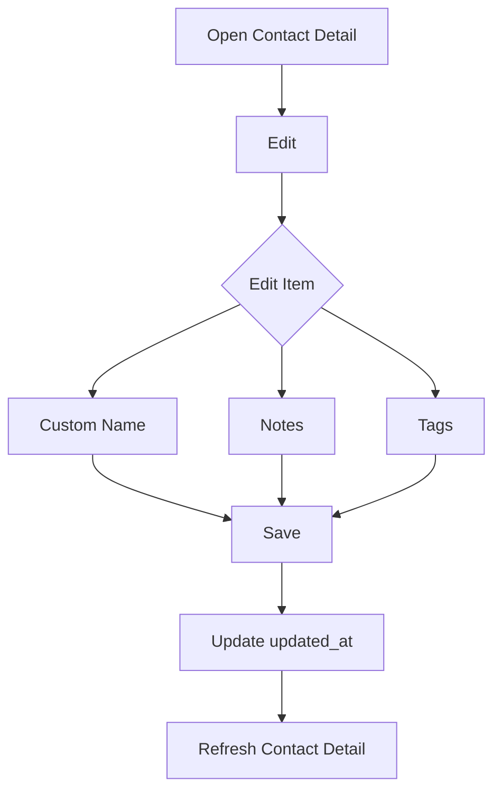
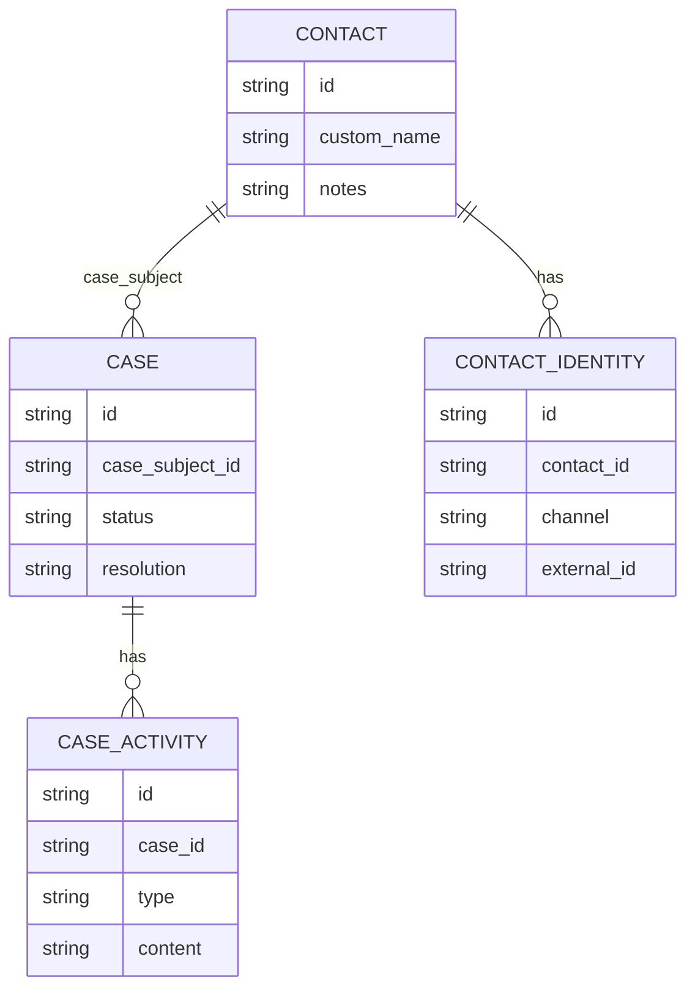
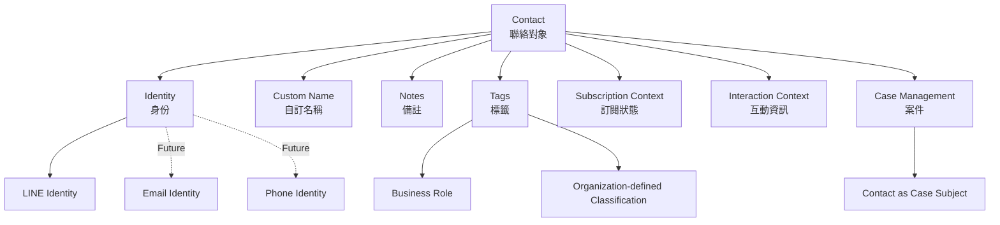
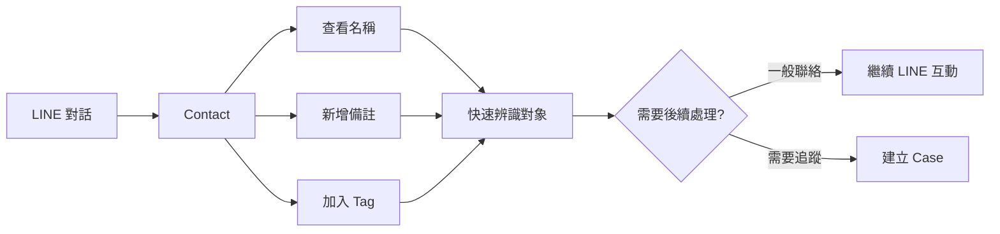

# Contact Management 建設規格
## Small Team First / 1–3 位後台管理員適用

---

# 1. 文件目的 (Purpose)

本文件定義 SaaS 平台中的 **Contact Management（聯絡對象管理）** 建設規格。

本系統主要服務：

```text
1–3 位後台管理員
Small Team Operations
```

適用對象包含：

- 小型公司
- 小型服務團隊
- 門市
- 加盟體系
- 小型 B2B / B2C 業務
- 小型內部協作團隊
- 由少數後台人員共同管理 LINE OA 的組織

本系統不是為 10–100 人以上的大型客服中心、CRM 團隊、企業級派工中心或大型組織流程管理所設計。

核心原則：

> **Small Team First.**

所有 Contact Management 功能皆應優先：

- 簡單
- 易懂
- 少設定
- 低維護成本
- 可直接使用
- 避免複雜角色與流程
- 避免大型 CRM 架構

---

# 2. 產品定位 (Product Positioning)

Contact Management 的用途是：

> 讓少數後台管理員快速知道「這個對象是誰、怎麼稱呼、有哪些備註、有哪些標籤、目前與哪些 LINE OA 有互動」。

系統應協助管理：

```text
Identity
Naming
Notes
Tags
Communication Context
Subscription Context
Interaction Context
```

系統不應演變成：

```text
Enterprise CRM
Sales Pipeline
Lead Management
Account Ownership
Assignment Queue
Relationship Graph
Complex Approval Workflow
```

---

# 3. 核心 Domain 定義 (Core Domain Definition)

系統統一使用：

```text
Contact
```

中文名稱：

```text
聯絡對象
```

`Contact` 代表平台中可被識別、聯繫、分類、備註與查詢紀錄的對象。

UI 用語（2026-10-01）：

- 名單、頁面、詳情與管理操作一律稱「聯絡對象」，不使用「收件者」、「收件人」或「聯絡人」（「聯絡人」容易誤解為只有個人，但 Contact 也包含組織／團體與群組）。
- 發送訊息時選擇的對象稱「發送對象」，例如「選擇發送對象」、「3 位發送對象」。
- 後台不設「一般收件者」角色：只在 LINE 收訊的人就是 Contact，不建立後台帳號；`employee` 角色及其資料已移除。
- 現有程式與資料表名稱（如 `recipients`、`/api/contacts`）不因用語調整而更名。

Contact 不預設一定是「客戶」。

Contact 可以代表：

- 零售顧客 (Customer)
- 會員 (Member)
- 加盟商 (Franchisee)
- 經銷商 (Dealer)
- 合作夥伴 (Partner)
- 廣告服務商 (Advertising Service Provider)
- 供應商 (Vendor)
- 物流商 (Logistics Provider)
- 顧問 (Consultant)
- 公司內部員工 (Employee)
- 主管 (Manager)
- 下屬 (Staff)
- 公司內部部門 (Internal Department)
- 子公司部門 (Subsidiary Department)
- 其他聯絡或互動對象

這些名稱皆屬於：

```text
Business Role / Business Context
```

而不是 Contact Core Domain。

---

# 4. 核心設計原則 (Design Principles)

## 4.1 Contact 只定義「對象本身」

Contact 用來回答：

> 這個對象是誰？

例如：

```text
Contact:
王小明
```

實際業務關係則由：

```text
Tags
Notes
Business Context
```

描述。

例如：

```text
Contact:
王小明

Tags:
- 加盟商
- 北區
- VIP
```

---

## 4.2 不建立大型 CRM Relationship Model

Phase 1 不建立以下固定關係：

```text
Customer
Vendor
Franchisee
Manager
Employee
Supplier
Advertiser
Dealer
```

為 Core Enum。

這些應優先使用：

```text
Tags
```

描述。

原因：

小型團隊不需要維護大型 Relationship Model。

---

## 4.3 LINE Identity 與 Contact 分離

LINE User 不等於 Contact Domain 本身。

LINE User 是 Contact 的：

```text
Communication Identity
```

概念：



目前主要使用：

```text
LINE Identity
```

未來若新增 Email / Phone / Other Channel，不需重新設計 Contact Core。

---

# 5. Small Team First 設計規則

因本系統主要由 1–3 位後台管理員共同使用：

## 必須優先

- 直接顯示重要資訊
- 直接修改名稱
- 直接新增備註
- 直接加 Tag
- 快速搜尋
- 快速篩選
- 少量 Bulk Action
- 保留必要歷史紀錄

## 不優先

- 多層級分類
- 多層主管簽核
- Contact Owner
- Contact Assignee
- Department Queue
- Territory Assignment
- Sales Stage
- Lead Score
- CRM Automation
- Relationship Graph

AI Agent 不得因「大型系統通常會有」而自行加入。

---

# 6. Contact 基本資料 (Contact Profile)

Phase 1 建議 Contact 至少包含：

```text
id
workspace_id
custom_name
notes
created_at
updated_at
last_interaction_at
```

欄位：

| Field | 中文 | 說明 |
|---|---|---|
| `id` | Contact ID | Contact Primary Key |
| `workspace_id` | 工作區 | Contact 所屬 Workspace |
| `custom_name` | 自訂名稱 | 後台管理員設定的內部名稱 |
| `notes` | 備註 | 內部自由文字 |
| `created_at` | 建立時間 | 系統建立時間 |
| `updated_at` | 更新時間 | 最後修改時間 |
| `last_interaction_at` | 最後互動時間 | 最近互動時間 |

原始 LINE 名稱不必複製成 Contact Core Field。

應由 LINE Identity 提供：

```text
external_display_name
```

## 6.1 聯絡對象類型 (Contact Type)

> 2026-10-01 使用者新增需求：聯絡對象需區分身分並記錄聯絡資訊。本節取代先前「不為名單管理收集電話、Email、職位」的決定。

聯絡對象分為兩大類、三種類型，以單一欄位 `contact_type` 表示：

| 大類 | `contact_type` | 中文 | 適用 |
|---|---|---|---|
| 非個人 | `organization` | 組織／團體 | 任何非個人的對象，不限公司行號，例如公司、門市、機關、學校、班級、協會、公益團體、競選總部、俱樂部、社團、好友團 |
| 個人 | `person_business` | 公務對象個人 | 以某組織／團體成員或代表身分聯繫的個人，例如廠商窗口、協會幹事、班級導師、競選總部聯絡人、俱樂部負責人 |
| 個人 | `person_private` | 一般個人 | 以私人身分聯繫的自然人，例如零售顧客、會員、家人 |

規則：

- 「組織／團體」泛指所有非個人對象，名稱與 UI 文案不得限定為「公司」或「公司行號」。
- `contact_type` 可為空，UI 顯示「未分類」。系統不得依 LINE 名稱、訊息內容或 LINE 個人／群組類型自動推測，由管理員手動選擇。
- UI 採兩層選擇：先選「非個人／個人」，選「個人」後再選「公務對象／一般個人」。
- `contact_type` 描述的是對象的**身分形式**，不是業務角色。顧客、加盟商、供應商等業務角色仍使用 Tags（見「4.2 不建立大型 CRM Relationship Model」），不得因新增此欄位而建立業務角色 Enum。
- 一個 Contact 只有一種類型。同一人若同時有公務與私人往來，Phase 1 以主要往來身分記錄，其餘寫入 Notes。

## 6.2 聯絡資訊欄位 (Contact Information)

所有欄位皆為選填，依 `contact_type` 顯示不同欄位：

| Field | 中文 | `organization` | `person_business` | `person_private` | 說明 |
|---|---|:---:|:---:|:---:|---|
| `phone` | 聯絡電話 | ✓ | ✓ | ✓ | 組織／團體為代表電話；個人為手機或個人電話 |
| `email` | Email | ✓ | ✓ | ✓ | 組織／團體為代表信箱；個人為私人信箱 |
| `postal_code` | 郵遞區號 | ✓ | ✓ | ✓ | |
| `address` | 地址 | ✓ | ✓ | ✓ | 單一文字欄位，不拆縣市／區 |
| `organization_name` | 對方組織 | ✓ | ✓ | — | 組織／團體名稱：組織／團體類型為本身名稱；公務對象為所屬或代表的組織／團體名稱（見「6.3 組織用語」） |
| `job_title` | 職稱 | — | ✓ | — | |
| `work_phone` | 公務電話 | — | ✓ | — | 所屬組織／團體的電話，例如公司電話、協會電話 |
| `work_phone_ext` | 分機 | — | ✓ | — | |
| `work_email` | 公務 Email | — | ✓ | — | 個人在所屬組織／團體使用的信箱，例如公司信箱，與私人 `email` 分開 |

規則：

- **對方組織與系統組織分開**：`organization_name`（對方組織）只供辨識，不影響權限；與決定報表接收的「系統組織」是不同欄位，定義與規則見「6.3 組織用語」。
- **資料來源**：以上欄位皆由管理員手動填寫。LINE Messaging API 不提供電話、Email、地址（見[LINE OA使用者識別研究](../研究/LINE%20OA使用者識別研究.md)），不得假設可自動取得。
- **格式檢查從寬**：
  - `email`、`work_email` 只檢查基本 Email 格式。
  - `phone`、`work_phone` 允許數字、`+`、`-`、空格、括號，例如 `+886 2-1234-5678`。
  - `work_phone_ext` 只允許數字。
  - `postal_code` 允許 3–6 位數字（台灣 3 碼、3+2 碼或 3+3 碼）。
  - 不強制國碼或固定格式，避免小型團隊無法輸入實際資料。
- **切換類型**：改為不適用某些欄位的類型時（例如公務對象改為一般個人），UI 須先列出將被清除的欄位並取得確認，儲存後才清除；不得靜默保留隱藏資料，也不得未經確認刪除。
- **個人資料保護**：電話、Email、郵遞區號、地址屬個人資料，與 Notes 同為內部資料（見「11. Notes」），不得自動對外傳送或顯示於 LINE 訊息，並遵守「23. Workspace Data Isolation」。清單畫面只顯示必要資訊，完整聯絡資訊於 Contact Detail 查看。
- **不擴充為 CRM**：除上表欄位外，不自行加入生日、身分證號、統一編號、網站、社群帳號、多組電話／地址等欄位，除非需求明確要求。

## 6.3 組織用語：系統組織與對方組織

「組織」只有一個定義：**非個人的團體**，不限公司行號，包括協會、公益團體、班級、競選總部、俱樂部、好友團等。

同一個「組織」概念依操作層面分兩種用法，名稱一律加上層面前綴，不得只寫「組織」：

| 用語 | 層面 | 指的是 | 欄位 | 填寫方式 | 影響 |
|---|---|---|---|---|---|
| 系統組織 | 系統使用者層面 | 在本平台建立、擁有後台帳號、LINE OA 與權限的組織 | `organization_id`（現有欄位 `recipients.company`） | 下拉選單，只能選已建立的系統組織 | 決定該對象可收到哪些報表、屬於哪些發送範圍 |
| 系統部門 | 系統使用者層面 | 系統組織內的部門 | `department`（現有欄位 `recipients.department`） | 依現有實作 | 同上，細分報表與發送範圍 |
| 對方組織 | 對話對象層面 | 對話對象本身或所屬的組織／團體 | `organization_name` | 自由輸入文字 | 只供辨識，不影響任何權限 |

規則：

- **兩者可以相同但互不同步**：例如自己公司的同事，系統組織與對方組織可能都是「ABC 公司」。系統組織表示「此對象歸哪個系統組織管理、收哪些報表」；對方組織表示「對方屬於哪個組織／團體」。修改其中一個不得自動修改另一個。
- **不建立組織關聯**：Phase 1 不把對方組織連結到系統組織，也不建立「對方組織」資料表或組織間關係，以符合「4.2 不建立大型 CRM Relationship Model」。
- **欄位命名**：現有欄位 `recipients.company` 實際存放系統組織 ID，名稱容易誤導。規格以 `organization_id` 稱呼；程式更名須另行規劃 Migration，Phase 1 可先沿用現有欄位，但新程式碼與文件不得把它當成公司名稱使用。
- **UI 用詞**：畫面標籤使用「系統組織」、「系統部門」與「對方組織」；介面配置見「15.1 聯絡對象編輯畫面分區」。

---

# 7. Contact Identity

建議概念模型：

```text
ContactIdentity
- id
- contact_id
- channel
- external_id
- external_display_name
- oa_id
- created_at
- updated_at
```

LINE：

```text
channel = line
```

LINE Identity 至少包含：

```text
external_id           = LINE userId
external_display_name = LINE displayName
oa_id                 = 平台內 LINE OA ID（現有 channel_id）
```

## 7.1 LINE API 原始參數對照（Source of Truth）

LINE 相關名稱一律以 LINE Messaging API 原始回傳參數為準。`external_*` 只是跨通路的 Domain 概念名稱；文件、UI 文案與程式中提到「LINE 名稱」、「LINE User ID」時，指的就是下表的原始參數，不得自行另取定義。

| LINE API 原始參數 | 來源 | 意義 | Domain 概念 | 現有欄位 |
|---|---|---|---|---|
| `source.type` | Webhook Event | `user` / `group` / `room` | `channel` 下的對象類型 | `recipients.kind` |
| `userId` | Webhook `source`、`GET /v2/bot/profile/{userId}` | 系統產生的使用者識別碼（`U` + 32 位十六進位），Provider 範圍內唯一；不是使用者自訂、可搜尋的 LINE ID | `external_id` | `recipients.recipient_id`（`kind = user`） |
| `displayName` | `GET /v2/bot/profile/{userId}`、群組成員 Profile | 使用者在 LINE 設定的顯示名稱，可能隨時變更 | `external_display_name` | `recipients.display_name`（`kind = user`） |
| `pictureUrl` | 同上 | 頭像網址，選填，可能缺少 | — | 現況未儲存 |
| `statusMessage` | `GET /v2/bot/profile/{userId}` | 個人狀態文字，選填；群組成員 Profile 不提供 | — | 現況未儲存 |
| `language` | `GET /v2/bot/profile/{userId}` | 使用者語言，選填；群組成員 Profile 不提供 | — | 現況未儲存 |
| `groupId` | Webhook `source` | 群組識別碼（`C` + 32 位十六進位） | `external_id` | `recipients.recipient_id`（`kind = group`） |
| `groupName` | `GET /v2/bot/group/{groupId}/summary` | 群組名稱 | `external_display_name` | `recipients.display_name`（`kind = group`） |
| `roomId` | Webhook `source` | 多人聊天室識別碼；LINE 不提供聊天室名稱 | `external_id` | `recipients.recipient_id`（`kind = room`） |

規則：

- 選填參數（`pictureUrl`、`statusMessage`、`language`）可能缺少，程式不得假設一定存在。
- 現有程式以 snake_case 儲存（`displayName` → `display_name`），對照關係以本表為準。
- 站內自訂名稱 `custom_name` 不屬於 LINE API 參數；現有對應欄位為 `recipients.alias`。
- 不得把 `displayName` 當成識別鍵；識別一律使用 `userId` / `groupId` / `roomId`。
- 官方參數定義見 [LINE Messaging API Reference](https://developers.line.biz/en/reference/messaging-api/)；研究筆記見 [LINE OA使用者識別研究](../研究/LINE%20OA使用者識別研究.md)。

---

# 8. Contact 與 LINE OA

Contact 可以透過一個或多個 LINE OA 被識別。

概念：



若 Existing Schema 已直接使用：

```text
LINE User
Recipient
Follower
Profile
```

等資料表：

> Phase 1 必須優先沿用，不得為了符合文件命名重新 Migration。

---

# 9. 顯示名稱規則 (Display Name Resolution)

UI 顯示名稱順序：

```text
custom_name
    ↓ fallback
LINE displayName
    ↓ fallback
Contact ID / Unknown Contact
```

建議：

```text
primary_display_name =
    custom_name
    ?? line_display_name
    ?? fallback
```

例如：

```text
LINE displayName:
Amy

Custom Name:
王小姐｜ABC 廣告公司
```

UI：

```text
王小姐｜ABC 廣告公司
Amy
```

---

# 10. Custom Name

自訂名稱固定欄位：

```text
custom_name
```

用途：

- 將 LINE 暱稱改成容易辨識的內部名稱
- 補充公司名稱
- 補充門市名稱
- 補充職務
- 補充部門

例如：

```text
LINE:
Kevin

Custom Name:
陳經理｜台中加盟店
```

或：

```text
LINE:
小王

Custom Name:
王先生｜物流商窗口
```

規則：

- 只影響 SaaS 內部顯示
- 不修改 LINE Profile
- 不回寫 LINE displayName
- 原始名稱仍保留供查閱

---

# 11. Notes（備註）

備註是**聯絡對象資訊**的一部分，與「6.2 聯絡資訊欄位」一起編輯。

備註欄位：

```text
notes
```

屬於：

```text
Internal Data
```

例如：

```text
偏好下午聯絡
ABC 公司採購窗口
退款問題請先確認發票
此聯絡人主要處理加盟事項
```

規則：

- 不自動傳送給 Contact
- 不自動顯示於 LINE Message
- 可供 Search
- UI 應容易直接編輯
- 最多 2,000 字

小型團隊優先：

> 使用單一簡單 Notes 欄位即可，不需建立複雜 Note Category。

## 11.1 對話記事本 (Chat Notes)

> 2026-10-01 使用者新增需求：參考 LINE 聊天進階方案的記事本。記事本與「11. Notes（備註）」是不同功能：備註描述「這個對象是誰」，記事本記錄「這段對話中發生的事」。考量本系統架設在單台 PC，數量上限低於 LINE（LINE 為每個聊天室 1,000 個）。

| | 備註 (`notes`) | 對話記事本 |
|---|---|---|
| 屬於 | 聯絡對象資訊 | 一個 LINE 聊天室（某個 OA 與某個使用者／群組的對話） |
| 數量 | 每個聯絡對象 1 個欄位 | 每個聊天室多筆 |
| 內容 | 對象的長期背景，例如偏好、職務 | 對話中的事件或交辦，例如「10/01 已答應週五回覆報價」 |
| 編輯位置 | 編輯聯絡對象畫面 | 對話畫面旁的記事本面板 |
| 作者與時間 | 只記錄最後更新時間 | 每筆記錄建立者、建立時間與最後修改者 |

| 項目 | 規則 |
|---|---|
| 每個聊天室的記事數 | 最多 100 筆；達上限時不可新增，UI 提示刪除舊記事 |
| 每筆內容 | 1–1,000 字，純文字，保留換行 |
| 排序 | 最新在前；先顯示最近 20 筆，其餘「載入更多」 |
| 編輯／刪除 | 管理員可編輯或刪除；刪除前確認，並寫入操作紀錄 |
| 範圍 | 依聊天室區分：同一人在不同 OA 的聊天室各有自己的記事本，不互相顯示 |

規則：

- 屬於 Internal Data：不傳送給對方，不顯示於 LINE Message。
- 記事本與備註互不同步、不互相移轉；兩者各自保存。
- 記事本只是記錄；需要追蹤處理進度的事項應建立 Case，處理過程寫入 Case Activity。
- 不建立記事分類、置頂、提醒或附件，除非需求明確要求。
- **顯示位置**：記事本位於聊天畫面的右側資訊面板（見[聊天功能規格](聊天功能規格.md)「9. 右側資訊面板」）。聊天畫面完成前，先在 Contact Detail 以獨立區塊「對話記事本（此 OA 聊天室）」呈現，與備註分開。

---

# 12. Tags

Tag 是 Contact 最主要的彈性分類工具。

Tag：

```text
Tag
- id
- workspace_id
- name
- color
- created_at
- updated_at
```

Contact 與 Tag：

```text
Many-to-Many
```

Relationship：

```text
ContactTag
- contact_id
- tag_id
```

---

## 12.1 Tag 使用方式

例如：

```text
顧客
加盟商
供應商
物流商
廣告商
內部
主管
財務部
北區
VIP
長期合作
```

例如：

```text
Contact:
王經理

Tags:
- 內部
- 子公司
- 財務部
- 主管
```

或：

```text
Contact:
陳先生

Tags:
- 加盟商
- 北區
- VIP
```

---

## 12.2 Tag 功能

Phase 1 至少支援：

```text
Create Tag
Rename Tag
Change Tag Color
Delete Tag
Assign Tag
Remove Tag
Bulk Assign Tag
Bulk Remove Tag
Filter by Tag
```

不需要：

```text
Nested Tag
Tag Hierarchy
Tag Rule Engine
Automatic Tag Workflow
```

除非後續有明確需求。

## 12.3 數量上限

本系統架設在單台 PC，上限依畫面可用性、即時計算負擔與備份大小訂定，低於 LINE 聊天進階方案（300 個標籤、每個聊天室 30 個）：

| 項目 | 上限 | 達上限時 |
|---|---|---|
| 每個 LINE OA 的標籤數 | 100 | 不可新增，UI 顯示目前數量／上限並提示刪除不用的標籤 |
| 每個 Contact 的標籤數 | 10 | 不可再指派；批次指派時略過已達上限的 Contact，完成後列出略過筆數 |
| 單次批次操作的 Contact 數 | 200 | 超過時請使用者分批或縮小篩選範圍 |

- 上限由後端檢查，前端只做提示並顯示「目前數量／上限」，不能只靠前端限制。
- 所有數量上限（本節、「11.1 對話記事本」、「13.2 自訂篩選條件」）集中定義在後端同一處，日後更換主機時可統一調高。
- 標籤管理與批次指派須檢查操作者為管理員，且每個 Contact 都屬於目前 LINE OA（見「23. Workspace Data Isolation」）。

---

# 13. Contact List

Contact List 是小型團隊最常使用的管理入口。

至少支援：

```text
Search
Tag Filter
Sort
Bulk Selection
```

Search 至少搜尋：

```text
custom_name
LINE displayName
LINE userId
notes
tag name
organization_name
phone / work_phone
email / work_email
```

---

## 13.1 Contact List 顯示資訊

建議顯示：

```text
Primary Display Name
Original LINE displayName
Contact Type
organization_name / job_title（僅公務對象，作為副標）
Tags
Subscription Status
Last Interaction Time
```

電話、Email、地址不在 List 顯示，於 Contact Detail 查看。

不要在 List 顯示過多企業級欄位。

主要原則：

> 一眼看出這個人是誰、被怎麼分類、最近是否有互動。

---

## 13.2 自訂篩選條件 (Saved Filters)

> 2026-10-01 使用者新增需求：參考 LINE 聊天進階方案的「自訂篩選條件」，可將常用的篩選組合存成名稱，一鍵查看符合的聯絡對象。因每次開啟都要即時計算筆數，上限低於 LINE（LINE 為 20 個）。

| 項目 | 規則 |
|---|---|
| 數量 | 每個 LINE OA 最多 10 個 |
| 名稱 | 1–40 字，同一 OA 內不可重複 |
| 共用 | 同一 OA 的管理員共用；發送人員可使用，但結果仍限於其授權範圍 |
| 結果 | 每次開啟時依當下資料即時計算，不儲存名單快照 |
| 顯示 | Contact List 側欄或篩選選單列出各篩選條件及符合筆數，可調整順序 |

可組合的條件（不同條件之間為「且」）：

| 條件 | 選項 |
|---|---|
| 關鍵字 | 搜尋範圍同「13. Contact List」（含備註） |
| 包含標籤 | 選一或多個標籤，指定「符合任一」或「符合全部」 |
| 排除標籤 | 有任一所選標籤即排除 |
| 聯絡對象類型 | 組織／團體、公務對象個人、一般個人、未分類，可多選 |
| 聊天室類型 | 個人、群組、多人聊天室 |
| 可接收狀態 | 可接收、已封鎖或已離開 |
| 訂閱狀態 | 依現有訂閱模組 |
| 系統組織／系統部門 | 依「6.3 組織用語」 |
| 最後互動時間 | N 天內有互動，或超過 N 天未互動 |
| 對話記事本 | 目前 OA 的聊天室有記事、無記事 |

規則：

- 只用上表條件，不提供巢狀「或」群組、自訂公式或腳本；這是存起來的篩選，不是 Rule Engine。
- 篩選只決定「顯示哪些聯絡對象」，不自動加標籤、發訊息、建立案件或執行其他動作。
- 可直接用於發送：在「建立發送」選擇某個篩選條件，帶入目前符合的聯絡對象作為發送對象，仍沿用既有確認流程；預約發送以確認當下的名單為準。
- 篩選條件引用的標籤被刪除時，該條件自動失效並在篩選名稱旁提示，不刪除整個篩選。
- LINE 的「未讀」、「待處理」、「處理完畢」屬於聊天狀態，定義見[聊天功能規格](聊天功能規格.md)「8. 聊天狀態與未讀」，與本節自訂篩選條件並列於聊天列表的篩選選單；需要多步驟追蹤的事項使用「案件管理」。

---

# 14. Contact Detail

Contact Detail 至少顯示：

```text
Primary Display Name
Original LINE displayName
LINE userId
Custom Name
Contact Type
Contact Information（依類型顯示，見「6.2 聯絡資訊欄位」）
Notes
Tags
Subscription Status
Last Interaction Time
Created At
Updated At
```

可直接編輯：

```text
custom_name
contact_type
contact information fields（6.2 所列欄位）
notes
tags
```

對話記事本不屬於上列欄位，每筆獨立新增、編輯、刪除（見「11.1 對話記事本」），不隨聯絡對象一起送出。

不需要建立：

```text
Assigned Owner
Account Manager
Department Owner
Approval Status
CRM Stage
```

---

# 15. Contact Detail UI 概念



## 15.1 聯絡對象編輯畫面分區

編輯畫面依操作層面分成兩個區塊，讓使用者一眼分辨「記錄對方資料」與「設定系統權限」：

| 區塊 | 內容 | 說明文字 |
|---|---|---|
| 聯絡資訊 | 自訂名稱、LINE 顯示名稱（唯讀）、LINE userId（唯讀）、聯絡對象類型、對方組織、職稱、電話、Email、郵遞區號、地址、備忘筆記、標籤 | 「供後台團隊辨識與聯絡，不會傳送給 LINE 使用者。」 |
| 系統設定 | 系統組織、系統部門 | 「決定此對象可收到哪些報表與發送範圍。」 |

- 兩個區塊須有明確的區塊標題與視覺分隔；手機版依序上下排列，聯絡資訊在前。
- 欄位依「6.1 聯絡對象類型」顯示或隱藏，類型未選時只顯示共用欄位。

---

# 16. Contact 建立流程

LINE Contact 建立概念：



注意：

- 必須優先檢查 Existing Code
- 不得重複建立 Contact / LINE User
- 不得因資料表名稱不同重新建模

---

# 17. Contact 編輯流程



LINE 原始資料：

```text
external_display_name
external_id
```

不可透過這個流程修改。

---

# 18. Bulk Actions

小型團隊只需要少數高頻 Bulk Actions。

Phase 1：

```text
Add Tag
Remove Tag
Update Subscription
```

若 Existing Backend 已存在，可提供：

```text
Export
Archive
```

不得優先增加大量 Bulk Workflow。

---

# 19. Subscription Context

Contact Management 與 Subscription Management 分離。

Contact Detail 顯示：

```text
Subscription Status
```

Subscription Module 處理：

```text
Enable Subscription
Disable Subscription
Bulk Subscription Update
Module Subscription Settings
```

Tag 與 Subscription 必須分離。

---

# 20. Contact 與 Case Management

Case 中的：

```text
case_subject
```

應引用：

```text
Contact
```

而不是直接引用：

```text
Customer
Vendor
Employee
```

概念：



這樣同一套 Case Management 可以處理：

```text
顧客
加盟商
供應商
內部同仁
主管
子公司部門
第三方服務商
```

---

# 21. Contact 與業務關係

Phase 1 不建立：

```text
ContactRelationship
RelationshipGraph
ParentContact
ChildContact
ReportingLine
AccountHierarchy
```

例如：

```text
主管 → 下屬
總公司 → 子公司
品牌 → 加盟商
公司 → 供應商
```

目前先使用：

```text
Tags
Notes
```

描述即可。

原因：

> 1–3 位後台管理員的實際操作需求，優先需要的是「容易找到與辨識」，而不是維護完整組織關係圖。

---

# 22. Data Model 建議

最小概念模型：

```text
Contact
- id
- workspace_id
- custom_name
- contact_type        -- organization | person_business | person_private | null
- phone
- email
- postal_code
- address
- organization_name   -- organization, person_business
- job_title           -- person_business
- work_phone          -- person_business
- work_phone_ext      -- person_business
- work_email          -- person_business
- notes               -- 備註，最多 2,000 字
- created_at
- updated_at
- last_interaction_at
```

欄位定義與規則見「6.1 聯絡對象類型」、「6.2 聯絡資訊欄位」。若沿用既有 `recipients` 資料表，新增欄位以 Migration 加入並保留既有資料；不得把 `organization_name` 寫入現有的 `company`（平台組織 ID）欄位。

```text
ContactIdentity
- id
- contact_id
- channel
- external_id
- external_display_name
- oa_id
- created_at
- updated_at
```

```text
Tag
- id
- workspace_id
- name
- color
- created_at
- updated_at
```

```text
ContactTag
- contact_id
- tag_id
```

```text
ChatNote                   -- 對話記事本，每個聊天室最多 100 筆
- id
- oa_id                    -- 現有 channel_id
- chat_id                  -- LINE userId / groupId / roomId（現有 recipient_id）
- content                  -- 1–1,000 字
- created_by
- created_at
- updated_by
- updated_at
```

```text
SavedFilter                -- 每個 LINE OA 最多 10 個
- id
- workspace_id / oa_id
- name                     -- 1–40 字，同 OA 不重複
- conditions               -- JSON，只允許「13.2 自訂篩選條件」所列條件
- sort_order
- created_by
- created_at
- updated_at
```

原則：

> 使用最少資料結構完成需求。

不得先建立未使用的企業級欄位。

---

# 23. Workspace Data Isolation

所有 Contact 必須遵守 Existing Workspace Data Isolation。

至少確保：

```text
Contact.workspace_id
Tag.workspace_id
OA.workspace_id
```

跨 Workspace：

```text
不得互相讀取
不得互相搜尋
不得互相修改
不得互相指派 Tag
不得互相查看 Notes
```

---

# 24. API 建議

如果 Existing API 已有等價能力：

> 沿用 Existing API。

若沒有，概念 API：

```text
GET    /api/contacts
GET    /api/contacts/{id}
PATCH  /api/contacts/{id}
```

Tag：

```text
GET    /api/tags
POST   /api/tags
PATCH  /api/tags/{id}
DELETE /api/tags/{id}
```

Contact Tag：

```text
POST   /api/contacts/{id}/tags
DELETE /api/contacts/{id}/tags/{tag_id}
```

Bulk：

```text
POST /api/contacts/bulk/tags
```

此處為 Conceptual API。

實作前必須確認 Existing API Naming Pattern。

---

# 25. UI / UX Requirements

遵循：

```text
Apple-style
Light Mode Only
Tailwind CSS
Mobile-first
```

## Desktop

可採：

```text
List
Table
Detail Panel
```

## Mobile

採：

```text
Single Column
Drawer / Full-screen Detail
Touch-friendly Actions
```

不依賴 Hover。

---

# 26. Small Team UI 原則

1–3 位管理員使用時，優先做到：

- Contact List 不塞過多欄位
- Edit Action 不藏太深
- Custom Name 可快速修改
- Tag 可直接新增 / 移除
- Notes 可快速編輯
- 對話記事可快速新增，最新在前
- 搜尋欄固定明顯
- Tag Filter 不需要進入複雜 Filter Builder；常用組合存成「13.2 自訂篩選條件」，一鍵套用
- 不建立 Dashboard 才能找到基本資料

原則：

> **常用操作最多 1–2 個 Interaction Level 即可完成。**

---

# 27. Accessibility

所有 Contact UI 必須支援：

```text
Keyboard Accessible
Visible Focus State
Semantic HTML
Accessible Form Labels
AA Contrast
```

本專案最低對比要求：

```text
5.297:1
```

Tag Color 不得作為唯一資訊。

必須同時顯示：

```text
Tag Name
```

---

# 28. Audit / History

小型團隊不需要完整 Enterprise Audit Trail。

若 Existing Audit System 已存在，可記錄：

```text
custom_name_changed
notes_updated
chat_note_added
chat_note_updated
chat_note_deleted
tag_added
tag_removed
subscription_changed
```

若 Existing System 尚無 Contact Audit：

> Phase 1 不應為 Contact 單獨建立一套大型 Audit Architecture。

只需保留必要：

```text
updated_at
```

以及既有系統可提供的操作紀錄。

---

# 29. Phase 1 明確不實作

以下不得自行加入：

```text
Contact Owner
Account Owner
Assignee
Assignment Queue
Sales Pipeline
Lead Score
Opportunity
Deal
Territory
Department Queue
Relationship Graph
Organization Hierarchy Engine
Approval Workflow
CRM Automation
Marketing Automation
Workflow Builder
Rule Engine
```

原因：

> 不符合 1–3 位後台管理員的產品規模定位。

---

# 30. AI Agent Implementation Rules

## Rule A — Small Team First

所有新增設計必須先判斷：

> 1–3 位管理員是否真的需要？

如果功能主要解決 10–100 人大型團隊的管理問題：

```text
Do Not Implement
```

除非 Requirement 明確要求。

---

## Rule B — 核心 Domain 固定使用 Contact

固定：

```text
Contact
```

不得使用以下詞作為核心 Domain：

```text
Customer
Client
Recipient
Vendor
Employee
Partner
```

---

## Rule C — LINE User 是 Identity

LINE 使用者身份屬於：

```text
ContactIdentity
```

LINE 不是 Contact Core Domain 本身。

---

## Rule D — Custom Name 不覆寫 LINE Name

必須區分：

```text
custom_name
external_display_name
```

不得回寫 LINE Profile。

---

## Rule E — Business Role 優先使用 Tag

以下應優先使用 Tag：

```text
Customer
Franchisee
Vendor
Manager
Employee
Supplier
Advertiser
Dealer
Internal Department
Subsidiary Department
```

不得任意建立大量 Core Enum。

---

## Rule F — Notes 為 Internal Data

```text
notes
```

不得自動對外傳送。

---

## Rule G — Tag 只負責分類

Tag 不等於：

```text
Permission
Subscription
Case Status
Workflow State
```

---

## Rule H — 優先沿用 Existing Schema

Existing Code 若已存在：

```text
LINE User
Recipient
Follower
Profile
Tag
Subscription
```

必須先 Mapping。

不得因命名不同重新建表。

---

## Rule I — Minimum Necessary Change

遵循：

> **Extend existing implementation. Do not rebuild existing implementation.**

---

## Rule J — 避免企業級過度設計

AI Agent 禁止自行增加：

```text
Owner
Assignee
Queue
Hierarchy
Pipeline
Approval
SLA Engine
Relationship Graph
Automation Engine
```

除非規格明確要求。

---

# 31. Contact Management Overall Architecture



---

# 32. 系統實際操作概念



這是 Contact Management 在本系統中的主要用途。

---

# 33. 核心設計摘要

本系統的 Contact Management 應保持：

```text
Simple
Generic
Low-maintenance
Small-team Friendly
Cross-industry
```

核心模型：

```text
Contact
+
LINE Identity
+
Custom Name
+
Notes
+
Tags
+
Subscription Context
+
Case Context
```

Contact 負責：

> 「這個對象是誰？」

Tag 負責：

> 「我們如何分類這個對象？」

Notes 負責：

> 「有什麼內部資訊需要記住？」

LINE Identity 負責：

> 「如何從 LINE 辨識與聯絡這個對象？」

Case Management 負責：

> 「是否有需要持續追蹤處理的事項？」

---

# 34. 最終產品原則

對 1–3 位後台管理員而言：

```text
能找到人
能認出人
能重新命名
能寫備註
能加標籤
能看訂閱
能從對話建立案件
```

即為 Contact Management 的核心價值。

不得為了「完整」而增加大型 CRM 所需的複雜度。

> **Small Team First. Simple Contact Management, not Enterprise CRM.**
