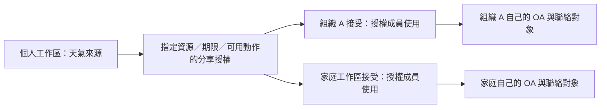

# SaaS 平台與全站 Tailwind 改版規劃

日期：2026-09-30。狀態：**全站 UI 與站內帳密登入已實作，公開入口切換及使用者登入已完成；個人／組織多 OA 已實作並完成資料庫升級，全站改為僅亮色；審核／草稿協作等仍為規劃**。

使用者已授權開始實作，並選定首版為「全站 Apple 風格＋Tailwind，先完整接上現有功能」。下方平台方向、資料模型及新功能仍依階段推進；「建議／規劃」不代表現有能力。首版沿用原生 JavaScript、現有認證及授權，不進行資料遷移。

### 首版實作範圍

- 全站以 `styles/app.css` 為 Tailwind 編譯入口，`index.html` 只載入 `web/app.css`；既有元件逐步整合，沒有新增前端框架或 CDN。
- 共用側欄、工具列、工作區／角色提示、系統字體、分段控制、亮色主題與手機抽屜（原深淺主題已於 2026-09-30 移除）；沿用原有品牌，AI 圖只參考版面與互動方向。
- 報告搜尋、清單／卡片切換與詳情；聯絡對象詳情與既有管理表單相接。桌面分欄，窄螢幕採單頁詳情／返回清單。
- `Ctrl / ⌘ K` 開啟工作台搜尋，僅涵蓋目前 API 授權且已載入的頁面、報告、聯絡對象；支援鍵盤操作。
- 新增獨立「排程管理」，使用既有單次預約 API、取消確認及工作結果；不模擬循環、自動化規則或審核進度。
- 原有多格式編輯、檔案選取、圖片預覽、訊息確認、訂閱、組織、人員及範圍授權繼續使用真實功能。多 OA 選單已於後續階段接上真實資料；通知、審核、版本歷史未以空按鈕呈現。
- 保留 `#00B900`；首版時深／淺各 53 個畫面與狀態通過文字對比檢查，最低 5.646:1／5.297:1（現為僅亮色，57 個畫面最低 5.297:1）。首版 74 項 Python 測試通過（目前 101 項）；瀏覽器使用隔離資料驗證現有及新增流程，禁止呼叫真實 LINE 發送。

已接續實作站內登入，部署及切換狀態見第 12.6 節。多 OA 實作狀態見第 13 節；下一階段為草稿／審核及循環排程；第 10 節的容量數字依然是目標，不是本次效能測試結果。

> **用語（2026-10-01）**：介面與文件以「聯絡對象」稱呼在 LINE 上往來的個人、組織／團體與群組，發送訊息時選擇的對象稱「發送對象」；不再使用「收件者」「收件人」。後台已移除「一般收件者」（`employee`）角色：只在 LINE 收訊的人就是聯絡對象，不建立後台帳號。本文第 14、15 節引用的舊名稱屬歷史紀錄。

## 1. 已確認的方向

- 整個後台統一使用 Tailwind CSS 主題；UI／UX 學習 Apple iOS／macOS，不只組織與人員管理。
- 保留主色 `#00B900`，其他背景與輔助色維持低飽和綠色相近色，避免大面積亮綠。
- 全站僅提供亮色介面（2026-09-30 改為不提供深色模式）；保留手機版與 Apple 風格的清楚層級及留白。
- UI 文字至少符合 AA 對比要求；手機版從設計開始一起規劃。
- 先以中小型 SaaS 的規模規劃，重視容易維護、跨組織隔離與操作完整度，保留未來擴充空間。
- 公司、單位、社團、俱樂部、家庭與個人工作室皆可作為組織。
- 只在 LINE 收訊的人是聯絡對象，不需要也不建立後台帳號。需要管理或發送的人才登入後台。
- 天氣是個人模組；公司數據報表與其他工具依組織、模組及人員授權區隔。
- 近期供自己與熟悉的組織使用；架構保留未來對外註冊的流程，初期邀請制為建議方案。
- 首期專注 LINE OA，支援「一個組織多個 LINE OA」及「一個人多個 LINE OA」；個人使用者不必先建立公司或組織。
- 允許組織管理員邀請人員、調整組織內角色及發送授權，具體上限建議見第 10 節。
- 訊息審核、草稿協作與循環排程皆需要；目前接受停機，後續目標遷移 Linux PC 並逐步提高可用性。
- 首版先完成全站主題與現有功能整合；後續新能力依本文件的階段及驗收條件推進。

## 2. 現況與目標分開看

| 項目 | 目前現況 | 後續規劃 |
| --- | --- | --- |
| Tailwind | 全站共用 Tailwind 編譯入口，整合既有元件與 Apple 風格版面 | 後續功能延續共用主題與互動規則 |
| 前端 | 原生 HTML／JavaScript，管理服務提供頁面與靜態檔 | 建議 Vue 3＋TypeScript＋Vite＋Tailwind；先做代表性原型再逐頁遷移 |
| 組織與權限 | 已有組織、成員資格、發送範圍與後端檢查 | 補齊租戶邊界、權限生命週期與管理委派設計 |
| 發送 | 立即／單次預約、多格式訊息、送出前驗權，獨立排程管理頁 | 草稿、範本、循環排程、審核與用量設計 |
| 報告 | 搜尋、清單／卡片、詳情、來源登記、預覽、單筆移除及內建天氣恢復 | 批次管理、版本、封存與來源健康狀態 |
| 檔案變更推送 | 尚未實作 | 獨立自動化規則與觸發紀錄 |
| 對話媒體 | 訊息紀錄與媒體識別資訊；未下載媒體本體 | 媒體保存、內容去重、訊息引用與保存政策 |
| 執行環境 | 本機 Python、SQLite、Cloudflare Tunnel＋站內帳密登入 | 依實際規模規劃持續運行、備援與部署演進 |
| LINE 連線 | 個人／組織多 OA、憑證加密、專屬 Webhook、工作區／OA 切換及資料隔離 | 額度監控、OA 移轉與更細的 OA 成員授權 |

現有測試結果只證明目前版本已檢查的行為，不視為未來全站改版或中小型 SaaS 容量的驗收結果。

## 3. 平台定位與主要使用者

定位為「供個人與組織使用的 LINE 多 OA 管理、報告與通知平台」。首期通訊整合只做 LINE OA；其他通訊平台及通用外部服務連接器不列入本期。天氣與公司報表仍是可透過 LINE 發送的內容模組，保留既有規劃。

核心流程為「登入平台帳號 → 選個人／組織工作區 → 選 LINE OA → 管理該 OA 的聯絡對象、內容與發送」。同一人可管理自己的多個 OA，也可依組織授權管理組織 OA；這兩種情況不混用資料或權限。

| 使用者 | 主要工作 | 首頁優先呈現 |
| --- | --- | --- |
| 平台管理員 | 管理全部組織、模組開放、後台帳號及平台健康 | 待處理事項、組織概況、異常工作與整合狀態 |
| 個人工作區擁有者 | 管理自己工作區內的多個 LINE OA、內容與發送 | 我的 OA、聯絡對象、報告與排程；無須填寫公司／部門 |
| 組織管理員 | 管理目前組織的人員、可委派授權、聯絡對象與已開放功能（人員委派待實作） | 組織報告、待審核、近期發送、排程與需處理的問題 |
| 發送人員 | 向指定部門／專案／群組發報告或通知 | 可用報告、建立發送、本人草稿／預約／結果 |
| 聯絡對象（非後台角色） | 在 LINE 收訊，依可用功能訂閱 | 無後台入口，不建立登入帳號；「一般收件者」角色已於 2026-10-01 移除 |

小組長、部門主管、專案主管是職務名稱；預設對應發送人員，不因職稱自動取得管理權。已確認允許組織管理員邀請人員、管理組織內角色與授權；第 10.3 節定義建議上限，本次不擴張現有程式權限。

## 4. 全站資訊架構

建議區分「目前組織工作區」與「平台管理區」。頂部固定顯示目前組織、真實登入身分、角色或唯讀預覽狀態；平台管理員仍需明確選定工作範圍後才進行資料操作。

| 導覽區 | 頁面 | 主要內容 |
| --- | --- | --- |
| 工作區 | 工作總覽 | 待辦、報告更新、即將發送、失敗或逾期工作、下一步捷徑 |
| 內容與發送 | 報告中心 | 報告清單、搜尋分類、版本預覽、來源狀態與管理 |
| 內容與發送 | 訊息中心 | 草稿、範本、立即／預約發送；支援既有訊息格式 |
| 內容與發送 | 排程與自動化 | 單次預約、未來循環規則、檔案觸發規則、暫停與執行紀錄 |
| 對象與互動 | 聯絡對象 | 個人／LINE 群組、分類、備註、訂閱、有效狀態 |
| 對象與互動 | 對話紀錄 | 聊天室與訊息檢索，未來附件保存與清理操作 |
| 對象與互動 | 訂閱管理 | 按模組查看可訂閱項目；天氣僅在有授權時出現 |
| 組織管理 | 人員與權限 | 登入人員、角色、發送範圍、邀請／停用與權限說明 |
| 工作區設定 | LINE OA 與模組 | 本工作區的 LINE OA、連線狀態、已開放模組及報告來源 |
| 紀錄 | 發送與稽核 | 發送工作、逐筆結果、操作人、權限變更與追查 |
| 平台管理 | 組織／模組／平台設定 | 跨組織管理、模組配置、服務狀態及維運設定 |

這是候選導覽分組，不是要求一次新增所有頁面。未實作功能不先放可點擊卻無作用的入口；一般人不顯示平台管理區。模組授權、資料可見性與操作權限分開判斷。

## 5. 全站 Tailwind CSS＋Apple iOS／macOS 設計系統

**已確認：Tailwind CSS 負責樣式與主題實作，Apple iOS／macOS 作為視覺及操作方式的參考。** 前端是否採 Vue 不影響這個方向；範圍包含登入、工作區外框、清單、表單、編輯器、審核及設定頁。

### Apple 風格如何落到本平台（待實作）

Apple HIG 強調清楚的視覺層級及適應不同空間的版面；本平台依此規劃下表，具體元件與數值是本案設計提案。[Apple HIG](https://developer.apple.com/design/human-interface-guidelines/)、[Layout](https://developer.apple.com/design/human-interface-guidelines/layout)

| 面向 | 桌面參考 macOS | 手機參考 iOS |
| --- | --- | --- |
| 導覽 | 側欄＋工具列＋主要內容；名單與詳情可分欄 | 導覽抽屜＋單欄內容；詳情有清楚返回入口 |
| 組織與 OA | 頂部保留工作區與 OA 上下文，切換器用選單 | 精簡切換器，展開後顯示完整名稱與目前選項 |
| 人員與設定 | 分組清單、行內摘要，點選進入詳情 | 分組設定列、標題／說明／目前值，整列容易點選 |
| 分類切換 | 圓角分段控制、明確選中區塊與鍵盤焦點 | 點選區至少 44 CSS px，選項多時改選單 |
| 表單與確認 | 短表單用對話框，複雜設定用詳情頁 | 短操作用底部面板，長流程用完整頁面，保留取消／返回 |
| 編輯與審核 | 左側編輯、右側預覽，主操作位置一致 | 分步編輯與可切換預覽，送出前顯示 OA、對象與版本 |

- 字體使用裝置系統字型與中文字型回退；以字級、字重、對齊及留白建立層級。內文建議 14–16px、手機表單 16px 起，不以極細字或過淡灰字營造風格。
- 間距先採 4／8px 基準；控制項圓角建議 8–12px、容器 12–20px，再用原型調整。一般按鈕與密集清單維持清楚輪廓，分段控制可採膠囊形。
- 陰影輕且有用途；半透明只用於導覽／工具列，內容、表格、表單保持穩定背景。瀏覽器不支援模糊或使用者減少透明時，改為實色。
- 動態建議 150–220ms，用於開合、選取及狀態變更；減少動態模式下取消非必要過渡，避免連續背景動畫。
- 純圖示適用於重新整理等熟悉操作，提供 tooltip、可讀名稱與手機說明；發送、授權、刪除等重要動作保留明確文字。
- 主色仍為 `#00B900`，大面積使用低飽和背景；全站僅亮色，半透明背景及互動狀態依本平台 AA 對比標準驗收。
- 網站操作保留瀏覽器返回、鍵盤及 Windows／Android 的可用性；先以實際資料檢查搜尋、權限設定與發送流程是否容易理解。

原型驗收至少包含登入、人員管理及訊息審核三頁，提供桌面／手機及空白／載入／錯誤狀態（僅亮色）。這些規劃尚未代表全站完成 Apple 風格改版。

### 主題與元件

- 在單一主題來源定義背景、卡片、文字、次要文字、邊框、主要操作、焦點及狀態色；元件使用語意變數，不逐頁硬寫色碼。
- `#00B900` 保留為主要操作與品牌標記；搭配可讀的深色文字。灰綠、苔綠、森林綠用於大面積背景及輔助區。
- 延續本機編譯及鎖定依賴版本；正式部署提供編譯後 CSS。是否調整目前 Tailwind 前綴／樣式層，於遷移前決定。
- 先統一 Button、IconButton、Input、Select、Checkbox、StatusBadge、Tabs、Dialog、Drawer、Toast、EmptyState、Skeleton，再遷移頁面。
- 頁面共用 PageHeader、搜尋篩選列、DataTable／手機清單、DetailPanel、批次操作列、分頁與確認視窗。
- 統一一般、hover、focus、disabled、loading、error、selected 狀態；錯誤與警示有文字、圖示或邊框，不只靠顏色。
- 圖表、狀態摘要與編輯器預覽使用同一主題，但不修改上傳圖片本體。

### 版面與互動

- 桌面以可收合側欄、固定頂部工具列、清楚頁面標題與內容區為基礎。
- 清單頁優先讓使用者掃描名稱、狀態與下一步；複雜設定放詳情頁或抽屜，避免大量堆疊小卡片。
- 一個頁面／步驟有清楚的主要操作；危險操作與一般編輯分開。
- 小型新增用視窗或手機底部表單；長表單、複雜權限及多步訊息編輯使用完整頁面，避免多層巢狀視窗。
- 搜尋、篩選、排序、分頁保留在同組織的頁面狀態；切換組織或身分時清除選取與不適用的快取。
- 組織切換前提示未儲存內容；草稿不得無聲帶入另一組織。
- 全站提供 loading、無資料、無搜尋結果、無權限、連線中斷及可重試錯誤狀態。
- 刪除／停用／封存的名稱、影響對象與是否可恢復需明確；批次動作先顯示筆數與範圍。

### 手機與無障礙

- 手機以組織下拉選擇、導覽抽屜與單欄任務流程為主；重要內容不被長導覽或大量統計卡壓到頁面下方。
- 寬表格改為可讀的資料列／卡片，只在確有必要的比較欄位使用橫向捲動。
- 點擊區以至少 44px 為設計目標；主要送出／儲存操作易於觸及，並避開鍵盤與安全區。
- 鍵盤、焦點回復、讀屏標籤、錯誤對應欄位及減少動態設定納入元件規格。
- UI 文字以至少 4.5:1 驗收；互動圖示、焦點與必要邊界另檢查非文字對比。
- 手機不能依賴 hover 才能理解操作；純圖示按鈕需有可讀名稱與可取得的說明。

## 6. 優先梳理的操作流程

| 流程 | 規劃步驟 | 完成時需讓使用者知道 |
| --- | --- | --- |
| 組織啟用 | 建立組織 → 選模組 → 檢查連線 → 加入人員 → 設定範圍 | 哪些項目已完成、還缺什麼、下一步在哪 |
| 新增後台人員 | 選組織 → Email／名稱 → 角色 → 範圍及模組 → 接受邀請／啟用帳號 | 帳號啟用與組織授權分開；目標流程不依賴 Cloudflare 白名單 |
| 發送訊息 | 選組織及 OA → 編輯／選報告 → 選對象 → 選時間 → 預覽／必要審核 → 查看結果 | 由哪個 OA 發給誰、哪一版內容、何時發、是否真正完成 |
| 管理報告 | 選來源／上傳 → 設歸屬與可見範圍 → 預覽 → 發送／封存／移除 | 刪除的是來源、版本或原始檔，是否影響預約 |
| 檔案觸發 | 選來源 → 檔案穩定及去重規則 → 指定對象 → 試跑 → 啟用 | 首次啟用／重啟是否補發，觸發及停止原因 |
| 權限調整 | 選組織與人員 → 檢視現況 → 修改 → 顯示影響 → 儲存 | 模組、報告、收件範圍與既有預約的影響 |

發送結果仍要區分「已排程、處理中、LINE 已接受、失敗、結果不明、取消、逾期」。不得把 API 接受當成對方已讀；結果不明不得無條件重新傳送。

## 7. 中小型 SaaS 的資料與權限邊界

先採模組化單體：一套 Python 應用、一個主要資料庫與持久化背景工作，由明確的工作區條件隔離資料。初期不為每個組織建立獨立服務或資料庫，也不導入微服務、Kubernetes 或跨區部署。規模縮小不代表放寬資料隔離；正式資料表與遷移方式待設計：

| 概念 | 責任與邊界 |
| --- | --- |
| 平台帳號 | 表示真實登入者；可擁有個人工作區並加入多個組織，不直接等同 LINE 使用者或 OA |
| 組織／工作區 | 個人與組織採共用工作區概念、不同類型；每筆資源明確歸屬，使用固定識別碼 |
| 成員資格 | 同一帳號在某組織的角色、啟用狀態與有效授權 |
| 發送範圍 | 某組織內的部門、專案或明確 LINE 聊天室集合 |
| LINE OA 連線／Channel | 個人或組織工作區均可有多 OA；每一 Channel 初期僅屬一工作區，憑證、事件及收件關係獨立 |
| 聯絡對象 | 個人或群組聊天室；不因可收訊就取得後台權限 |
| 模組與資源 | 模組開放、個人使用權及某份報告的存取條件分開管理 |
| 發送工作 | 綁定組織、操作人、來源版本、確認內容與逐筆結果 |
| 媒體與引用 | 檔案內容可去重，但訊息、來源、時間及授權引用獨立保存 |
| 分享授權 | 來源工作區授予指定目標工作區對指定資源的動作、期限及是否允許對外發送；不共享整個資料庫 |

- 保留「先限定組織，再判斷角色、模組、範圍及資源」的後端驗證；不可只靠 UI 隱藏。
- 組織條件需覆蓋 API、背景工作、搜尋、快取、素材預覽、下載及匯出。
- 平台管理員的跨組織操作需記錄真實身分與目標組織；角色預覽保持唯讀，不能冒用被預覽者發送。
- 同一人有多個範圍時，範圍可取聯集，但仍須同時符合組織與報告本身的限制。
- 組織管理員可委派，但上限為平台開放能力、組織有效模組與可委派範圍的交集，且不能授予平台管理員；細則見第 10.3 節。
- 多 OA 的收件關係按工作區、Channel、來源類型及 LINE ID 分開保存；Provider 識別規則與多 OA 防誤送設計見第 10.2 節。
- SHA-256 儲存名稱不等於存取權。跨組織實體去重、下載授權、引用計數及刪除政策須分開處理，不能因內容相同就開放別的組織讀取。
- 個人天氣模組目前屬內建特殊來源；建議遷入個人工作區，透過明確分享授權供組織使用，遷移時保留歷史引用與原有授權，不預設全組織可用。見第 10.5 節。

## 8. 擴充與維運規劃

先以清楚模組邊界規劃服務，不預設必須改成微服務、Kubernetes 或特定前端框架。

- 大名單採後端搜尋、分頁與批次 API；批次選取需說明是「本頁」或「全部符合條件」，並提供進度及逐筆失敗結果。
- 排程與發送需有持久工作狀態、去重鍵、可控併發、退避及公平處理，避免單一組織占滿資源。
- Webhook 接收、媒體下載、報告生成與實際發送分開描述工作生命週期；不讓慢工作阻塞收訊。
- 檢查憑證輪替、連線健康、配額、上傳容量與保存期限；介面顯示可理解的狀態及處理入口。
- 維運紀錄區分應用日誌、操作稽核與發送結果，避免記錄秘密；需要可追查單一工作。
- 定義備份、還原演練、資料保存／刪除及停用組織的處理方式。
- 依預期併發、資料量、工作堆積與部署方式，評估何時需要由 SQLite 演進至伺服器資料庫、佇列或物件儲存；本次不執行遷移。
- 若仍部署在個人電腦，關機／睡眠／斷線仍會影響服務；UI 改版不等於已取得持續運行能力。
- 第 10 節提供本機／Linux PC 的可用性、RPO／RTO 與方案規劃建議，均待實測與實作；雲端部署及企業 SSO 不列初期範圍。

## 9. 分階段產出與驗收

| 階段 | 預期產出 | 驗收重點 |
| --- | --- | --- |
| A：產品與架構規劃 | 導覽圖、角色矩陣、頁面清單、核心流程及現況差距 | 每個角色能說清楚去哪裡完成工作；待決策事項有記錄 |
| B：設計系統與原型 | 全站主題、共用元件、桌面／手機線框及互動原型 | 亮色主題一致；操作名稱與錯誤／空狀態一致；可理解下一步 |
| C：共用外框與低風險頁 | 導覽、組織切換、總覽、組織、人員與清單元件 | 組織切換不混資料；原有登入與角色限制保持有效 |
| D：核心業務頁 | 報告、聯絡對象、訊息編輯、預約／發送紀錄 | 內容快照、對象確認、送出前驗權與防重複行為可驗證 |
| E：擴充能力 | 自動化、媒體、批次、稽核及維運能力逐項設計／交付 | 每一項有獨立資料遷移、測試、回復方式與部署條件 |

此表是建議順序，不是已核准的實作排程。階段 C 以後需另有實作指示才開始。

後續驗收應至少包含：

- 新使用者能辨認目前組織與角色，完成新增人員、設定授權及第一次發送預覽，不需查找多個長頁面。
- 搜尋、篩選、分頁、批次選取與未儲存提示，在跨組織切換時行為一致。
- 所有核心頁面達 AA 文字對比；手機、平板、桌面及鍵盤流程可操作。
- 非管理角色、停用帳號、撤權後預約與跨組織直接 API 請求都經過負向測試。
- 空名單、來源遺失、LINE API 錯誤、配額不足、網路中斷、重複提交與結果不明有明確行為。
- 性能依第 10.7 節的建議容量與測試條件驗證；這些是待驗收目標，不是現況效能承諾。
- 使用隔離資料與模擬發送驗證；正式測試訊息另指定對象。既有資料、憑證、備份與共用 Tunnel 不因 UI 改版受到影響。

## 10. 九項決策與建議方案（2026-09-30）

「已確認」來自使用者本次答覆；「建議」是本次設計提案，尚未實作、啟用或完成容量驗證。整體按中小型 SaaS 規劃。

| 項目 | 已確認方向 | 建議落地方式 |
| --- | --- | --- |
| 使用對象 | 自己與熟悉組織，預留對外註冊 | 邀請制先行，日後開放申請再逐步自助註冊 |
| OA | 本期只做 LINE，組織與個人均可多 OA | 每個 OA 各自連線、憑證、聯絡對象與用量；發送前明選 OA |
| 管理委派 | 組織管理員可邀請、調角色、授權 | 組織負責人標記＋有限委派，不能跨組織或升為平台管理員 |
| 模組／方案 | 請協助規劃 | 先免費內部使用、人工開通；先建使用權與用量，後接付費 |
| 個人／跨組織 | 請研究與規劃 | 個人工作區＋資源級分享；預設不可轉分享／對外發送 |
| 工作流程 | 審核、協作、循環排程都需要 | 草稿版本 → 單級審核 → 循環排程 → 進階協作 |
| 容量 | 請協助規劃 | 首階段 10 組織、30 OA、100 後台帳號、20 同時操作，詳見 10.7 |
| 維運 | 現階段接受停機，未來 Linux PC、目標不中斷 | 先可還原、再可監控與快速恢復，最後才做第二主機備援 |
| 前端 | 請推薦 | Vue 3＋TypeScript＋Vite＋Tailwind，保留 Python 後端並逐頁遷移 |

### 10.1 使用對象與註冊生命週期

**已確認：** 現階段供自己與熟悉組織使用，但朝未來開放註冊設計。

- 初期由平台管理員建立組織及首位負責人；組織管理員邀請其他後台人員。LINE 聯絡對象不需註冊。
- 個人使用者啟用帳號後可按需建立「我的工作區」並連接自己的多個 LINE OA；不強迫建立組織、填公司名稱或設定部門。平台帳號仍依邀請制建議開通，個人工作區能力受平台開放範圍及額度限制。
- 建議以 Email＋密碼登入，帳號名稱供顯示；內部主鍵獨立於 Email，日後改信箱不改資料歸屬。Email 啟用／忘記密碼屬網站流程，不依賴 Cloudflare Access。
- 邀請綁定目標組織、Email、角色與範圍，建議 7 天到期、單次接受、可撤銷；已存在帳號只新增該組織成員資格，不再建立另一份密碼。
- 未來分「開放申請、人工審核」與「自助註冊」兩階段；新增組織預設待啟用，OA 尚未驗證及模組未開通前不能對外推送。
- 狀態分帳號啟用／停用、組織啟用／暫停、成員邀請中／有效／撤銷。退出一個組織不刪除其他組織資格。
- 公開註冊前須完成濫用限制、用量上限、帳號恢復、資料匯出／刪除與客服流程；註冊不等於自動獲得免費大量發送。

### 10.2 組織／個人多 LINE OA 的資料與操作方式

**已確認：本期只針對 LINE OA，組織與個人都可管理多個 OA。** 建議採同一套工作區模型：個人工作區歸該平台帳號擁有，組織工作區由具備資格的成員管理。

| 情境 | 工作區與 OA 歸屬 | 使用方式 |
| --- | --- | --- |
| 一個人有多個 OA | 我的工作區 → 個人 OA-A、OA-B | 同一平台帳號登入後切換 OA；不需另外建立組織 |
| 一個組織有多個 OA | 組織 A → 品牌 OA、客服 OA、內部通知 OA | 管理員分配人員可管理／發送的 OA 與收件範圍 |
| 一人同時管理個人與公司 OA | 我的工作區＋組織 A 工作區，各自擁有 OA | 先切工作區再選 OA，公司資格不授予其他人讀取其私人 OA |

本平台記錄的是 OA 的管理歸屬與操作授權，不會因建立工作區而改變 LINE 官方的 OA 管理員或 Provider 設定。建議初期每個 OA／Messaging API Channel 僅歸屬一個工作區，已有連線不能以另一工作區重複綁定；如需多人管理，透過該工作區授權處理。跨工作區分享內容時使用接收方自己的 OA 發送。

- 個人工作區擁有者可管理其 OA、來源與排程，仍受平台模組、額度及 OA 有效狀態限制；不因此取得平台管理權。個人需要團隊協作時，再明確規劃移交到組織，不自動把私人工作區變成共享組織。
- 個人模式顯示「我的 OA／聯絡對象／報告／發送」，組織模式額外顯示「人員與權限／部門與專案」；兩者共用編輯器、主題與發送機制。
- OA 選擇器顯示名稱、識別資訊及連線狀態；只有一個 OA 時可預選，多個時須明確確認。切換 OA 後清除不適用的發送對象選取並提示未儲存草稿；已建立的草稿／排程仍固定原工作區及 OA。

- 每個連線記錄工作區、Provider、Channel ID、名稱、狀態、憑證引用與額度查詢時間。憑證以伺服器端加密保存，金鑰與資料庫分開；介面只允許替換、驗證及停用，不回傳明文密鑰。
- 建議每個連線有獨立 Webhook 路徑，以路由找到 Channel secret，先驗證原始請求簽章才接受事件；路徑 ID 本身不代表授權。官方驗章規則見 [LINE Webhook 驗證](https://developers.line.biz/en/docs/messaging-api/verify-webhook-signature/)。
- 收件關係使用 `(workspace_id, channel_id, source_type, source_id)` 邊界；好友、群組可用狀態、訂閱、訊息與發送紀錄皆保留來源 Channel。事件去重使用 Channel＋Webhook event ID。
- LINE 使用者 ID 依 Provider 發放：同 Provider 同一人可取得相同 ID，不同 Provider 則不同；相同 ID 也不代表可自由共享資料或透過另一 OA 發送。[LINE 使用者 ID](https://developers.line.biz/en/docs/messaging-api/getting-user-ids/)、[Provider 設計說明](https://developers.line.biz/en/tips/2026/06/25/provider-design-basics/)
- 建立發送順序為「工作區 → OA → 內容 → 該 OA 可用的對象 → 時間／審核」。列表可跨 OA 檢視，但第一階段每筆工作固定一個 OA，不自動改用另一 OA 重送或避開配額。
- 同一人出現在多 OA 時保留各連線關係；跨 Provider 的人員連結只能透過明確綁定，不依名稱／頭像猜測。跨 OA 重複通知先提示，不默默合併或改寫聯絡對象。
- OA 停用／憑證失效時暫停其工作；轉移歸屬、刪除連線需檢查未送工作、訂閱及歷史紀錄，不自動搬到另一組織。
- 遷移現有單 OA 時先建立其工作區／連線映射，回填既有紀錄；歸屬不明者進待整理清單，不以目前登入組織直接猜測。

### 10.3 組織管理員的權限上限

**已確認：** 可邀請人員、調整組織內角色及發送授權。**建議：** 維持平台管理員／組織管理員／發送人員三個主要角色；在組織管理員中指定一位「組織負責人」，作為移交與最高組織權限的標記，不新增一串職稱角色。

| 操作 | 平台管理員 | 組織負責人 | 其他組織管理員 | 發送人員 |
| --- | --- | --- | --- | --- |
| 邀請發送人員、撤銷組織資格 | 所選組織 | 本組織 | 可委派範圍內 | 不可 |
| 新增／升降其他組織管理員 | 可 | 本組織可 | 不可自行建立同級管理員 | 不可 |
| 委派報告、OA、部門／專案／群組 | 所選組織有效能力內 | 本組織有效能力內 | 自身可委派範圍內 | 不可 |
| OA 憑證新增／替換、停用 | 可 | 本組織可 | 需明確授予「管理連線」 | 不可 |
| 開通方案／提高平台額度 | 可 | 申請 | 申請 | 不可 |
| 審核訊息 | 需記錄操作組織 | 有審核授權且非送審人 | 同左 | 僅另獲指定範圍審核能力者 |
| 刪除組織／移交負責人 | 可恢復或代辦並稽核 | 再驗證身分後申請／執行 | 不可 | 不可 |
| 管理其他組織、授予平台管理員 | 平台層專屬操作 | 不可 | 不可 | 不可 |

- 權限判定採「有效帳號與成員資格 ∩ 組織模組／額度 ∩ 角色能力 ∩ OA／資源／收件範圍 ∩ 有效分享／審核條件」。未指定即無權限；同組織多範圍可取聯集，但不可放寬報告或分享來源限制。
- 將「能使用」與「能委派」分開。組織管理員看得到某份私人分享報告，不代表能將它轉授全組織。平台停用、到期、撤銷等限制優先。
- 組織管理員只能撤銷本組織資格或寄出帳號恢復通知，不能查看／設定他人的全平台密碼，也不能停用對方在其他組織的帳號。
- 不允許刪除最後一位有效負責人；移交須新負責人接受，保留舊新身分與時間。初期首位負責人由平台指定，公開自助註冊後才由通過啟用的組織建立者取得。
- 平台管理員保留全平台管理能力；讀取組織內容與代辦操作需明確選工作區並留下稽核，不能冒名送出或靜默繞過組織審核。
- UI 用「可做的事＋適用範圍＋可否委派」三部分呈現，提供有效權限摘要及調整後會暫停的工作。

這是針對本專案的設計建議。角色與資源權限分離可參考 [GitHub 組織角色](https://docs.github.com/en/organizations/managing-peoples-access-to-your-organization-with-roles/roles-in-an-organization)；預設拒絕、最小權限與每次請求驗權依 [OWASP 授權建議](https://cheatsheetseries.owasp.org/cheatsheets/Authorization_Cheat_Sheet.html)。

### 10.4 模組開放、試用與未來計費

**建議先管理使用權與成本，初期不接金流、不自動扣款。** 平台開放的是組織可用模組，組織再授權到人員；個人天氣內容能否分享是另一項資源授權。

| 階段 | 開通方式 | 收費建議 |
| --- | --- | --- |
| 自己與熟悉組織 | 平台人工開通模組及上限，標記內部使用 | 先不收平台費，記錄實際資源用量；LINE OA 費用由各 OA 持有人負責 |
| 對外試用 | 建議 14 天試用、到期提醒、人工續期；提供測試預覽 | 不要求信用卡，不自動轉付費；未核准前不開放大量推送 |
| 對外正式方案 | 基礎通知、團隊協作、進階自動化三種能力組合 | 建議組織月費含一定 OA／後台席次／儲存量，再加購；先量測成本再定價格 |

- 基礎包含名單、報告、訊息編輯及單次預約；團隊增加協作與審核；進階增加循環排程與檔案觸發。資料隔離、備份及基本安全不作為付費解鎖項目。
- LINE 聯絡對象不算後台席次；後台帳號按組織成員資格計量，發送用量、OA 數與儲存量另列，不將一個群組誤當一位計費對象。
- 使用權記錄來源（內部／試用／方案／人工加開）、開始／到期、功能及上限。畫面顯示未開通、試用中、已開通、到期與暫停，避免用方案名稱寫死程式判斷。
- 到期停止新增工作及未送出排程，保留基本查看／匯出窗口，建議 30 天；不自動刪除資料。重新開通不補發過期通知，須明確恢復。
- 首期無超量自動加購。額度預留需具備交易一致性，送出時重驗；LINE OA Manager 外部發送可能改變餘額，因此平台估算不能保證 LINE 接受。
- LINE 實際計數依收訊人數，不是 API 次數或訊息物件數；群組也不能只算一筆。配額與平台工作量分開顯示，地區方案以官方為準。[LINE 計價與計數](https://developers.line.biz/en/docs/messaging-api/pricing/)

「產品功能使用權獨立於付款」的模式可參考 [Stripe Entitlements](https://docs.stripe.com/billing/entitlements)。本案只採其分層概念，未選定金流商或報價。

### 10.5 個人工作區與跨組織分享：研究與建議

官方產品中的常見方式如下；用途欄及本案採法是根據案例所做的設計判斷，不是直接照搬其權限規則。

| 方式與來源 | 解決的問題 | 本案如何採用 |
| --- | --- | --- |
| [Notion 指定頁面、對象與權限](https://www.notion.com/help/sharing-and-permissions) | 只讓外部協作者接觸需要的資源，不必加入整個工作區 | 指定報告／來源分享給特定組織，明列可看、可用、可發送 |
| [Slack Connect 跨組織頻道](https://slack.com/help/articles/115004151203-Slack-Connect-guide--Work-with-external-organizations) | 多組織協作時保留各自管理邊界及資源擁有方 | 來源方邀請分享、接收方管理員接受；雙方各自管理自己的成員 |

**建議採「個人工作區＋組織工作區＋資源級授權」。** 同一帳號可切換自己的空間與多個組織，私人天氣模組放個人工作區；公司報表直接歸公司工作區，不因建立者離職變私人資料。



- 分開「模組程式」、「資料來源／版本」、「發送權」：組織安裝天氣模組不會看到你的私人來源，看到來源也不代表能把內容傳給所有好友。
- 分享指定來源工作區、資源或來源系列、接收工作區、用途、期限、可查看／可建立草稿／可對外發送；預設不允許轉分享、複製成永久資產、修改原始內容或使用來源方 OA。
- 區分「單一版本」與「持續更新來源」。單一版本不跟著原檔變更；來源分享可看後續版本，但每次發送仍固定內容快照。分享本身不自動啟用推送或循環排程。
- 接收組織管理員接受後，再指定可使用的人員與發送範圍；來源授權上限始終有效。來源方不能看到接收組織的私有名單，接收方不能瀏覽來源方其他報表。
- 例如你分享天氣來源給公司 A，允許「查看＋發送」，公司管理員只授權行政人員透過 OA-A 發給 A 的指定部門；公司 B 沒有接受分享便看不到。
- 撤銷／到期立即阻止新的查看與發送，停住未執行工作並失效相關快取；已發到 LINE、已合法下載的副本無法藉平台撤權收回。保留必要稽核與版本識別，不暗中保留可繼續使用的分享副本。
- 真正需要永久副本時另設「允許複製」動作與確認，建立接收方所有的新資產並保留來源；UI 說明此副本不隨原分享撤銷。初期先不開放。
- 組織之間用分享授權保持邊界；只需外部協作某份草稿的人採資源級訪客資格，不能因此成為整個組織管理員。初期先做工作區對工作區分享，訪客協作排後續。
- 媒體先在各工作區內做內容去重；跨組織先保存授權引用，不做可被猜測 Hash 查詢的全平台檔案庫。

### 10.6 草稿協作、審核與循環排程的順序

**已確認三者都需要。** 建議先在同一組織、同一 OA 內實作，跨組織共同編輯與即時多人游標先不列首期。

| 優先序 | 範圍 | 驗收重點 |
| --- | --- | --- |
| P0 | 持久草稿、自動儲存、版本紀錄、指定協作者與留言 | 更新須比對版本；多人編輯衝突可辨識，不能靜默覆蓋 |
| P1 | 單級審核、退回修改、核准後立即／單次預約 | 建立／編輯者不得核准自己送審的版本；修改即失效重審 |
| P2 | 每日／每週／每月循環、時區、暫停與截止日 | 每次發送有唯一工作識別；重啟不重複，漏跑不一次補發大量通知 |
| P3 | 多級審核、進階協作與規則自動化 | 依實際需求增加，先不建一般化工作流程引擎 |

- 組織可設定哪些 OA／報告來源／發送類型必須審核；個人工作區可不審核，但組織規則不能由發送人員自行關掉。
- 審核固定內容版本、OA、收件清單快照、時間與附件。核准後如變更內容、增加對象、換 OA 或改時間，重回草稿／待審；撤權與退訂可在送出時縮減對象並記錄。
- 若只有一名後台操作者，UI 明確顯示無其他審核者；須由有權限的負責人調整規則並稽核，不偷偷自動核准。
- 初期採每次執行審核；後續才允許負責人核准「特定自動報告來源＋固定範圍＋期限／次數上限」的規則授權，內容來源或範圍變更即失效。
- 循環規則保存 IANA 時區（預設 `Asia/Taipei`）與 UTC 執行時間；不存在的日期建議略過，DST 重複時段只執行一次，設定時預覽後續 5 次。
- 故障漏跑預設標記逾期並通知管理員，恢復後執行下一次，不自動補齊全部。規則可另選「有效期內只補最新一次」，仍重新驗權與審核。
- 到期缺最新報告、審核未完成、配額不足或來源失效時標記阻擋原因，不偷偷發舊報告。每次執行重新檢查人員、來源分享、模組與 Channel 狀態。
- 在本平台用持久工作鍵與逐筆狀態防重複；LINE retry key 為有期限的 API 防重複機制，不等於保證送達。[LINE 重試說明](https://developers.line.biz/en/docs/messaging-api/retrying-api-request/)
- 初期維持結果不明不自動重送；日後若加入重試，須保存原請求與 retry key，限制在 LINE 有效期內，不換 key 盲目補送。

### 10.7 第一階段容量與等待時間（建議驗收目標）

以下是中小型邀請制首期的**設計與壓測目標，尚未量測現有設備，不代表現有程式已能承受**。帳號數不含 LINE 聯絡對象；工作區及 OA 上限可配置，達標後才提高。

| 項目 | 首期建議目標 | 定義／限制 |
| --- | --- | --- |
| 工作區 | 10 組織＋最多 100 個人工作區 | 個人工作區按需建立；額度共用平台總預算 |
| OA | 全平台 30；個人／組織工作區各預設最多 3 | 這是建議可配置的首期額度，不是 LINE 的限制；需增加時平台核准，總額度共用 |
| 後台帳號 | 100 個啟用帳號、20 人同時操作 | 同一帳號跨組織仍需各自成員資格 |
| 收件關係 | 全平台 10,000 筆，每 OA 初始 2,000 | 個人／群組各一筆；同人跨 OA 可有多筆，不等於 LINE 計費人數 |
| 發送工作量 | 每日 5,000、每月 100,000 次聊天室投遞 | 每次＝一工作對一聊天室；LINE 真正計費及額度另外查詢 |
| 排程 | 1,000 筆待執行工作、200 條循環規則 | 到期形成執行工作，不預建無限未來工作 |
| 報告與紀錄 | 500 個來源、100 萬筆可查詢訊息／投遞紀錄 | 須後端分頁、索引、保存政策，不能一次載入瀏覽器 |
| 檔案總量 | 50 GiB 線上素材；每工作區預設 5 GiB | 平台總上限優先，另估 DB、暫存與備份空間；影片後續再開 |
| 單檔 | 首期沿用既有圖片輸入 8 MiB、輸出 PNG 1 MB 限制 | 不因本筆記放寬現況；其他格式逐項定規格及驗收 |

- 保存建議：應用日誌 30 天、可搜尋對話 180 天、發送與權限稽核 365 天；素材預設 90 天後進清理候選，仍被有效來源、草稿、預約或分享引用者保留。工作區可縮短；延長需檢查額度。這是產品建議，不宣稱滿足特定法規。
- 平台總量／組織額度 80% 提醒、90% 要求處理、100% 阻擋新增素材與新增發送工作；提供清理與匯出，優先保留控制紀錄所需磁碟，不因滿額盲目刪除既有引用。
- 壓測暫以 4 核心、8 GiB RAM、SSD、至少 150 GiB 可用資料空間作起始環境假設；不是硬體採購建議或已驗證最低需求。備份放不同裝置，不計入同磁碟可用空間。

| 指標 | 建議通過條件 | 測試範圍 |
| --- | --- | --- |
| 清單搜尋與分頁 | API p95 ≤ 1 秒 | 20 名登入者、目標資料量、混合讀寫持續 30 分鐘；不含 LINE 外部 API |
| 新增草稿／提交工作 | API p95 ≤ 2 秒 | 回傳已儲存／已入列，不等候所有發送對象完成 |
| 手機主要畫面可操作 | p95 ≤ 3 秒 | 指定測試手機與 10 Mbps／100 ms 延遲環境；不含上傳大型檔案 |
| Webhook 接受 | p95 ≤ 1 秒 | 驗章、事件持久保存後回應；下載媒體及查名稱移至背景 |
| 排程啟動 | 到期後 p95 ≤ 60 秒開始 | 服務正常、無審核／配額阻擋、壓測量內；完成時間另列 |
| 大量發送 | 1,000 筆聊天室投遞 ≤ 10 分鐘 | 模擬 LINE 延遲且無節流／故障；每 OA 與平台公平排隊，真實 LINE 無此時間保證 |
| 小工作等待 | 正常負載 p95 ≤ 30 秒開始 | 大組織批次不能完全阻塞其他組織；顯示排隊狀態 |

- 另驗證 Webhook 短時間 20 次／秒持續 60 秒、服務重啟、工作中斷、權限撤銷與多 OA 隔離。正式壓測用模擬 LINE，不產生真實群發費用。
- SQLITE_BUSY、鎖等待 p95 超過 200 ms、資料 API 超標或需要多主機寫入時，先調整索引／交易，再評估 PostgreSQL；不以人數門檻單獨決定遷移。工作佇列先可用資料庫持久化，不預設需要 Redis。

### 10.8 Linux PC、備份與逐步提高可用性

**已確認：** 現在能接受中斷，未來想搬 Linux PC，長期目標不中斷。建議將「不中斷」轉成可量測的可用性目標，單台 Linux PC、UPS 或 Tunnel 都不能保證零停機。

| 階段 | 部署建議 | 建議可用性／恢復目標，尚未驗證 |
| --- | --- | --- |
| 現階段 Windows | 保留本機與共用 Tunnel；先補備份及可恢復工作 | 接受計畫停機、不承諾月可用率；有備機／人員時 RTO 4 小時，備份涵蓋資料 RPO 24 小時 |
| Linux PC | 專用 Linux、服務自啟／重啟、UPS、磁碟與外部健康監控 | 連續量測後以月可用率 99.5% 為目標；備援硬體可用時 RTO 1 小時，備份資料 RPO 1 小時 |
| 後續持續運行 | 第二台主機、異機資料保護、可切換入口及單一有效發送者 | 依演練結果再訂 99.9% 或更高；未完成前不承諾零停機 |

RPO 是最多可接受遺失多久的已保存資料；RTO 是故障後恢復服務的時間。30 天月份 99.5% 約容許 3 小時 36 分中斷，99.9% 約 43 分鐘；建議維護停機也計入。另區分本平台可用性與 LINE／網路外部故障，不能拿 API 上線率當訊息送達率。

- 備份：Windows 建議每日、Linux 階段每小時；保留 24 份小時、7 份每日、4 份每週備份（首階段無小時備份）。至少一份加密異機／離線副本，每月做一次還原演練並記錄實際 RTO/RPO。
- 同時保護資料庫、媒體、版本清單、必要設定及解密金鑰；金鑰獨立控管、還原流程需取得金鑰。SQLite 運行中備份使用一致快照，例如 [SQLite Online Backup API](https://www.sqlite.org/backup.html)，不只複製可能缺 WAL 內容的主檔。
- RPO 不包含停機期間未收到的 Webhook；已送出的 LINE 訊息也不能因還原倒退。還原後預設暫停發送，辨識備份後可能已執行的工作，結果不明者不補送。
- Linux 遷移順序：盤點 Windows 路徑／PowerShell 相依 → 對應 Linux 路徑或受驗證的本機上傳代理 → 安裝服務與相依 → 還原資料及素材 → 隔離驗證 → 暫停舊發送者／短暫停寫 → 最終備份 → 切換入口 → 驗收／回復。
- 天氣產生器若仍在 Windows，須明確決定一併遷移或上傳成果；伺服器改 Linux 不會自動讀取原本 `D:\` 路徑。
- 共用 Tunnel 還承載 MultiThreader。Linux 遷移時建議為 LINE 服務建立獨立 Tunnel 並只切換 LINE 子網域，仍保留 Cloudflare Tunnel 技術；不要將 Linux 直接加入原共用 Tunnel 就假定所有本機服務都能互通。
- 初期以 systemd 管理 Python Web／worker；前端提供編譯後靜態檔。DB／worker 維持單一權威狀態，雙機切換需租約或隔離舊執行者，避免同一排程雙發。
- 到多主機前再決定 PostgreSQL、遠端素材儲存與高可用佇列；本輪不安裝容器平台、不建立叢集。

### 10.9 前端技術選型建議

**建議：Vue 3＋TypeScript＋Vite＋Tailwind CSS，Vue Router 管理頁面；跨頁共用的帳號／工作區／編輯狀態採 Pinia，局部表單仍用局部狀態。保留 Python API。** 這是根據現有原生 JavaScript、多人管理、組織切換及訊息編輯複雜度做的專案選型，尚未安裝或遷移。

| 選項 | 本專案的取捨 | 建議 |
| --- | --- | --- |
| 模組化原生 JavaScript＋Tailwind | 不需換框架，但複雜草稿、版本、表單與跨頁狀態需自行維護 | 保留既有穩定頁與純函式，作為逐步遷移起點 |
| Vue 3＋TypeScript＋Vite | HTML 類型模板便於銜接現有畫面；可建立可重用表單／編輯器元件，但需學習工具鏈 | 優先做代表性原型，通過後逐頁採用 |
| React＋TypeScript＋Vite | 也能漸進整合；若未來維護者更熟 React 有採用理由，但現有專案未建立 React 資產 | 保留替代選項，不同時導入兩套框架 |

Vue 官方支援漸進採用，`create-vue` 採 Vite；React 也提供既有專案整合方式，因此推薦 Vue 是維護選擇，不是宣稱 React 做不到。[Vue 入門](https://vuejs.org/guide/quick-start.html)、[React 漸進整合](https://react.dev/learn/add-react-to-an-existing-project)、[Pinia](https://pinia.vuejs.org/introduction.html)

- Tailwind 沿用品牌色 `#00B900`、低飽和相近色、僅亮色介面及 AA 驗收；編譯工具可整合 Vite，版本於實作時鎖定。[Tailwind Vite 整合](https://tailwindcss.com/docs/installation/using-vite)
- 不先選大型套版覆蓋現有設計；優先做少量共用元件。Dialog／Popover／選單如採第三方元件，另驗證鍵盤、焦點及讀屏行為，不假設用了 Tailwind 就符合無障礙。
- 原型先驗證「組織切換＋人員授權表單」、「多格式訊息草稿＋預覽＋版本衝突」、「手機審核」三個流程；衡量狀態清楚程度、重複程式與測試成本。
- 先建立 API 型別與錯誤契約、主題及共用外框，再分批搬低風險頁、編輯器與排程。新舊頁不共用同一 DOM 控制權，避免 Vue 與既有 DOM 操作互相覆蓋。
- 初期採前後端同源、伺服器 Session／HttpOnly Cookie；前端路由守衛只改善體驗，後端仍逐次驗權，切工作區時清除不適用快取與選取。
- 內部管理後台先不引入 SSR、Nuxt 或新的 Node 常駐後端；Node 用於建置，正式 Python 服務提供編譯結果。保留既有瀏覽器流程測試，再加有意義的元件／權限測試。

### 10.10 規劃結論與接續順序

建議依序完成：個人／組織工作區與多 LINE OA 權限矩陣 → 登入、邀請及 OA 切換原型 → 全站主題與前端代表性原型 → 草稿／審核／循環規則設計 → 容量與故障驗收計畫 → Linux 遷移手冊。首個多 OA 驗收涵蓋「個人 2 個 OA」、「組織 2 個 OA」及同一帳號跨工作區切換，確認聯絡對象、草稿、排程及憑證不混用。其中個人／組織多 OA、工作區切換與站內登入已實作（第 12、13 節）；其餘仍是筆記，需後續實作指示才改程式。

後續需在具體原型或實測時定案：方案價格與金流商、超過首期容量的預算、密碼恢復郵件服務、Linux 設備與備援資源，以及原型驗證後的前端依賴版本。已確認的一組織多 OA、管理委派、先供自己與熟悉組織使用，以及保留 Tunnel 不再列為未決問題；邀請制、角色委派細則與技術組合為本次建議。

## 11. 文件關係與下次接續

- [專案需求.md](專案需求.md)：功能與權限需求，本筆記補充全站產品與 UX 方向。
- [UI風格與元件規範.md](../UI設計/UI風格與元件規範.md)：現行介面規範，後續擴充為全站設計系統。
- [UI配色與對比規範.md](../UI設計/UI配色與對比規範.md)：既有色票與已驗證結果。
- [LINE訊息格式與編輯器設計.md](../功能規格/LINE訊息格式與編輯器設計.md)：訊息內容格式與編輯器需求。
- [進度紀錄與UIUX重規劃.md](進度紀錄與UIUX重規劃.md)：已完成事項及待接續工作。

> 2026-10-02：第七階段已移除「匯入既有 OA」、單一 OA 模式、個人工作區與 `upgrade_multi_oa.py`，OA 一律在網頁「LINE OA」頁新增；本節以下為當時紀錄。

全站 Tailwind、站內登入與多 OA 已完成。下次先由平台管理員匯入既有 OA（第 13 節），再依第 10.6 節規劃草稿／審核與循環排程。框架更換或部署重構不能僅因讀到這份筆記就自動開始。

## 12. 保留 Cloudflare Tunnel，改用網站帳號密碼登入

使用者於 2026-09-30 確認：**連線繼續使用 Cloudflare Tunnel，登入驗證與授權規則改由本網站管理，不使用 Cloudflare Access 作為人員登入機制。** 操作體驗參考 `D:\Tools\MultiThreader` 的「網址＋站內帳號密碼」。已接續實作，現行部署已改用站內帳密登入，保留 Tunnel；第 12.6 節記錄驗收狀態。

### 12.1 查核到的參考專案現況

- MultiThreader 的 `README.md`、`控制台規劃.md` 記載公開入口仍由 Cloudflared／共用 Tunnel 提供，網址為 `https://multithreader.stack-base.com`。
- `templates/login.html` 提供帳號與密碼欄位；`multithreader/web.py` 使用站內使用者資料、密碼雜湊驗證及登入 Session。
- 因此「有自己的網址與帳密登入」和「使用 Tunnel」可以同時成立。參考專案是站內驗證與公開連線分開處理，不是已移除 Tunnel 的範例。
- 本次只閱讀程式與文件，沒有讀取／複製該專案帳密、Token 或登入資料，也不修改它的設定。

### 12.2 三個層次分開設計

| 層次 | 用途 | 與本次需求的關係 |
| --- | --- | --- |
| 網域／網址 | 使用者進入網站的固定地址 | 可沿用既有子網域，通常不必購買新網域 |
| 網路入口 | 讓網際網路連到實際服務 | 保留既有 Cloudflare Tunnel 與本機服務 |
| 登入與授權 | 驗證登入者，再決定可操作的組織與資料 | 採網站帳號密碼、登入 Session 與後端權限檢查，取代 Cloudflare Access 人員登入 |

Cloudflare Tunnel 提供對外連線；Cloudflare Access 提供存取驗證。站內帳密登入可以配合不同網路入口使用。[Cloudflare 說明](https://developers.cloudflare.com/use-cases/apis/internal-services/)

### 12.3 已選定的登入與連線流程

```text
瀏覽器 → https://line-admin.stack-base.com → Cloudflare Tunnel
→ 本機管理服務 → 網站帳號密碼登入 → Session 驗證 → 組織／角色／發送範圍授權
```

- 沿用現有網域、Tunnel 與本機服務位置；電腦仍須開機、連網並持續執行服務。
- 使用者直接看到本平台登入頁，完成切換後不再經過 Cloudflare Access Email 驗證碼登入。
- 帳號啟用／停用、密碼與 Session 管理由本平台處理；每個管理 API 均依實際登入帳號檢查權限。
- 平台管理員、組織管理員、發送人員及跨部門／專案範圍沿用既有授權邊界；聯絡對象不因此取得後台帳號。
- 不採用前次討論的「移除 Tunnel、搬到公開主機」或「本機直接開放連線」方案。未來主機遷移如有需要，另行規劃。

### 12.4 站內登入的功能範圍

- 自有登入頁，沿用全站 Tailwind 主題、`#00B900`、亮色介面及手機版。
- 帳號識別建議沿用既有 Email，另設顯示名稱與固定帳號主鍵；配合第 10.1 節邀請／啟用流程設計資料結構。
- 管理員建立／邀請帳號、初始密碼設定或啟用連結、修改／重設密碼、停用帳號與撤銷既有登入。
- 密碼以適當的密碼雜湊保存，不儲存明文；Session、Cookie、CSRF、登入嘗試限制及登出流程需完整設計。
- 可規劃「記住登入」及登入裝置管理；仍需定義有效期、撤銷及敏感操作重新驗證。這不等於多個帳號共用同一登入身分。
- 忘記密碼需決定郵件服務或管理員重設流程；MFA 可列為後續管理員選項，不能先顯示未實作功能。
- 現有 Cloudflare Access 使用者沒有可直接轉用的站內密碼；須保留原帳號、組織資格與授權，透過明確啟用流程建立認證資料。
- 真實登入身分與管理員唯讀視角預覽保持分開；登入改版不提升任何現有角色權限。
- 完整站內認證及管理 API 保護驗收後，才安排替換 Access 入口；不能先移除 Access 再補登入。

### 12.5 LINE、本機報告與切換驗收

- LINE 接收事件仍需要可由 LINE 平台存取的 HTTPS Webhook。Webhook 用 LINE 簽章驗證，不導向人員帳密登入頁。[LINE Messaging API](https://developers.line.biz/en/reference/messaging-api/)
- LINE 取圖所需網址仍需設計可達性與素材存取範圍；管理 API、私人素材與公開取圖不能因更換登入方式而混用保護規則。
- 本機服務位置不變，`D:\Tools\ai_weather_report\output\weather_report.png` 等報告來源維持現有方式，不需因登入改版新增雲端上傳流程。
- 沿用 `line-admin.stack-base.com`／`reports.stack-base.com` 的管理與公開服務分工；只針對本平台管理入口規劃 Access 政策切換，不影響 MultiThreader 或共用 Tunnel。
- 切換驗收包含登入／登出、逾時、停用帳號、密碼重設、撤銷 Session、未登入直接呼叫管理 API、跨組織存取與既有預約權限重驗；並確認 Webhook、LINE 取圖與推送仍正常。
- 完整登入機制驗證完成後才切換入口；切換失敗須能恢復既有 Access 保護及登入流程。

### 12.6 站內登入實作與切換狀態

- `/login` 使用既有 Apple 風格 Tailwind 亮色主題，提供 Email／密碼、保持登入、顯示密碼與恢復說明。
- scrypt 密碼雜湊、隨機 opaque Session／HttpOnly Cookie、CSRF 與同源檢查、持久化速率限制已實作；Cookie 不取代後端組織／角色／發送範圍重驗。
- 原有 Access 身分可設定自己的網站密碼；本機控制台仍保留獨立管理入口。平台管理員可產生 30 分鐘一次性設定連結；不自動寄信、不代設密碼、不開放聯絡對象註冊。
- 一般登入最長 12 小時、閒置 2 小時失效；保持登入最長 30 天、閒置 7 天失效。改密碼／重設／停用會撤銷既有 Session，登出撤銷目前 Session。
- 已新增 `ADMIN_AUTH_MODE=cloudflare|password`，本機 `configure_login.py` 檢查管理員已設定密碼後才允許切換。當前已切為 password 模式；Cloudflare Bypass 已生效，全新瀏覽器確認公開首頁進入同網域 `/login`、未登入 `/api/session` 回傳 401，使用者已確認登入完成。
- 後續已依使用者要求清空正式資料庫、刪除舊備份，並由完整 `schema.sql` 建立新資料表；舊版補欄位、换表與回填邏輯已移除。使用者已重新建立平台管理員及密碼。
- 測試涵蓋有效／失效 Cookie、期限、跨站阻擋、角色隔離、停用、改密碼、啟用連結一次性／並行兌換與切換檢查；瀏覽器驗證完整操作。步驟與回復方式見 [網站登入.md](../功能規格/網站登入.md)。

此階段尚未包含 Email 發信、MFA、外部註冊及 LINE Login；多 OA 資料模型及其他 SaaS 功能仍依後續階段推進。


## 13. 個人／組織多 LINE OA 實作（2026-09-30）

本次已接上既有收訊、名稱快取、報告、圖片素材、多格式編輯、立即發送、單次預約、訂閱與發送紀錄。

- **工作區與管理**：頂端選擇個人／組織工作區及 OA；「LINE OA 管理」可新增、驗證、更新憑證、停用／啟用。平台管理員可管理所有工作區；個人 OA 由本人管理；組織 OA 由該組織管理員管理。聯絡對象沒有後台登入資格。
- **歸屬固定**：一個 OA 只屬於一個工作區，以 LINE 回傳的 Bot user ID 防止重複登記。Token 更新不能換成另一個 OA。此版未提供工作區移轉。
- **資料隔離**：同一 SQLite 檔內以 `channel_id` 區隔。訊息、聯絡對象、指令去重採 OA 複合鍵；報告、素材、發送工作、操作紀錄、發送範圍及授權均帶 OA 範圍。相同 LINE user ID／message ID 出現在不同 OA 時，不合併訂閱或資料。
- **發送**：API 驗證 OA 存取權，畫面確認 OA／工作區；切換後清除尚未送出的內容與對象。預約固定保存 OA，工作執行時重新驗證資格、OA 狀態、收件範圍及 Token，絕不改用其他 OA。結果不明仍不自動重送。
- **憑證與 Webhook**：Token／Secret 以 Fernet 加密保存，金鑰位於忽略追蹤的 `instance/line-credentials.key`；管理 API 不回傳原值。每個 OA 使用 `/webhook/{channel_id}`，依其 Secret 驗證原始本文簽章及 `destination`。Token 驗證僅讀取官方帳號資料；Secret 須由 LINE Developers 的 Verify 實際確認。
- **既有 OA**：首次匯入時選擇工作區，保留原本 `/webhook` 入口作為該 OA 的別名。原本帳號、密碼、組織與訊息保留；不重新建立管理員。
- **部署**：`schema.sql` 仍是完整的新安裝 schema；舊安裝僅需停止 LINE 服務後執行一次 `upgrade_multi_oa.py --apply`。工具以單一交易保留所有資料並檢查筆數／完整性，錯誤即 rollback；正常啟動沒有歷史遷移分支。共享 Tunnel 不需重建。正式資料庫已於 2026-09-30 完成升級，服務已重啟。
- **備份與 Linux**：須同時保存 SQLite、`instance/line-credentials.key`、上傳與已發布圖片；單有資料庫不能解密憑證。金鑰檔必須限制為服務帳號可讀，不提交 Git。
- **命令列**：多 OA 模式的 `send_image.py` 必須加 `--oa <channel_id>`，避免以舊環境 Token 搭配其他 OA 名單。

驗證包含既有 Python 回歸、多 OA 重複 ID／訂閱隔離、越權、素材／報告隔離、非預期 Token 更換、排程憑證路由、資格撤銷、Webhook 簽章及資料升級 rollback。瀏覽器以假 LINE API 驗證新增 OA、切換、個人上傳、手機版及文字 AA 對比（改為僅亮色後重新驗證）；沒有發送真實訊息。

此階段不包含額度／方案計費、公開註冊、草稿協作、審核、循環排程、檔案變更觸發或媒體下載；Telegram 繼續暫緩。

**正式環境現況（2026-09-30，已由第七階段取代）**：既有 OA 尚未匯入工作區（`line_channels` 為 0 筆），服務以 `.env` 憑證的單一 OA 模式運作，收發正常。平台管理員於「LINE OA 管理」按「匯入既有 OA」並選定工作區後，即切換為多 OA 模式。

依據 LINE 官方文件：[Bot information / Messaging API](https://developers.line.biz/en/reference/messaging-api/#get-bot-info)、[Webhook 簽章驗證](https://developers.line.biz/en/docs/messaging-api/verify-webhook-signature/)、[接收訊息與 destination](https://developers.line.biz/en/docs/messaging-api/receiving-messages/)。

## 14. Vue＋Apple HIG 收件者管理原型（2026-09-30，未整合）

另一份筆記「SaaS 平台與全站 Tailwind 改版規劃」（已併入本節並刪除）記錄了一個 Vue 3 收件者管理元件原型。下列內容已依實際檔案查核；原筆記中「全部測試通過、可準備部署」等說法與程式現況不符，不予採用。此原型不代表第 10.9 節的前端選型已開始實作。

### 14.1 相關檔案

下列原型檔已於 2026-10-01 全部移除（`templates/` 與根目錄 `web/`），需要時可從 commit `3888aae` 取回。正式網頁檔案位於 `line-oa-archive/web/`，首頁為根目錄 `index.html`。

| 檔案 | 內容 |
| --- | --- |
| `web/components/crm/contacts-manager.vue` | Vue 3 單檔元件（約 363 行）；`templates/components/crm/` 有相同副本 |
| `web/index.html` | 以 unpkg 載入 Vue，並用 `require()` 載入 `.vue` |
| `web/test.html`、`web/test-esm.html`、`web/test-integration.html` | 以 unpkg Vue 做 ES Module／全域版本載入測試 |
| `templates/apple-hig-contacts.html`、`templates/apple-hig-sidebar.html` | Apple HIG 風格展示頁；前者使用 Tailwind Play CDN |
| `web/app.css`、`web/management.css`、`templates/management.css` | 全域與管理介面樣式；根目錄 `web/` 的 CSS 為 `line-oa-archive/web/` 的重複副本 |
| `templates/apple-hig-index-prototype.html` | 原型曾覆蓋正式首頁 `index.html`，並在 `styles/app.css` 末尾追加樣式、清空 `admin_server.py`；已於 2026-09-30 還原正式版本，原型首頁移至此檔保存 |

### 14.2 元件目前內容

- 統計卡片 4 張（總收件者、組織標籤、活躍、待處理），數值為寫死的示範資料，未接 API。
- 篩選 4 種：全部、活躍、未分類、高級搜尋。
- 排序 5 種：姓名 A–Z／Z–A、Email、新增時間新→舊／舊→新。
- 收件者卡片：頭像、名稱、職位、部門、電話等欄位、進度條、組織標籤、狀態指示、主要／更多動作按鈕、空狀態與載入遮罩。
- `contacts` 初始為空陣列，沒有 CRUD、批次操作或 CSV 匯入匯出。

### 14.3 查核到的問題

- `stats` 的 `label` 字串引號位置錯誤（`'...' </span>`），屬 JavaScript 語法錯誤，元件無法載入。
- 瀏覽器不能直接 `import`／`require()` `.vue` 單檔元件，需經 Vite 等工具編譯；目前的測試頁無法真正渲染此元件。
- 使用 unpkg、Tailwind Play CDN，違反首版「不新增前端框架或 CDN」及本機編譯、鎖定依賴版本的原則。
- 資料欄位（Email、職位、部門、電話、網站、進度）屬通用 CRM 模型，與本平台的 LINE 聯絡對象（個人／群組聊天室、`channel_id` 範圍、訂閱、發送範圍）不一致；也未處理工作區／OA 隔離與後端權限。
- 部分文字色（如 `text-gray-500`）未依本平台 AA 對比規範驗證。

### 14.4 後續處理建議

- 視為視覺參考，不直接接到正式入口。若採 Vue，依第 10.9 節先建立 Vite＋TypeScript 建置、API 型別與共用外框，再以真實聯絡對象 API 重做此頁。
- 原型只參考名單清單、標籤及篩選互動。目錄名稱 `crm` 不代表產品範圍；活動管理、分析儀表板、銷售流程不因原型而列入需求。名單相關功能以第 15 節為準，CSV 匯入匯出另行確認。

## 15. LINE 對話對象（TA）與名單管理（2026-10-01 需求澄清）

**CRM 只是介面與操作的舉例，並非要建置 CRM 系統。** 使用者要的是基本的 LINE 對話對象分類、標籤、篩選與名單管理。本節取代先前「收件者經營（CRM）」設計；舊文將 CRM 延伸為負責人、跟進狀態及生命週期指標，不能繼續當作本次已確認需求或實作指令。

這裡的 TA 指要整理與篩選的 LINE 對話／收件對象，包括個人聊天室與群組聊天室；不是網站登入帳號，也不是自動建立的群組成員名冊。本次更新需求文件，不代表下列新功能已實作。

### 15.1 基本範圍

| 功能 | 需要的操作 |
| --- | --- |
| 名單管理 | 列出已取得的 LINE 個人／群組對象，搜尋名稱、備註或識別碼，查看詳情、維護備註名稱與分類；有空名單、載入及分頁狀態 |
| 分類 | 依實際用途整理，例如家人、同事、部門、活動參加者；業務分類不等同組織成員資格或後台角色 |
| 多標籤 | 同一對象可有多個標籤；可新增、改名、選色、刪除標籤，及對個別對象加上／移除標籤 |
| 篩選 | 結合關鍵字、分類／部門、標籤、聊天室類型、可接收狀態及現有訂閱條件，顯示符合筆數，並可清除條件 |
| 批次整理 | 勾選多個對象後批次加上／移除標籤、調整分類；明確區分「本頁」與「全部符合」，操作前顯示範圍與筆數 |
| 用於發送 | 從篩選結果選取名單，沿用既有立即／預約發送與確認流程；分類及貼標籤不會自動傳訊息 |

多標籤篩選需清楚區分「符合任一標籤」與「符合全部標籤」。分類與標籤由有權限的人員維護，不依 LINE 暱稱或訊息內容自行推測身分。

### 15.2 名單、訂閱與權限分開

- 所有清單、標籤、分類及批次操作都受目前工作區／OA 與既有授權限制；直接 API 也必須檢查，不能只在畫面隱藏。
- 分類如「家人」「業務部」只是整理對象；不會因此新增組織、加入組織成員、提升後台角色或取得發送權。
- 同一個人出現在不同 OA，仍維持各自的對話及收件關係；不因同名或相同標籤自動合併。
- 貼標籤不等於訂閱；移除分類、標籤或名單項目，不等於取消 LINE 好友、退出群組或刪除對話紀錄。名單移除／封存的具體行為須在實作時明確定義。
- 名單整理權與發送權分開；沿用既有角色與發送範圍，不能用標籤繞過授權。
- 「同一對象多組織歸屬」與「OA 共用」屬獨立權限議題，不是基本分類／多標籤的前置條件，不因本次需求自行重建組織模型。

### 15.3 畫面與操作

- 導覽與頁面使用「聯絡對象」（2026-10-01 由「收件者管理」更名），不新增「CRM 系統」入口。
- 主要畫面為搜尋／篩選列、符合筆數、名單與勾選後的批次操作列；不要以銷售指標或大型經營儀表板佔據主要區域。
- 詳情面板顯示 LINE 名稱、個人／群組類型、備註、分類、標籤、可接收／訂閱狀態及已有的互動資訊；未知資料明確顯示未取得。
- 標籤管理提供名稱與顏色，文字與顏色並用；刪除時提示會移除哪些標籤關聯，不刪除聯絡對象。
- 發送確認顯示實際 OA、收件名單與數量。單次預約沿用目前固定名單設計，到期再驗有效性及權限；不自行改成依當時標籤動態新增對象。
- 延續既有 Tailwind／Apple 風格、`#00B900`、僅亮色介面、文字 AA、手機單欄及鍵盤操作。第 14 節原型僅作參考。

### 15.4 不納入本次需求

銷售漏斗、商機、成交金額、客戶價值評分、銷售負責人派案、銷售跟進階段、流失／沉睡判定、生命週期儀表板及活動管理均不納入。~~不為基本名單管理額外收集電話、Email、職位或網站等 CRM 欄位。~~（2026-10-01 已由使用者調整：聯絡對象改分三種類型並記錄電話、Email、郵遞區號、地址及公務對象的組織／團體名稱、職稱、公務電話／分機／Email，見[聯絡人管理規格](../功能規格/聯絡人管理規格.md)「6.1 聯絡對象類型」、「6.2 聯絡資訊欄位」；網站等其他 CRM 欄位仍不納入。）後台登入 Email 仍屬既有帳號功能。另依使用者追加需求，案件的承辦、處理進度與結案納入第 16 節，與本節名單分類分開管理。

### 15.5 後續實作與驗收

1. 先核對現有聯絡對象 API、OA／工作區隔離及名單畫面，再補分類、多標籤與必要的關聯資料；不沿用舊節預先指定的 CRM 升級腳本或強制移除既有欄位。
2. 接上單筆與批次維護、複合篩選、清除條件及筆數提示；清單與篩選結果必須一致。
3. 同一對象可同時標記「同事」「活動 A」，任一／全部篩選結果正確；改名保留關聯，刪除標籤不刪除對象。
4. 未授權者不能讀取／修改其他工作區或 OA 的標籤與名單；批次操作同樣逐筆驗證範圍並回報結果。
5. 從篩選結果勾選對象可進入既有發送流程；整理名單、貼標籤與執行測試均不會自動發送真實訊息。

資料表、API 與升級工具名稱於實作時依現況定案；本次僅修正需求與範圍，不宣稱標籤系統已完成。


## 16. 案件管理（2026-10-01 新增需求，待實作）

**已確認需求：** 管理人員能根據 LINE 對話手動建立案件，整理問題、持續追蹤、更新處理進度，並按「結案」完成處理。本功能定位為通用案件管理，可用於問題追蹤、內部協作、異常處理、需求處理或客服等需要追蹤進度及結案的情境；客服僅為其中一種用途。與第 15 節的對話對象分類／標籤／名單管理相連。

案件採通用名稱與欄位，不強制使用客戶、客服人員或客訴等特定情境用語。案件分類由工作區依用途設定，例如問題、需求、異常、協作事項；首版仍以 LINE 對話手動建案為入口，不因此擴充為完整專案管理或銷售 CRM。

以下欄位、狀態與畫面為首版設計建議；本節不代表程式已具備案件工作台或已上線。

### 16.1 從對話到案件

1. 管理人員在有權限查看的 LINE 對話中，選取一則或多則與事項相關的訊息，按「建立案件」。
2. 自動帶入目前工作區、OA、來源聊天室與所選訊息引用；填寫案件標題、內容摘要及分類，建立案件編號。
3. 進入案件詳情，新增處理紀錄、更新狀態與下一步；可設定承辦人、優先程度及預計處理日期。
4. 後續相關訊息可由人員選擇「加入既有案件」。同一聊天室可同時有多個不同事項的案件，不把每一則新訊息都自動建立或加入案件。
5. 事項處理完畢，按「結案」，填寫處理結果後確認；保留完整處理歷程。若有後續事項需處理，可手動重新開啟並填寫原因。

### 16.2 案件欄位與處理狀態

| 項目 | 首版設計 |
| --- | --- |
| 識別與來源 | 案件編號、工作區、OA、個人／群組聊天室、關聯訊息及建立人／時間 |
| 案件內容 | 標題、內容摘要、案件分類；案件分類與聯絡對象標籤分開，不互相自動改寫 |
| 處理資訊 | 狀態、處理紀錄、下一步；建議提供承辦人、優先程度、預計處理日期 |
| 結案資訊 | 處理結果、結案人、結案時間；重新開啟原因及時間 |
| 歷程 | 建立、更新、指派、狀態變更、結案及重新開啟，記錄操作者與時間 |

建議狀態：**待處理 → 處理中 → 待對方回覆／待內部處理 → 已結案**。

- 「待對方回覆」「待內部處理」皆可返回處理中；已結案案件可由有權限人員重新開啟。
- 處理進度以狀態、下一步及紀錄表達，首版不要求填寫主觀百分比。
- 結案須填寫處理結果並確認；結案不刪除對話、名單或案件，也不改變好友／群組與訂閱狀態。
- 新訊息不自動重新開啟已結案案件。畫面可顯示最近訊息時間供人員判斷，是否與案件相關由人員決定。
- 承辦人須具備該工作區／OA 的案件處理權限；指派不會自動新增權限。人員停用或失去資格時，案件保留並提示管理員改派。

### 16.3 畫面與日常操作

- **案件列表**：提供「未結案」「我負責」「已結案」檢視；可搜尋案件編號、標題與對話對象，並依狀態、案件分類、承辦人、優先程度及日期篩選。
- **對話入口**：可建立案件或關聯既有案件，並看到此聊天室已關聯的案件，降低同一事項重複建案的機會。
- **案件詳情**：主要區域顯示內容摘要與來源訊息，另一區顯示狀態、承辦及下一步；下方顯示處理時間軸。手機改為單欄。
- **主要操作**：「開始處理」「更新進度」「新增處理紀錄」「結案」；已結案後提供「重新開啟」。結案確認顯示案件編號、標題及處理結果。
- 內部處理紀錄明確標示「僅後台可見」。新增紀錄、指派、更新或結案均不會自動傳 LINE 訊息；需要通知對方時，仍須另外執行有權限且經確認的發送操作。
- 延續既有 Tailwind／Apple 風格、僅亮色、AA 對比、鍵盤操作與手機版，不以大量儀表板取代案件清單。

### 16.4 資料、引用與權限

- 案件固定所屬工作區與 OA；來源聊天室、關聯訊息及承辦人皆須在允許範圍內，API 逐次驗證。不能藉由案件引用讀取其他 OA 或工作區的對話。
- 平台管理員可管理全部案件；組織管理員管理獲授權組織／OA 的案件；其他後台人員需另外取得案件檢視／處理權，發送權不自動等於案件權。LINE 聯絡對象不用登入後台。
- 群組聊天室是案件來源，不把群組中所有人當成同一個人；需要時引用原訊息發話者，而不推測真實身分。
- 訊息以 OA 範圍內的識別碼引用，不因建案另存一份永久不可撤回的全文。原訊息撤回或依保存規則移除後，引用顯示「已撤回／已移除」；案件內容摘要與處理紀錄有獨立保存規則，不用來還原原訊息。
- 附件只有在媒體保存功能實作且已成功取得後才能顯示；不能將 LINE 訊息 ID 當作已保存圖片或檔案。
- 建案及新增紀錄防止重複提交；多人同時修改時須檢查版本，避免後一次操作默默覆蓋別人的進度或結案結果。
- 建議以案件主表、訊息關聯表及處理歷程表建模；實際 schema／API 名稱及升級方式於實作前核對現況，不直接套用舊 CRM 模型。

### 16.5 實作順序與驗收

1. 先補齊有權限的對話／訊息查看及選取入口，再接上手動建案、案件列表與詳情。
2. 同一聊天室可建立兩個案件，相關訊息只加入人員選定的案件；新增 LINE 訊息不自動建案。
3. 可更新案件內容、狀態、下一步與處理紀錄；每次變更保留操作者與時間，內部紀錄不發送到 LINE。
4. 按結案填入處理結果後，案件出現在已結案列表，未刪除原對話；重新開啟須留原因及歷程。
5. 搜尋、篩選、未結案筆數與實際清單一致；無權限者不能透過直接 API 或關聯訊息跨工作區／OA 讀寫。
6. 驗證重複提交、多人編輯衝突、承辦人停用及來源訊息撤回／移除，並以隔離資料測試桌面與手機操作。

首版先完成上述案件追蹤流程；自動派案、SLA 承諾、機器人自動判定／結案、知識庫及外部工單整合不因本節而自動納入。
